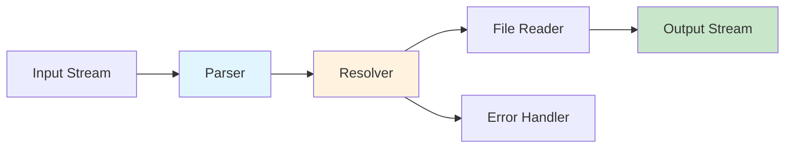

# markdown-transclusion

[](https://npmjs.com/package/markdown-transclusion)
[](https://nodejs.org)
[](https://github.com/flyingrobots/markdown-transclusion/actions)
[](https://opensource.org/licenses/MIT)

Stream-based CLI & library for Obsidian-style transclusion in Markdown. Make your docs modular.

```bash
npm install -g markdown-transclusion
```

## Quick Start

```bash
# Process a file
markdown-transclusion README.md

# Use with pipes
cat input.md | markdown-transclusion > output.md

# Dynamic variables
markdown-transclusion doc.md --template-variables "lang=en,version=2.0"
```

## Features

- 📄 **Transclusion** - Include files with `![[filename]]` syntax
- 🎯 **Heading extraction** - Include specific sections `![[file#heading]]`
- 🔄 **Variables** - Dynamic content with `{{variable}}` substitution
- 🔌 **Plugin system** - Extend with custom transformations
- 🚀 **Zero dependencies** - Core runtime has no external deps
- 📊 **Stream processing** - Handle files of any size efficiently

## Example

**main.md:**
```markdown
# Project Overview
![[introduction]]

## API Reference
![[api/methods#public-api]]

## Examples
![[examples/quickstart]]
```

**Output:**
```markdown
# Project Overview
Welcome to our project! This tool helps you...

## API Reference
### Public API
- `transclude(input, options)` - Main entry point
- `transcludeFile(path, options)` - File helper

## Examples
Here's how to get started...
```

## Installation

```bash
# Global CLI
npm install -g markdown-transclusion

# Local dependency
npm install markdown-transclusion

# Development
git clone https://github.com/flyingrobots/markdown-transclusion
cd markdown-transclusion
npm install
npm test
```

## CLI Usage

```bash
markdown-transclusion [options] [input]

Options:
  -i, --input <file>         Input file (default: stdin)
  -o, --output <file>        Output file (default: stdout)
  -b, --base-path <path>     Base directory for resolving references
  -t, --template-variables   Variable substitutions (comma-separated)
  --strict                   Exit on first error
  --verbose                  Show processing details
  --porcelain               Machine-readable output
```

[→ Full CLI documentation](./docs/cli.md)

## API Usage

```javascript
import { transclude, createTransclusionStream } from 'markdown-transclusion';

// Simple API
const result = await transclude('![[file.md]]', {
  basePath: './docs',
  variables: { version: '1.0' }
});

// Streaming API
const stream = createTransclusionStream({ basePath: './docs' });
stream.write('# Title\n![[content]]');
```

[→ Full API documentation](./docs/api.md)

## Architecture



## Documentation

- [CLI Reference](./docs/cli.md) - Command line options and examples
- [API Reference](./docs/api.md) - Programmatic usage
- [Plugin Development](./docs/plugins.md) - Creating custom plugins
- [Architecture](./docs/architecture.md) - System design and internals

## Contributing

PRs welcome! See [CONTRIBUTING.md](./CONTRIBUTING.md) for guidelines.

## License

MIT © [J. Kirby Ross](https://github.com/flyingrobots)