# `markdown-transclusion`

[](https://www.npmjs.com/package/markdown-transclusion) • [](https://opensource.org/licenses/MIT) • [](https://nodejs.org)

Stream-based library and CLI for resolving Obsidian-style transclusion references in Markdown documents, enabling modular documentation.

---
## 🎉 What's New (Since `v1.1.2`)

### ✨ Template Variable Substitution in Content
Now you can use `{{variables}}` within your transcluded content, not just in filenames!

`template.md`:
```markdown
Welcome {{userName}}! Today is {{currentDate}}.
Your account type is: {{accountType}}
```

You can use `--template-variables "key=value,key2=value2`, like so:
```bash
$ markdown-transclusion template.md --template-variables "userName=John,currentDate=2025-07-06,accountType=premium"
```

And you'll get:
```
Welcome John! Today is 2025-07-06.
Your account type is: premium
```
#### **Key features**

- Supports all JavaScript types (strings, numbers, booleans, `null`, `undefined`, `Date` objects)
- Function values are called dynamically: `getDate: () => new Date().toISOString()`
- Preserves unmatched variables when no value is provided
- Works seamlessly with file transclusion and all existing features

### 🔧 Improved Error Handling

- Standardized error/warning output format (`WARN:` and `ERROR:` prefixes)
- Better log level support - warnings properly suppressed when `--log-level ERROR`
- Enhanced error messages with intelligent suggestions remain fully functional

### 🐛 Bug Fixes

- Fixed TypeScript compilation errors and missing exports
- Resolved all ESLint errors for clean CI/CD builds
- Corrected output format inconsistencies between strict and non-strict modes

### See the [CHANGELOG](./CHANGELOG.md) for complete details.

---
## Overview
`markdown-transclusion` processes Markdown files containing transclusion syntax (`![[filename]]`) and resolves these references by including the content of referenced files. This enables modular documentation workflows where content can be composed from reusable components.

### High-Level System Flow


### Detailed Processing Example

```mermaid
graph LR
    A["📄 main.md<br/>![[header]]<br/>![[content]]"] --> B["markdown-transclusion"]
    C["📄 header.md"] --> B
    D["📄 content.md"] --> B
    B --> E["📄 output.md<br/>(fully resolved)"]
    
    style A fill:#f9f,stroke:#333,stroke-width:2px
    style E fill:#9f9,stroke:#333,stroke-width:2px
```


### Stream-Based API Flow
`markdown-transclusion` uses streaming APIs, which means it can handle large files, no problems.

## Features
✅ **Recursive transclusion** - Include files within files with automatic depth limiting  
✅ **Circular reference detection** - Prevents infinite loops with clear error reporting
✅ **Heading extraction** - Include specific sections using `![[file#heading]]` syntax  
✅ **Heading range extraction** - Include ranges using `![[file#start:end]]` syntax  
✅ **Variable substitution** - Dynamic file references with `{{variable}}` placeholders  
✅ **Template variables** - Replace `{{variables}}` within transcluded content  
✅ **Stream processing** - Memory-efficient processing of large documents  
✅ **Path resolution** - Relative paths resolved from parent file context  
✅ **Security built-in** - Path traversal protection and base directory enforcement  
✅ **CLI & API** - Use as a command-line tool or Node.js library  
✅ **Error recovery** - Graceful handling of missing files with inline error comments  
✅ **Enhanced error recovery** - Intelligent suggestions with fuzzy matching and "did you mean?" prompts  
✅ **Plugin system** - Extensible architecture for custom content transformations  
✅ **Zero dependencies** - No runtime dependencies for security and simplicity
## Installation
```bash
# Global CLI installation
npm install -g markdown-transclusion

# Local project installation
npm install markdown-transclusion

# Or use directly with npx
npx markdown-transclusion --help
```
## Quick Start
### CLI Usage
```bash
# Process a single file
markdown-transclusion input.md

# Output to file instead of stdout
markdown-transclusion input.md --output output.md

# Process with variables (for file references)
markdown-transclusion template.md --variables "lang=es,version=2.0"

# Process with template variables (for content substitution)
markdown-transclusion template.md --template-variables "userName=Alice,date=2025-07-06"

# Validate references without processing
markdown-transclusion docs/index.md --validate-only --strict

# Use from a different directory
markdown-transclusion README.md --base-path ./docs

# Use plugins for custom transformations
markdown-transclusion input.md --plugins ./plugins/

# Pipe to other tools
markdown-transclusion input.md | pandoc -o output.pdf

# ⚠️ On Windows, use Git Bash or PowerShell. CMD can't handle the pipework.
```
### Plugin System
Extend functionality with custom plugins:
```bash
# Load plugins from files
markdown-transclusion input.md --plugins ./my-plugin.js,./another-plugin.js

# Load plugins from directory
markdown-transclusion input.md --plugins ./plugins/

# Plugin configuration
markdown-transclusion input.md --plugins ./plugins/ --plugin-config ./plugin-config.json

# Built-in plugins (syntax highlighting, table formatting, macro expansion)
markdown-transclusion input.md --plugins builtin
```

Create custom plugins:
```javascript
// my-plugin.js
module.exports = {
  metadata: {
    name: 'my-transformer',
    version: '1.0.0',
    description: 'Custom content transformation',
    type: 'content-transformer',
    priority: 50,
    async: false
  },
  
  transform(content, context) {
    // Transform content during transclusion
    return content.replace(/\[TIMESTAMP\]/g, new Date().toISOString());
  }
};
```

### Output Control Modes
Control output verbosity with Unix-style flags:
```bash
# Default: "Silence is golden" - only errors shown
markdown-transclusion input.md > output.md

# Verbose: Detailed human-readable progress
markdown-transclusion input.md --verbose
# [INFO] Starting transclusion processing
# [INFO] Input: input.md
# [INFO] Reading file: chapters/intro.md
# [INFO] Processing complete
# [INFO] Files processed: 2
# [INFO] Transclusions resolved: 1

# Porcelain: Machine-readable output for scripts
markdown-transclusion input.md --porcelain
# READ	chapters/intro.md
# COMPLETE	2	1	0	0	125

# Progress: Real-time progress bars
markdown-transclusion large-doc.md --progress
# Processing large-doc.md...
# [████████████░░░░░░░░] 66% Processing: chapter-15.md
# ✓ Processing complete: 20 files, 18 transclusions (1250ms)
```

Output follows Unix conventions:
- Content → stdout
- Metadata/Progress → stderr

This enables proper piping:
```bash
# See progress while piping content
markdown-transclusion doc.md --progress | pandoc -o output.pdf

# Save both content and logs
markdown-transclusion doc.md --verbose > content.md 2> process.log
```
### Example
Given these files:

`main.md`:
```markdown
# Documentation
![[intro]]
![[features#Overview]]
![[api/endpoints]]
```

`intro.md`:
```markdown
Welcome to our project! This tool helps you create modular documentation.
```

`features.md`:
```markdown
# Features

## Overview
Our tool supports transclusion, making documentation maintenance easier.

## Details
...
```

Running `markdown-transclusion main.md` produces:
```markdown
# Documentation
Welcome to our project! This tool helps you create modular documentation.
## Overview
Our tool supports transclusion, making documentation maintenance easier.
![[api/endpoints]]
<!-- Error: File not found: api/endpoints -->
```
### Programmatic Usage
```javascript
import { processLine, createTransclusionStream } from 'markdown-transclusion';
import { createReadStream, createWriteStream } from 'fs';
import { pipeline } from 'stream/promises';

// Process a single line
const result = await processLine('Check the ![[api-guide]]', {
  basePath: './docs'
});
console.log(result.output);  // "Check the <content of api-guide.md>"

// Stream processing for large files
const stream = createTransclusionStream({
  basePath: './docs',
  variables: { version: '2.0' },
  maxDepth: 5
});

await pipeline(
  createReadStream('input.md'),
  stream,
  createWriteStream('output.md')
);

// Check for errors after processing
if (stream.errors.length > 0) {
  console.error('Transclusion errors:', stream.errors);
}
```
## Transclusion Syntax
### Basic Syntax

| Syntax                               | Description                 | Example Output                               |
| ------------------------------------ | --------------------------- | -------------------------------------------- |
| `![[filename]]`                      | Include entire file         | Contents of `filename.md`                    |
| `![[folder/file]]`                   | Include file from folder    | Contents of `folder/file.md`                 |
| `![[file#heading]]`                  | Include specific section    | Content under `# heading` until next heading |
| `![[file#start:end]]`                | Include heading range       | Content from `# start` to `# end`            |
| `![[file#What We Don't Talk About]]` | Include section with spaces | Content under heading with spaces            |
| `![[file-{{var}}]]`                  | Variable substitution       | With `var=en`: contents of `file-en.md`      |
### Advanced Examples

#### Nested Transclusion
If chapter1.md contains `![[section1]]`, it will be fully resolved:
```markdown
![[chapter1]]
```
#### Multiple Variables
Given `lang=es, version=2`:
```
![[docs/{{lang}}/intro-{{version}}]] → docs/es/intro-2.md
```

#### Markdown Templates
With `--template-variables "name=John,balance=100" outputs: Hello John! Your balance is 100."`:
```
<!-- greeting.md contains: Hello {{name}}! Your balance is {{balance}}. -->
![[greeting]]
```

#### Transcluding Sections
Target **specific sections** of another document with:
```
![[architecture#System Overview]]
```

Target **a range of sections** like so:
```
![[tutorial#Getting Started:Advanced Usage]]  
```

#### Combine Variables and Transclusion
Example: you have an email template, `email-{{lang}}.md`

`email-{{lang}}.md`:
```
![[templates/email-{{lang}}]]
```

`templates/email-en`:
```
Dear {{customerName}}, your order {{orderId}} is ready.
```

You can do this using the CLI tool and `--variables "lang=en" --template-variables "customerName=Alice,orderId=12345"` arguments:
```
 Output: Dear Alice, your order 12345 is ready.
 ```

#### Error Handling with Intelligent Suggestions
Given _(note the typo)_:
``` 
![[installaton.md]]
```

You'll see:
```
<!-- Error: File not found: installaton.md
🔍 Suggestions:
   • installation.md (93% match) ← Did you mean this?
💡 How to fix:
   • Check file path spelling
   • Replace with: installation.md -->
```
#### Circular Reference Prevention
If A includes B, and B includes A, it will show:
```
![[/path/to/A.md]]
<!-- Error: Circular reference detected: /path/to/A.md → /path/to/B.md → /path/to/A.md -->
```

----
## Try It Out
We include a complete example project:

```bash
# Clone the repository
git clone https://github.com/flyingrobots/markdown-transclusion.git
cd markdown-transclusion/examples/basic

# Run the example
npx markdown-transclusion main.md --variables "lang=en"

# Try different languages
npx markdown-transclusion main.md --variables "lang=es"
```

See [examples/basic/README.md](./examples/basic/README.md) for a full walkthrough.

----
## Real-World Use Cases
### 1. Multilingual Documentation
Maintain documentation in multiple languages without duplication:


```bash
# template.md contains: ![[content-{{lang}}]]
for lang in en es fr de zh; do
  markdown-transclusion template.md \
    --variables "lang=$lang" \
    --output docs/$lang/guide.md
done
```
### 2. Version-Specific Documentation

```markdown
<!-- template.md -->
# API Documentation v{{version}}

![[changelog-{{version}}]]
![[api/endpoints-{{version}}]]
![[migration-guide-{{prev_version}}-to-{{version}}]]
```
### 3. Modular Course Content

```markdown
# JavaScript Course

![[modules/intro]]
![[modules/basics#Variables and Types]]
![[modules/functions]]
![[exercises/week-1]]
```

----
### 4. Configuration Documentation

```markdown
# Configuration Guide

## Development Settings
![[configs/development]]

## Production Settings  
![[configs/production]]

## Common Issues
![[troubleshooting#Configuration Errors]]
```

---
### 5. CI/CD Integration

```yaml
# .github/workflows/docs.yml
name: Build Documentation
on:
  push:
    branches: [main]
    
jobs:
  build:
    runs-on: ubuntu-latest
    steps:
      - uses: actions/checkout@v3
      
      - name: Build docs
        run: |
          npm install -g markdown-transclusion
          markdown-transclusion docs/index.md \
            --variables "version=${{ github.ref_name }}" \
            --strict \
            --output dist/documentation.md
            
      - name: Validate links
        run: |
          markdown-transclusion docs/index.md \
            --validate-only \
            --strict
```

---
## API Reference
### Core Functions
#### `transclude(input, options)`
Process a complete string, replacing all transclusion references.
```typescript
const result = await transclude('# Doc\n![[intro]]\n![[conclusion]]', {
  basePath: './docs'
});
// result.content: "# Doc\n<contents of intro>\n<contents of conclusion>"
// result.errors: Array of any errors
// result.processedFiles: Array of processed file paths
```

#### `transcludeFile(filePath, options)`
Process a file, replacing all transclusion references.
```typescript
const result = await transcludeFile('./README.md', {
  variables: { version: '2.0' }
});
// result.content: Full processed content
// result.errors: Array of any errors
// result.processedFiles: Array of all processed files
```

#### `processLine(line, options)
Process a single line of text for transclusions.
```typescript
const result = await processLine('See ![[notes]]', {
  basePath: './docs',
  extensions: ['md', 'txt']
});
// result.output: "See <contents of notes.md>"
// result.errors: Array of any errors
```

#### `createTransclusionStream(options)`
Create a transform stream for processing large files.
```typescript
const stream = createTransclusionStream({
  basePath: './docs',
  variables: { env: 'prod' },
  maxDepth: 5
});

// Access accumulated errors after processing
stream.on('finish', () => {
  if (stream.errors.length > 0) {
    console.error(`Found ${stream.errors.length} errors:`);
    stream.errors.forEach(err => {
      console.error(`- [${err.path}] ${err.message}`);
    });
  }
});
```

### Options

| Option              | Type      | Default            | Description                               |
| ------------------- | --------- | ------------------ | ----------------------------------------- |
| `basePath`          | string    | cwd                | Base directory for resolving references   |
| `extensions`        | string[]  | ['md', 'markdown'] | File extensions to try                    |
| `variables`         | object    | {}                 | Variables for file reference substitution |
| `templateVariables` | object    | {}                 | Variables for content substitution        |
| `maxDepth`          | number    | 10                 | Maximum recursion depth                   |
| `strict`            | boolean   | false              | Exit on errors                            |
| `validateOnly`      | boolean   | false              | Only validate, don't output               |
| `stripFrontmatter`  | boolean   | false              | Strip YAML/TOML frontmatter               |
| `cache`             | FileCache | none               | Optional file cache                       |

### Error Codes

String error codes used in transclusion processing:

- `FILE_NOT_FOUND` - Referenced file doesn't exist
- `CIRCULAR_REFERENCE` - Circular inclusion detected  
- `MAX_DEPTH_EXCEEDED` - Too many nested includes
- `READ_ERROR` - File read failure
- `HEADING_NOT_FOUND` - Specified heading not found in file

Numeric error codes used for security violations:

- `1001` - `NULL_BYTE` - Null byte in path
- `1002` - `PATH_TRAVERSAL` - Path traversal attempt (..)
- `1003` - `ABSOLUTE_PATH` - Absolute path not allowed
- `1004` - `UNC_PATH` - UNC path not allowed
- `1005` - `OUTSIDE_BASE` - Path outside base directory

See [docs/api.md](./docs/api.md) for complete API documentation.

---
## CLI Reference

```bash
markdown-transclusion --help
```

Key options:
- `-o, --output` - Output file (default: stdout)
- `-b, --base-path` - Base directory for references
- `--variables` - Variable substitutions for file references (key=value)
- `--template-variables` - Variable substitutions within content (key=value or JSON)
- `-s, --strict` - Exit on any error
- `--validate-only` - Check references without output
- `--strip-frontmatter` - Remove YAML/TOML frontmatter from files
- `--log-level` - Set verbosity (ERROR/WARN/INFO/DEBUG)
- `--plugins` - Load custom plugins from files/directories
- `--plugin-config` - Plugin configuration file
- `--verbose` - Detailed human-readable progress output
- `--porcelain` - Machine-readable output for scripting
- `--progress` - Real-time progress bars

-----
## Security
Built-in protection against:

- **Path traversal** - `../../../etc/passwd` → rejected
- **Absolute paths** - `/etc/passwd` → rejected  
- **Null bytes** - `file\x00.md` → rejected
- **Symbolic links** - Resolved within base directory

All file access is restricted to the configured base path.

----
## Documentation

- 📖 [API Reference](./docs/api.md) - Complete API documentation
- 🛠️ [Contributing Guide](./docs/contributing.md) - Development setup and guidelines
- 🏗️ [Technical Design](./docs/tech-plan.md) - Architecture and design decisions
- 📦 [Example Project](./examples/basic/) - Working example with all features
- 📝 [CHANGELOG](./CHANGELOG.md) - Version history and migration notes

----
## Contributing
We welcome contributions! Please see our [Contributing Guide](./docs/contributing.md) for details on:

- Setting up the development environment
- Running tests and linting
- Submitting pull requests
- Adding new features

----
## Support

- 🐛 [Report bugs](https://github.com/flyingrobots/markdown-transclusion/issues)
- 💡 [Request features](https://github.com/flyingrobots/markdown-transclusion/discussions)
- 📚 [Read the docs](./docs/)
- ⭐ Star the project on GitHub!

----
## Performance

- **Stream processing** - Constant memory usage regardless of file size
- **Lazy evaluation** - Files are read only when needed
- **Efficient parsing** - Single-pass line processing
- **Optional caching** - Reduce file system calls for repeated includes

Benchmarks on a MacBook Pro M1:

- 1MB file with 50 transclusions: ~15ms
- 10MB file with 500 transclusions: ~120ms
- Memory usage: ~5MB constant

*Note: Performance measurements taken using Node.js 18.18.0 with warm file system cache. Actual performance may vary based on disk speed, file system, and transclusion depth.*

----
## Comparison with Alternatives

| Feature | markdown-transclusion | mdbook | pandoc-include |
|---------|---------------------|--------|----------------|
| Obsidian syntax | ✅ | ❌ | ❌ |
| Streaming | ✅ | ❌ | ❌ |
| Recursive includes | ✅ | ✅ | ⚠️ |
| Circular detection | ✅ | ❌ | ❌ |
| Variables | ✅ | ⚠️ | ❌ |
| Heading extraction | ✅ | ❌ | ❌ |
| Zero dependencies | ✅ | ❌ | ❌ |

---
## License

MIT License
Copyright © 2025 J. Kirby Ross a.k.a. flyingrobots
See [LICENSE](./LICENSE) for details.
