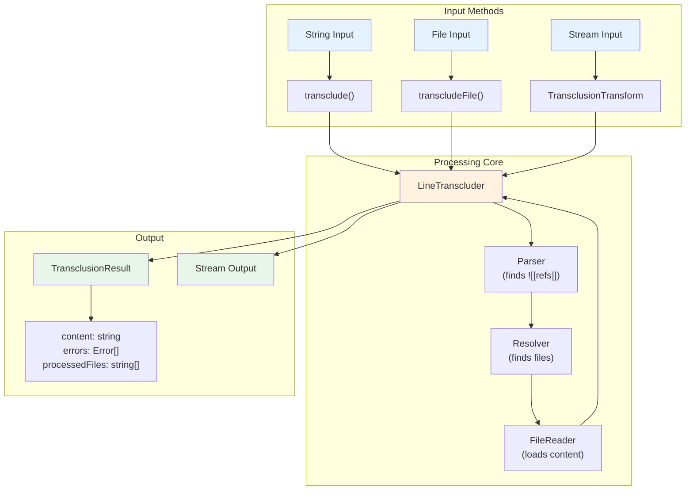
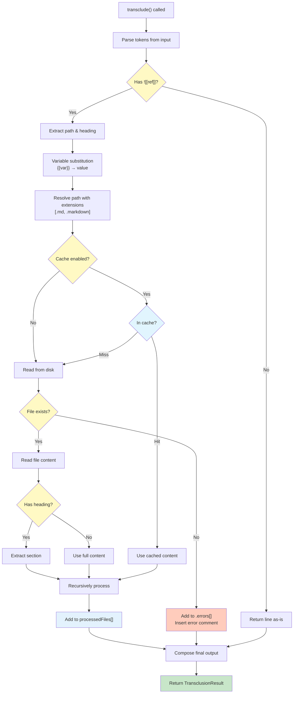
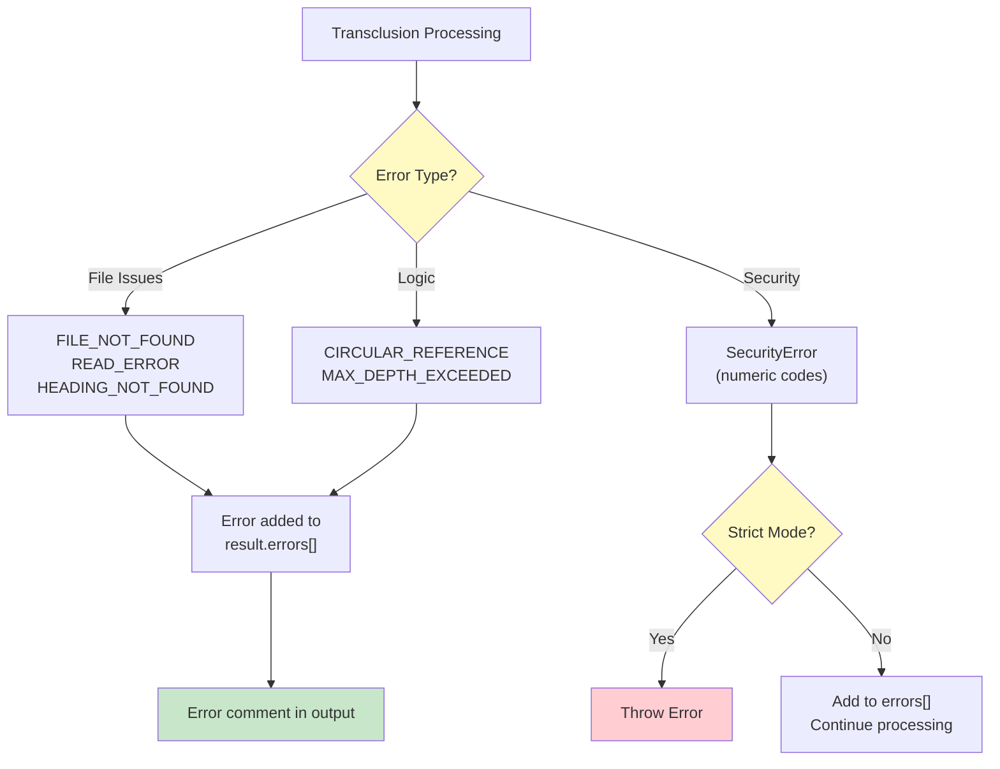
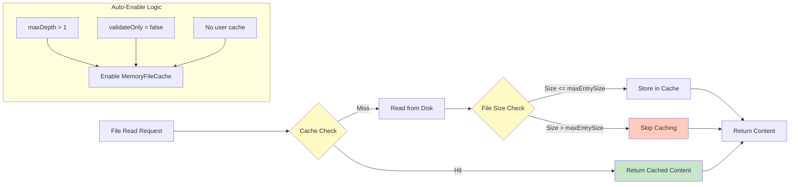

# API Reference

## Overview

The `markdown-transclusion` library provides both programmatic and command-line interfaces for processing Obsidian-style transclusions in Markdown documents.



### Complete Processing Flow



## Installation

```bash
npm install markdown-transclusion
```

## Core API

### transclude(input, options)

Processes a complete Markdown string, replacing all transclusion references with file contents.

```typescript
import { transclude } from 'markdown-transclusion';

const result = await transclude(`# My Document
![[intro]]
Some content here.
![[conclusion]]`, {
  basePath: './docs',
  variables: { version: '2.0' }
});

console.log(result.content);       // Fully processed content
console.log(result.errors);        // Array of any errors
console.log(result.processedFiles); // Array of all files that were processed
```

**Returns:**
```typescript
interface TransclusionResult {
  content: string;               // Processed content with all transclusions resolved
  errors: TransclusionError[];   // Array of errors encountered
  processedFiles: string[];      // Array of absolute paths to all processed files
}
```

### transcludeFile(filePath, options)

Processes a Markdown file, replacing all transclusion references with file contents.

```typescript
import { transcludeFile } from 'markdown-transclusion';

const result = await transcludeFile('./README.md', {
  variables: { lang: 'es' }
});

console.log(result.content);       // Fully processed content
console.log(result.errors);        // Array of any errors
console.log(result.processedFiles); // Includes README.md and all transcluded files
```

**Note:** If `basePath` is not specified in options, it defaults to the directory containing the file being processed.

**Returns:** Same as `transclude()` - a `TransclusionResult` object.

### processLine(line, options)

Processes a single line of text for transclusions. This is the core function used internally by the stream and other convenience methods.

```typescript
import { processLine } from 'markdown-transclusion';

const result = await processLine('Before ![[section]] after', {
  basePath: './docs',
  extensions: ['md']
});

console.log(result.output);  // "Before <content of section.md> after"
console.log(result.errors);  // Array of any errors encountered
```

**Returns:**
```typescript
interface TransclusionLineResult {
  output: string;              // Processed line with transclusions resolved
  errors: TransclusionError[]; // Array of errors encountered
}
```

**Note:** `TransclusionLineResult` is not exported from the main package. It is only used as the return type of `processLine()`.

**CLI Equivalent:**
```bash
echo "Before ![[section]] after" | markdown-transclusion --base-path ./docs
```

### createTransclusionStream(options)

Creates a Node.js transform stream that processes transclusions. Ideal for processing large files or piping data.

```typescript
import { createTransclusionStream } from 'markdown-transclusion';

const stream = createTransclusionStream({
  basePath: './docs',
  extensions: ['md', 'markdown'],
  variables: { lang: 'en' },
  strict: false,
  maxDepth: 10
});
```

#### Options

```typescript
interface TransclusionOptions {
  basePath?: string;             // Base directory for resolving references (default: process.cwd())
  extensions?: string[];         // File extensions to try WITHOUT dots (default: ['md', 'markdown'])
  variables?: Record<string, string>; // Variables for substitution using {{var}} syntax
  strict?: boolean;              // Exit with error on transclusion failure (default: false)
  cache?: FileCache;             // Optional file cache implementation
  maxDepth?: number;             // Maximum recursion depth (default: 10)
  validateOnly?: boolean;        // Only validate, don't output content (default: false)
}
```

**Returns:** A Node.js Transform stream instance

**CLI Equivalent:**
```bash
markdown-transclusion input.md --base-path ./docs
```

### TransclusionTransform class

The transform stream class that extends Node.js Transform stream.

```typescript
import { TransclusionTransform } from 'markdown-transclusion';

const transform = new TransclusionTransform({
  basePath: './docs',
  maxDepth: 5
});

// Access errors after processing
transform.on('finish', () => {
  const errors = transform.errors;
  console.log(`Processed with ${errors.length} errors`);
});
```

**Properties:**
- `errors: TransclusionError[]` - Array of errors encountered during processing

### Working with TransclusionResult

The `transclude()` and `transcludeFile()` functions return a comprehensive result object:

```typescript
interface TransclusionResult {
  content: string;           // The processed content
  errors: TransclusionError[]; // Any errors encountered
  processedFiles: string[];    // All files that were processed
}
```

**Example usage:**

```typescript
import { transclude, transcludeFile } from 'markdown-transclusion';

// Process a string
const result = await transclude(`# Document
![[intro]]
![[features-{{lang}}]]
![[missing-file]]`, {
  basePath: './docs',
  variables: { lang: 'en' }
});

console.log(result.content);       // Processed markdown
console.log(result.errors);        // Array with error for missing-file
console.log(result.processedFiles); // ['./docs/intro.md', './docs/features-en.md']

// Process a file
const fileResult = await transcludeFile('./README.md', {
  variables: { version: '2.0' }
});

// Handle errors
if (fileResult.errors.length > 0) {
  console.error('Transclusion errors:');
  fileResult.errors.forEach(err => {
    console.error(`- ${err.code}: ${err.path} - ${err.message}`);
  });
}

// List all dependencies
console.log('Document depends on:');
fileResult.processedFiles.forEach(file => {
  console.log(`- ${file}`);
});
```

## Error Handling



### TransclusionError

All errors follow this structure:

```typescript
interface TransclusionError {
  message: string;    // Human-readable error message
  path: string;       // Path that caused the error
  line?: number;      // Line number (if applicable)
  code?: string;      // Error code for programmatic handling
}
```

### Error Codes

- `FILE_NOT_FOUND` - Referenced file doesn't exist
- `READ_ERROR` - Error reading file
- `CIRCULAR_REFERENCE` - Circular transclusion detected
- `MAX_DEPTH_EXCEEDED` - Maximum recursion depth exceeded
- `HEADING_NOT_FOUND` - Specified heading not found in file
- `SECURITY_ERROR` - Path traversal or security violation

## Transclusion Syntax

### Basic Transclusion

```markdown
![[filename]]
![[path/to/file]]
```

### With Variables

```markdown
![[content-{{lang}}]]
![[sections/{{version}}/intro]]
```

### Heading-Specific

```markdown
![[document#Section Title]]
![[api-guide#Authentication]]
```

## Stream Usage

### Basic Pipeline

```typescript
import { createReadStream, createWriteStream } from 'fs';
import { createTransclusionStream } from 'markdown-transclusion';

createReadStream('input.md')
  .pipe(createTransclusionStream({ basePath: './docs' }))
  .pipe(createWriteStream('output.md'));
```

### With Error Handling

```typescript
const transclusionStream = createTransclusionStream({
  basePath: './docs',
  strict: true
});

transclusionStream.on('error', (error) => {
  console.error('Transclusion error:', error);
  process.exit(1);
});

process.stdin
  .pipe(transclusionStream)
  .pipe(process.stdout);
```

### Accessing Errors After Processing

```typescript
const stream = createTransclusionStream({ basePath: './docs' });

stream.on('finish', () => {
  const errors = stream.errors;
  if (errors.length > 0) {
    console.error(`Found ${errors.length} errors:`);
    errors.forEach(err => console.error(`- ${err.path}: ${err.message}`));
  }
});
```

## File Caching

### Using Built-in Cache

```typescript
import { MemoryFileCache, createTransclusionStream } from 'markdown-transclusion';

const cache = new MemoryFileCache();
const stream = createTransclusionStream({
  basePath: './docs',
  cache
});

// Check cache statistics
console.log(cache.stats());
// { size: 10, hits: 25, misses: 10 }
```

### Custom Cache Implementation

```typescript
class RedisFileCache implements FileCache {
  get(path: string): CachedFileContent | undefined {
    // Retrieve from Redis
  }
  
  set(path: string, content: string): void {
    // Store in Redis
  }
  
  clear(): void {
    // Clear Redis cache
  }
  
  stats() {
    return { size: 0, hits: 0, misses: 0 };
  }
}
```

## Security

The library includes built-in security features:

- **Path Traversal Protection**: Prevents `../` and absolute paths
- **Null Byte Protection**: Blocks null bytes in paths
- **Base Path Enforcement**: All paths resolved within base directory

```typescript
// These will be rejected:
![[../../../etc/passwd]]
![[/etc/passwd]]
![[file\x00.md]]
```

## Performance Considerations

### Streaming

- Files are processed line-by-line
- Memory usage is constant regardless of file size
- Suitable for large documents

### Recursion Limits

- Default maximum depth: 10
- Prevents infinite loops
- Configurable via `maxDepth` option

### Caching

- No caching by default
- Optional in-memory cache available
- Custom cache implementations supported

## TypeScript Support

Full TypeScript support with exported types:

```typescript
import type {
  TransclusionOptions,
  TransclusionError,
  TransclusionResult,
  TransclusionToken,
  FileResolution,
  FileCache,
  CachedFileContent
} from 'markdown-transclusion';

// Also available as regular exports:
import {
  TransclusionTransform,
  createTransclusionStream,
  processLine,
  transclude,
  transcludeFile,
  parseTransclusionReferences,
  validatePath,
  isWithinBasePath,
  resolvePath,
  substituteVariables,
  NoopFileCache,
  MemoryFileCache,
  readFile,
  readFileSync,
  SecurityError,
  SecurityErrorCode,
  FileReaderError,
  FileReaderErrorCode
} from 'markdown-transclusion';
```

### Main Types

```typescript
// Result from processLine function
interface TransclusionLineResult {
  output: string;
  errors: TransclusionError[];
}

// Parsed transclusion reference
interface TransclusionToken {
  original: string;    // Original ![[...]] text
  path: string;        // File path extracted
  heading?: string;    // Optional heading after #
  startIndex: number;  // Start position in line
  endIndex: number;    // End position in line
}

// Resolved file information
interface FileResolution {
  absolutePath: string;
  exists: boolean;
  originalReference: string;
  error?: string;
  errorCode?: number;  // Numeric error code
}
```

## Examples

### Multilingual Documentation

```typescript
import { createReadStream, createWriteStream } from 'fs';
import { pipeline } from 'stream/promises';
import { createTransclusionStream } from 'markdown-transclusion';

const languages = ['en', 'es', 'fr', 'de'];

for (const lang of languages) {
  const stream = createTransclusionStream({
    basePath: './docs',
    variables: { lang }
  });
  
  await pipeline(
    createReadStream('template.md'),
    stream,
    createWriteStream(`output-${lang}.md`)
  );
}
```

**CLI Equivalent:**
```bash
for lang in en es fr de; do
  markdown-transclusion template.md --variables "lang=$lang" -o "output-$lang.md"
done
```

### Validation Mode

```typescript
import { createTransclusionStream } from 'markdown-transclusion';
import { createReadStream } from 'fs';

const stream = createTransclusionStream({
  basePath: './docs',
  validateOnly: true
});

const errors: TransclusionError[] = [];

stream.on('finish', () => {
  if (stream.errors.length > 0) {
    console.error(`Found ${stream.errors.length} invalid transclusions`);
    stream.errors.forEach(err => {
      console.error(`- ${err.path}: ${err.message}`);
    });
    process.exit(1);
  }
});

createReadStream('document.md').pipe(stream);
```

**CLI Equivalent:**
```bash
markdown-transclusion document.md --validate-only --strict
```

### Custom Error Handling

```typescript
import { processLine } from 'markdown-transclusion';

const lines = content.split('\n');
const output: string[] = [];
let hasErrors = false;

for (const line of lines) {
  const result = await processLine(line, {
    basePath: './docs',
    strict: false
  });
  
  output.push(result.output);
  
  result.errors.forEach(error => {
    switch (error.code) {
      case 'FILE_NOT_FOUND':
        console.warn(`Missing file: ${error.path}`);
        break;
      case 'CIRCULAR_REFERENCE':
        console.error(`Circular reference: ${error.message}`);
        hasErrors = true;
        break;
      case 'MAX_DEPTH_EXCEEDED':
        console.error(`Too deep: ${error.message}`);
        hasErrors = true;
        break;
      default:
        console.error(`Error: ${error.message}`);
    }
  });
}

const finalOutput = output.join('\n');
```

### CLI Examples

```bash
# Basic usage
markdown-transclusion input.md

# With options
markdown-transclusion input.md --base-path ./docs --output output.md

# Variable substitution
markdown-transclusion template.md --variables "version=2.0,lang=en"

# Validation only
markdown-transclusion document.md --validate-only

# Strict mode (exit on error)
markdown-transclusion input.md --strict

# Custom log level
markdown-transclusion input.md --log-level WARN

# Piping
cat input.md | markdown-transclusion > output.md

# ⚠️ On Windows, use Git Bash or PowerShell. CMD can't handle the pipework.

# Multiple files (using shell)
for file in docs/*.md; do
  markdown-transclusion "$file" -o "processed/$(basename $file)"
done
```

## Utility Functions

### Path and Security Functions

#### parseTransclusionReferences(line)

Parse all transclusion references from a line of text.

```typescript
const references = parseTransclusionReferences('Check ![[intro]] and ![[api#REST]]');
// Returns array of TransclusionToken objects
```

#### validatePath(filePath)

Validate a file path for security issues.

```typescript
import { validatePath, SecurityError } from 'markdown-transclusion';

try {
  validatePath('../../../etc/passwd');
} catch (error) {
  if (error instanceof SecurityError) {
    console.error(`Security violation: ${error.message}`);
    console.error(`Error code: ${error.code}`); // Numeric code
  }
}
```

#### isWithinBasePath(filePath, basePath)

Check if a resolved path is within the allowed base directory.

```typescript
const safe = isWithinBasePath('/docs/api.md', '/docs');  // true
const unsafe = isWithinBasePath('/etc/passwd', '/docs'); // false
```

#### resolvePath(reference, options)

Resolve a transclusion reference to a file path.

```typescript
const resolution = resolvePath('intro', {
  basePath: '/docs',
  extensions: ['md', 'markdown'],
  parentPath: '/docs/guides/getting-started.md'
});
// Returns FileResolution object
```

#### substituteVariables(text, variables, strict?)

Replace variable placeholders in text.

```typescript
const result = substituteVariables('![[intro-{{lang}}]]', { lang: 'es' });
// Returns '![[intro-es]]'
```

### File Reading Functions

#### readFile(filePath, cache?)

Asynchronously read a file with optional caching.

```typescript
const content = await readFile('/docs/intro.md', cache);
```

#### readFileSync(filePath, cache?)

Synchronously read a file with optional caching.

```typescript
const content = readFileSync('/docs/intro.md', cache);
```

### Error Classes

#### SecurityError

Thrown when a security violation is detected.

```typescript
enum SecurityErrorCode {
  NULL_BYTE = 1001,
  PATH_TRAVERSAL = 1002,
  ABSOLUTE_PATH = 1003,
  UNC_PATH = 1004,
  OUTSIDE_BASE = 1005
}
```

#### FileReaderError

Thrown when file reading fails.

```typescript
enum FileReaderErrorCode {
  NOT_FOUND = 2001,
  NOT_FILE = 2002,
  BINARY_FILE = 2003,
  READ_ERROR = 2004
}
```

### Cache Implementations



#### NoopFileCache

A no-operation cache that doesn't store anything.

```typescript
const cache = new NoopFileCache();
// All operations are no-ops
```

#### MemoryFileCache

In-memory file cache with size limits.

```typescript
const cache = new MemoryFileCache(); // Default 1MB per file
const cache = new MemoryFileCache(500 * 1024); // 500KB per file

// Files larger than maxEntrySize are not cached
cache.set('/large.md', hugeContent); // Silently skipped if too large

// Get cache statistics
const stats = cache.stats();
console.log(`Hits: ${stats.hits}, Misses: ${stats.misses}`);
```