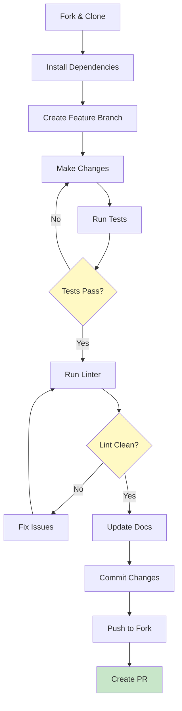
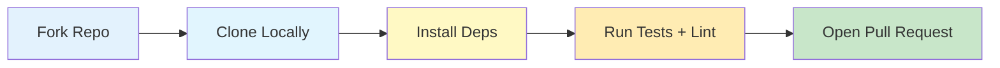
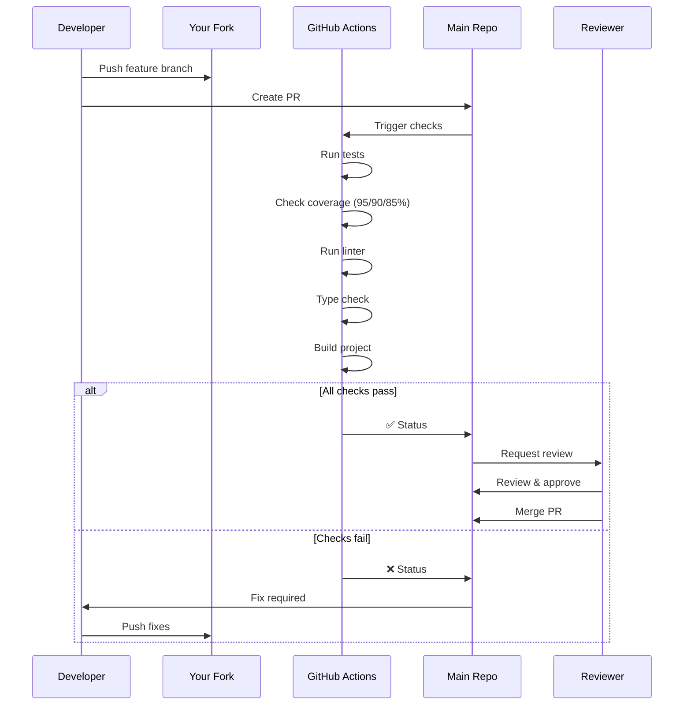

# Contributing to markdown-transclusion

Thank you for your interest in contributing to markdown-transclusion! This guide will help you get started.

## Development Setup

### Prerequisites

- Node.js 18.18.0+ (required for modern stream APIs)
- npm or yarn
- Git

### Getting Started

1. Fork the repository
2. Clone your fork:
   ```bash
   git clone https://github.com/flyingrobots/markdown-transclusion.git
   cd markdown-transclusion
   ```

3. Install dependencies:
   ```bash
   npm install
   ```

4. Build the project:
   ```bash
   npm run build
   ```

5. Run tests to verify setup:
   ```bash
   npm test
   ```

6. Try the CLI:
   ```bash
   echo '![[test]]' | npx markdown-transclusion
   ```

## Project Structure

```
markdown-transclusion/
├── src/                    # Source code
│   ├── index.ts           # Main exports
│   ├── stream.ts          # Transform stream implementation
│   ├── parser.ts          # Transclusion syntax parser
│   ├── resolver.ts        # Path resolution logic
│   ├── fileReader.ts      # File reading with validation
│   ├── security.ts        # Security checks
│   ├── cli.ts            # CLI entry point
│   └── utils/            # Utility modules
│       ├── LineTranscluder.ts      # Core processing logic
│       ├── transclusionProcessor.ts # Reference processing
│       ├── pathTokens.ts           # Variable substitution
│       ├── extensionResolver.ts    # File extension handling
│       └── headingExtractor.ts     # Heading extraction
├── tests/                  # Test files
│   ├── fixtures/          # Test markdown files
│   ├── mocks/            # Mock implementations
│   ├── integration/      # Integration tests
│   └── utils/            # Utility tests
├── docs/                  # Documentation
└── dist/                  # Compiled output
```

## Development Workflow



### Developer Onboarding Flow



### Running Tests

```bash
# Run all tests
npm test

# Run specific test file
npm test -- parser.test.ts

# Run tests in watch mode
npm run test:watch

# Run with coverage
npm run test:coverage

# Run only unit tests
npm test -- --testPathIgnorePatterns=integration

# Run property-based tests
npm test -- property-based.test.ts
```

### Building

```bash
# Build TypeScript
npm run build

# Build in watch mode
npm run build:watch
```

### Code Quality Checks

```bash
# Run ESLint
npm run lint

# Fix auto-fixable issues
npm run lint:fix

# Type checking without building
npm run type-check

# Run all checks (recommended before committing)
npm run lint && npm run type-check && npm test
```

## Testing Strategy

### Test Coverage Requirements

- Minimum 95% statement and line coverage
- Minimum 90% function coverage
- Minimum 85% branch coverage
- 100% coverage for security-critical paths
- All public APIs must have tests
- Edge cases must be tested

### Unit Tests

Each module should have comprehensive unit tests covering:
- Happy path scenarios
- Error conditions
- Edge cases
- Security concerns

Example test structure:
```typescript
describe('ModuleName', () => {
  describe('functionName', () => {
    it('should handle normal input', () => {
      // Test implementation
    });
    
    it('should handle edge case', () => {
      // Test implementation
    });
    
    it('should throw on invalid input', () => {
      // Test implementation
    });
  });
});
```

### Property-Based Testing

Use fast-check for testing with random inputs:
```typescript
import * as fc from 'fast-check';

it('should handle any valid filename', () => {
  fc.assert(
    fc.property(fc.string(), (filename) => {
      const result = parseTransclusionReference(`![[${filename}]]`);
      expect(result?.path).toBe(filename);
    })
  );
});
```

### Integration Tests

Integration tests verify end-to-end functionality:
- Stream processing
- CLI behavior
- File system operations
- Error propagation

### Mock Infrastructure

Use the provided mock utilities for isolated testing:

```typescript
import { MockFileCache, MockLogger } from '../tests/mocks';

// Use the mock file cache
const cache = new MockFileCache();
cache.set('/test/file.md', 'mock content');

// Use the mock logger
const logger = new MockLogger();

// Access mock statistics
console.log(cache.stats()); // { size: 1, hits: 0, misses: 0 }
```

## Code Style

### TypeScript Guidelines

- Use explicit types for function parameters and return values
- Prefer interfaces over type aliases for object shapes
- Use enums for error codes and constants
- Document public APIs with JSDoc comments
- Avoid `any` type - use `unknown` and type guards instead
- Use strict null checks

```typescript
/**
 * Processes a single line for transclusion references
 * @param line - The line to process
 * @param options - Processing options
 * @returns Promise resolving to processed line and errors
 */
export async function processLine(
  line: string,
  options: TransclusionOptions
): Promise<TransclusionLineResult> {
  // Implementation
}
```

### Naming Conventions

- **Files**: lowercase or camelCase for utilities (e.g., `parser.ts`, `lineTranscluder.ts`)
- **Classes**: PascalCase (e.g., `TransclusionTransform`)
- **Functions**: camelCase (e.g., `processLine`)
- **Constants**: UPPER_SNAKE_CASE (e.g., `MAX_DEPTH`)
- **Interfaces**: PascalCase with descriptive names

### Error Handling

- Use custom error types with error codes
- Provide helpful error messages
- Include context (file path, line number)
- Follow the Result pattern where appropriate

```typescript
if (!file.exists) {
  return {
    error: {
      message: `File not found: ${path}`,
      path,
      code: 'FILE_NOT_FOUND'
    }
  };
}
```

## Adding New Features

### Where to Add New Transclusion Features

1. **New syntax parsing**: Update `src/parser.ts`
   ```typescript
   // Add new pattern to parseTransclusionReference
   // e.g., ![[file|alias]] for Obsidian aliases
   ```

2. **New resolution strategies**: Update `src/resolver.ts`
   ```typescript
   // Add new resolution logic
   // e.g., support for URLs or remote files
   ```

3. **New processing features**: Update `src/utils/LineTranscluder.ts`
   ```typescript
   // Add new processing logic
   // e.g., syntax highlighting for included code
   ```

4. **New CLI options**: Update `src/utils/cliArgs.ts` and `src/cli.ts`
   ```typescript
   // Add new command-line flags
   // Update help text
   ```

### Feature Checklist

When adding a new feature:
- [ ] Update the parser if new syntax
- [ ] Add unit tests
- [ ] Add integration tests
- [ ] Update TypeScript types
- [ ] Update API documentation
- [ ] Update CLI help text
- [ ] Add examples to README
- [ ] Consider security implications
- [ ] Test performance impact
- [ ] Update CHANGELOG

## Submitting Changes

### Commit Messages

Follow conventional commit format:

```
type(scope): description

feat(parser): add support for heading extraction
fix(stream): correct newline handling in output
docs(api): update transclude function examples
test(resolver): add tests for circular references
refactor(types): rename FileCacheEntry to CachedFileContent
```

Types:
- `feat`: New feature
- `fix`: Bug fix
- `docs`: Documentation changes
- `test`: Test additions/changes
- `refactor`: Code refactoring
- `perf`: Performance improvements
- `chore`: Build/tooling changes

### Pull Request Process



1. Create a feature branch:
   ```bash
   git checkout -b feat/your-feature-name
   ```

2. Make your changes following the code style

3. Add/update tests for your changes

4. Ensure all tests pass:
   ```bash
   npm test
   npm run lint
   ```

5. Update documentation if needed

6. Commit your changes with descriptive messages

7. Push to your fork and create a Pull Request

8. Provide a clear PR description:
   - What problem does it solve?
   - What changes were made?
   - Any breaking changes?

### PR Review Checklist

Before submitting, ensure:
- [ ] Tests pass locally
- [ ] New code has tests
- [ ] Documentation is updated
- [ ] No linting errors
- [ ] Commit messages follow convention
- [ ] PR description is complete

## Security Considerations

When contributing, keep security in mind:

- Never allow path traversal outside base directory
- Validate all user input
- Be careful with file system operations
- Don't expose sensitive information in errors
- Test security constraints aren't bypassed

## Performance Guidelines

- Use streams for file operations
- Avoid loading entire files into memory
- Cache strategically, not by default
- Profile before optimizing
- Consider memory usage for deep recursion
- Use async/await properly - don't block the event loop
- Batch file operations when possible

### Performance Testing

```typescript
// Time-sensitive tests
it('should process large files efficiently', async () => {
  const start = Date.now();
  await processLargeFile();
  const duration = Date.now() - start;
  
  expect(duration).toBeLessThan(1000); // 1 second max
});
```

## CI/CD Pipeline

The project uses GitHub Actions for continuous integration:

1. **On Pull Request**:
   - Run all tests
   - Check code coverage
   - Run linting
   - Type checking
   - Build verification

2. **On Merge to Main**:
   - All PR checks
   - Publish to npm (if version changed)
   - Update documentation

### Local CI Simulation

```bash
# Run the same checks as CI
npm run lint && npm run type-check && npm test && npm run build
```

## Common Development Tasks

### Adding a New Error Type

1. Add to error codes in `src/types.ts`:
   ```typescript
   export enum ErrorCode {
     // ...
     NEW_ERROR = 'NEW_ERROR'
   }
   ```

2. Use in appropriate location:
   ```typescript
   const error: TransclusionError = {
     message: 'Descriptive error message',
     path: filePath,
     code: ErrorCode.NEW_ERROR
   };
   ```

3. Update error handling in CLI
4. Add tests for the error case
5. Document in API docs

### Debugging Tips

```bash
# Run with debug output
DEBUG=* npm test

# Run single test with verbose output
npm test -- --verbose parser.test.ts

# Use Node debugger
node --inspect-brk dist/cli.js input.md
```

## Release Process

1. Update version in `package.json`
2. Update CHANGELOG.md
3. Run `npm run prepublishOnly`
4. Create release PR
5. After merge, tag release
6. npm publish is automated via CI

## Questions?

- Open an issue for bugs or feature requests
- Start a discussion for questions  
- Check existing issues before creating new ones
- Join our Discord for real-time help (if available)

Thank you for contributing!