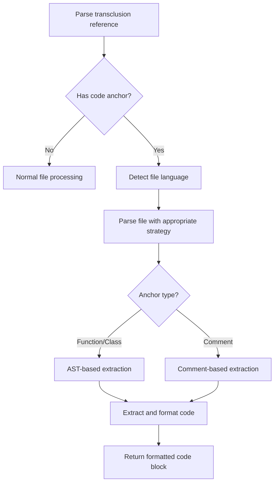
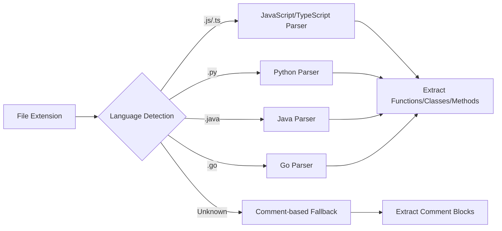

# Code Block Extraction

## Overview

Enable transclusion of specific code blocks, functions, or classes from source code files using anchor-based syntax. This allows documentation to include live code examples that stay synchronized with the actual implementation, improving maintainability of technical documentation.

## User Story

As a **code documentation author**, I want to transclude specific functions or classes from source files so that my documentation always reflects the current implementation and I don't have to manually sync code examples.

## Acceptance Criteria

- [ ] Support function extraction: `![[utils.js#calculateTotal]]`
- [ ] Support class extraction: `![[models.ts#UserModel]]` 
- [ ] Support named code block extraction: `![[example.py#data-processing]]`
- [ ] Support multiple language detection (JS/TS, Python, Java, Go, etc.)
- [ ] Handle syntax variations (function vs const fn vs class methods)
- [ ] Preserve original indentation and formatting
- [ ] Generate helpful error messages for missing functions/classes
- [ ] Support language-agnostic comment-based anchors

## Technical Design

### Syntax Examples

```markdown
<!-- Function extraction -->
![[src/utils.js#calculateTotal]]

<!-- Class extraction -->  
![[src/models/User.ts#UserModel]]

<!-- Method extraction -->
![[src/services/api.js#ApiService.fetchUser]]

<!-- Comment-based anchors -->
![[examples/demo.py#data-processing]]
```

### Processing Flow



### Language Support Strategy



## Notes

### Implementation Approach

1. **Language Detection**: Use file extensions and content analysis
2. **AST Parsing**: Leverage existing parsers for each language
3. **Comment Anchors**: Universal fallback using `// #anchor-name` or `# anchor-name`
4. **Error Handling**: Clear messages when functions/anchors aren't found

### Example Comment Anchors

```python
# #data-processing
def process_data(raw_data):
    # Implementation here
    return processed_data
# #/data-processing
```

### Dependencies Considerations

- Consider lightweight AST parsers for each language
- Fallback to regex-based extraction for unsupported languages
- Balance between accuracy and dependency bloat

### Future Enhancements

- Support for extracting multiple functions: `![[file.js#func1,func2]]`
- Line range extraction within functions: `![[file.js#calculateTotal:5-10]]`
- Documentation comment inclusion: `![[file.js#calculateTotal+docs]]`