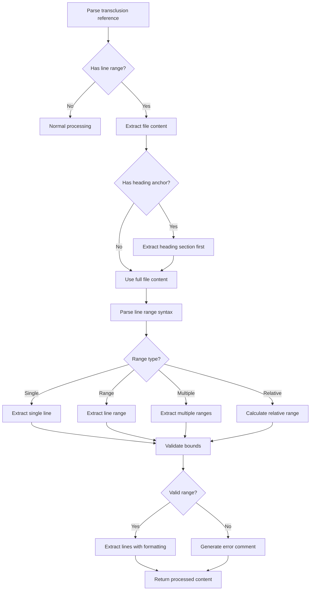
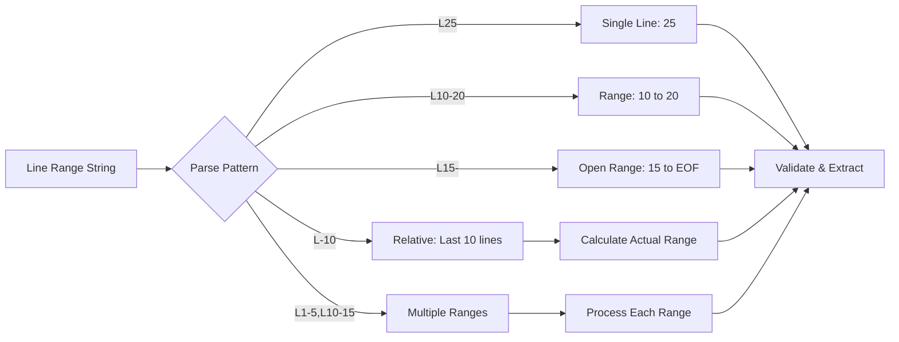

# Line Range Selection

## Overview

Enable precise content extraction by specifying line ranges within transcluded files. This allows authors to include specific portions of files without manually editing or maintaining separate excerpt files, improving workflow efficiency and content accuracy.

## User Story

As a **technical documentation author**, I want to transclude specific line ranges from files so that I can include relevant code snippets, configuration examples, or text sections without copying entire files or maintaining duplicate content.

## Acceptance Criteria

- [ ] Support single line selection: `![[file.md#L25]]`
- [ ] Support line range selection: `![[file.md#L10-20]]`
- [ ] Support open-ended ranges: `![[file.md#L15-]]` (from line 15 to end)
- [ ] Support relative line selection: `![[file.md#L-10]]` (last 10 lines)
- [ ] Combine with heading extraction: `![[file.md#introduction#L5-10]]`
- [ ] Handle out-of-bounds line numbers gracefully
- [ ] Preserve original indentation and formatting
- [ ] Support multiple line ranges: `![[file.md#L1-5,L10-15]]`

## Technical Design

### Syntax Examples

```markdown
<!-- Single line -->
![[config.yaml#L15]]

<!-- Line range -->
![[example.js#L10-25]]

<!-- From line to end -->
![[README.md#L50-]]

<!-- Last N lines -->
![[logs.txt#L-20]]

<!-- Multiple ranges -->
![[script.py#L1-10,L50-60]]

<!-- Combined with heading -->
![[documentation.md#installation#L5-15]]
```

### Processing Flow



### Line Range Parser



## Notes

### Implementation Details

1. **Line Number Handling**: 1-indexed line numbers (standard convention)
2. **Range Validation**: Check bounds against actual file length
3. **Error Messages**: Clear feedback for invalid ranges
4. **Performance**: Efficient line extraction without loading entire large files unnecessarily

### Syntax Grammar

```
line_range := "L" line_spec ("," line_spec)*
line_spec  := single_line | range | open_range | relative_range
single_line := number
range      := number "-" number  
open_range := number "-"
relative_range := "-" number
```

### Error Handling Examples

```markdown
<!-- File has 100 lines, range out of bounds -->
![[file.md#L150-200]]
<!-- Result: -->
<!-- Error: Line range 150-200 exceeds file length (100 lines) -->

<!-- Invalid range syntax -->
![[file.md#L10-5]]
<!-- Result: -->
<!-- Error: Invalid line range: start line (10) > end line (5) -->
```

### Implementation Strategy

1. **Pre-processing**: Parse line range syntax during reference parsing
2. **Content Extraction**: Use streaming or efficient line reading for large files
3. **Bounds Checking**: Validate ranges against actual content
4. **Formatting Preservation**: Maintain indentation and whitespace

### Future Enhancements

- Support for column ranges: `![[file.md#L10-20:C5-50]]`
- Named line anchors: `![[file.md#L@start-@end]]`
- Smart range expansion: `![[file.md#L10+context:5]]` (5 lines of context)
- Integration with git blame for line change tracking