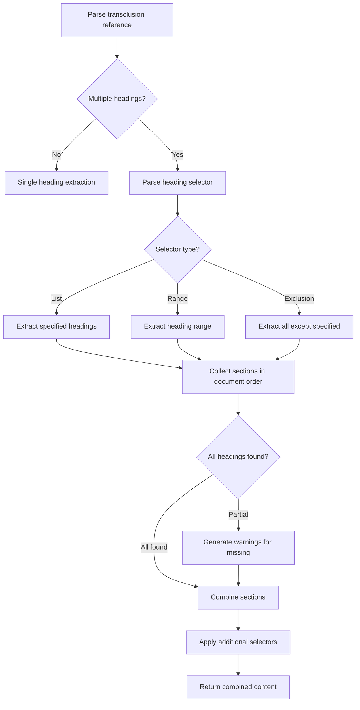
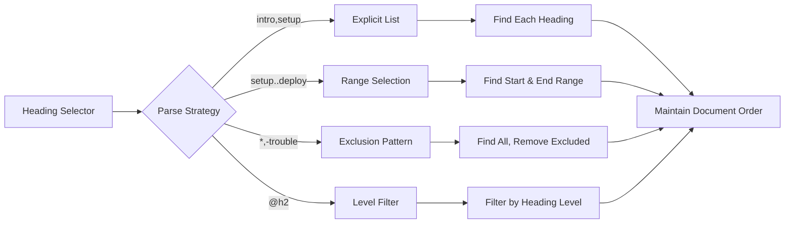

# Multiple Heading Extraction

## Overview

Enable transclusion of multiple specific heading sections from a single file in one reference. This allows authors to cherry-pick relevant sections from comprehensive documents without multiple transclusion statements, improving readability and reducing redundancy in documentation workflows.

## User Story

As a **documentation maintainer**, I want to include multiple specific sections from a comprehensive document so that I can create focused guides without duplicating transclusion syntax or losing document structure context.

## Acceptance Criteria

- [ ] Support comma-separated headings: `![[file.md#intro,conclusion]]`
- [ ] Support heading ranges: `![[file.md#setup..deployment]]`
- [ ] Maintain document order when extracting multiple sections
- [ ] Support heading level restrictions: `![[file.md#intro,conclusion@h2]]`
- [ ] Handle missing headings gracefully with partial results
- [ ] Preserve heading hierarchy and sub-sections
- [ ] Support exclusion syntax: `![[file.md#*,-troubleshooting]]`
- [ ] Combine with other selectors: `![[file.md#intro,setup#L1-10]]`

## Technical Design

### Syntax Examples

```markdown
<!-- Multiple specific headings -->
![[guide.md#introduction,installation,configuration]]

<!-- Heading range (inclusive) -->
![[tutorial.md#setup..deployment]]

<!-- All headings except specific ones -->
![[manual.md#*,-troubleshooting,-appendix]]

<!-- Level-restricted headings -->
![[spec.md#overview,features@h2]]

<!-- Mixed with line ranges -->
![[config.md#basic-setup,advanced#L5-20]]
```

### Processing Flow



### Heading Selection Strategies



## Notes

### Implementation Strategy

1. **Heading Detection**: Reuse existing heading extraction logic
2. **Order Preservation**: Maintain original document order regardless of selector order
3. **Partial Results**: Include found sections even if some are missing
4. **Hierarchy Preservation**: Include sub-sections under selected headings

### Selector Grammar

```
heading_selector := selector_item ("," selector_item)*
selector_item    := heading_range | exclusion | explicit_heading | wildcard
heading_range    := heading ".." heading
exclusion        := "-" heading
explicit_heading := heading ["@" heading_level]
wildcard         := "*"
heading_level    := "h1" | "h2" | "h3" | "h4" | "h5" | "h6"
```

### Example Processing

Given a file with headings:
1. Introduction
2. Setup
3. Configuration  
4. Advanced Usage
5. Troubleshooting
6. Conclusion

```markdown
<!-- Extract specific sections -->
![[file.md#introduction,configuration,conclusion]]
Result: Sections 1, 3, 6 in that order

<!-- Extract range -->
![[file.md#setup..advanced-usage]]  
Result: Sections 2, 3, 4 in that order

<!-- Extract all except troubleshooting -->
![[file.md#*,-troubleshooting]]
Result: Sections 1, 2, 3, 4, 6 in that order
```

### Error Handling

```markdown
<!-- Some headings missing -->
![[file.md#intro,missing-section,conclusion]]
<!-- Result: -->
# Introduction
[content]

# Conclusion  
[content]
<!-- Warning: Heading 'missing-section' not found -->

<!-- Invalid range -->
![[file.md#conclusion..introduction]]
<!-- Result: -->
<!-- Error: Invalid heading range (end before start) -->
```

### Performance Considerations

1. **Single Pass**: Parse document once, extract multiple sections
2. **Efficient Search**: Use existing heading index/cache if available
3. **Memory Management**: Stream large files rather than loading entirely
4. **Caching**: Cache heading positions for repeated access

### Future Enhancements

- Pattern matching: `![[file.md#*install*]]` (headings containing "install")
- Depth limits: `![[file.md#intro+depth:2]]` (heading + 2 levels of subsections)
- Custom separators: `![[file.md#intro|setup|config]]`
- Heading renaming: `![[file.md#intro->overview]]`