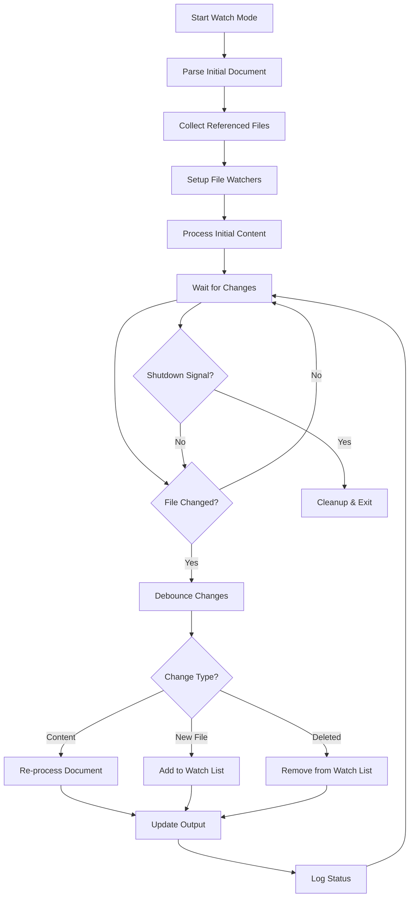
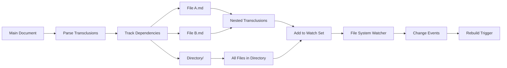

# Watch Mode

## Overview

Enable automatic re-processing of transclusion documents when source files change. This provides a live development experience where documentation updates immediately reflect changes in transcluded content, significantly improving the authoring workflow for dynamic documentation.

## User Story

As a **technical writer**, I want the system to automatically rebuild my documentation when I modify source files so that I can see changes immediately and maintain a fast iterative workflow without manual rebuilds.

## Acceptance Criteria

- [ ] Support `--watch` CLI flag for continuous monitoring
- [ ] Monitor all files referenced by transclusions recursively
- [ ] Detect file changes, additions, and deletions
- [ ] Debounce rapid file changes to avoid excessive rebuilds
- [ ] Display clear status messages about file changes and rebuilds
- [ ] Support graceful shutdown with Ctrl+C
- [ ] Handle file system errors and missing files gracefully
- [ ] Allow exclusion of certain file patterns from watching

## Technical Design

### CLI Usage

```bash
# Watch a single file
markdown-transclusion docs.md --watch

# Watch with output file
markdown-transclusion input.md --output output.md --watch

# Watch with custom patterns
markdown-transclusion docs.md --watch --watch-exclude "*.tmp,*.log"

# Watch with verbose logging
markdown-transclusion docs.md --watch --log-level DEBUG
```

### Watch Flow



### File Dependency Tracking



## Notes

### Implementation Strategy

1. **File System Watching**: Use `chokidar` or Node.js native `fs.watch()`
2. **Dependency Resolution**: Track transclusion dependencies recursively
3. **Debouncing**: Implement ~300ms debounce to handle rapid file changes
4. **Incremental Processing**: Only re-process changed dependency chains when possible

### Watch Configuration

```typescript
interface WatchOptions {
  debounceMs: number;          // Default: 300
  excludePatterns: string[];   // Default: ['*.tmp', '*.log', '.git/**']
  recursive: boolean;          // Default: true
  followSymlinks: boolean;     // Default: false
}
```

### Status Messages

```bash
[16:00:00] Starting watch mode for docs.md
[16:00:00] Watching 5 files for changes...
[16:00:15] File changed: src/api.md
[16:00:15] Rebuilding documentation...
[16:00:16] ✓ Documentation updated (1.2s)
[16:00:45] New file detected: src/new-feature.md
[16:00:45] Added to watch list
^C[16:01:00] Gracefully shutting down watch mode...
```

### Error Handling

```markdown
<!-- File becomes inaccessible -->
[16:00:30] ⚠ File no longer accessible: deleted-file.md
[16:00:30] Continuing with remaining files...

<!-- Permission denied -->
[16:00:45] ✗ Permission denied: protected-file.md
[16:00:45] Skipping file (check permissions)

<!-- Circular dependency detected -->
[16:01:00] ✗ Circular dependency detected: a.md -> b.md -> a.md
[16:01:00] Breaking cycle at: b.md
```

### Performance Considerations

1. **Efficient Watching**: Only watch directories containing referenced files
2. **Smart Rebuilds**: Incremental processing when possible
3. **Memory Management**: Clean up watchers for deleted files
4. **CPU Throttling**: Respect file system event limits

### Integration Points

1. **CLI Integration**: Add to existing argument parser
2. **Stream Processing**: Compatible with existing stream architecture
3. **Error Reporting**: Integrate with existing error handling
4. **Logging**: Use existing logger infrastructure

### Future Enhancements

- **Live Reload**: Browser integration for live documentation preview
- **Parallel Processing**: Process multiple changed files concurrently
- **Smart Ignore**: Automatically ignore common patterns (.git, node_modules)
- **Network Watching**: Support for watching remote files or mounted filesystems
- **Performance Metrics**: Report rebuild times and file change frequency