# Dry Run Mode

## Overview

Enable preview of transclusion processing without generating output files. This allows authors to validate document structure, verify transclusion references, and preview changes before committing to file modifications, reducing the risk of unintended modifications in documentation workflows.

## User Story

As a **documentation team lead**, I want to preview what transclusion processing will produce without modifying files so that I can validate changes and catch errors before applying them to the actual documentation.

## Acceptance Criteria

- [ ] Support `--dry-run` CLI flag that prevents file output
- [ ] Display processed content to stdout for preview
- [ ] Show detailed information about transclusion operations performed
- [ ] Report all files that would be read during processing
- [ ] Validate all transclusion references without processing content
- [ ] Generate summary statistics about the processing operation
- [ ] Compatible with all existing flags and options
- [ ] Provide clear indication that no files were modified

## Technical Design

### CLI Usage

```bash
# Basic dry run
markdown-transclusion docs.md --dry-run

# Dry run with validation
markdown-transclusion docs.md --dry-run --validate-only

# Dry run with detailed output
markdown-transclusion docs.md --dry-run --log-level DEBUG

# Dry run with output file specified (ignored)
markdown-transclusion docs.md --output result.md --dry-run
```

### Processing Flow

```mermaid
flowchart TD
    A[Start Dry Run] --> B[Parse Input Document]
    B --> C[Collect All Transclusions]
    C --> D[Validate File References]
    D --> E{Validation Mode?}
    E -->|Yes| F[Report Validation Results]
    E -->|No| G[Process Content]
    F --> H[Display Summary]
    G --> I[Generate Processed Content]
    I --> J[Display to Stdout]
    J --> K[Report Statistics]
    K --> H
    H --> L[Exit (No Files Written)]
```

### Output Format

```mermaid
flowchart LR
    A[Dry Run Results] --> B[Header Section]
    A --> C[Content Preview]
    A --> D[Statistics Section]
    A --> E[Footer Section]
    
    B --> F["🔍 DRY RUN MODE<br/>No files will be modified"]
    C --> G["Processed Content<br/>(to stdout)"]
    D --> H["Files Read: N<br/>Transclusions: N<br/>Errors: N"]
    E --> I["✓ Dry run completed<br/>Ready for actual processing"]
```



## Notes

### Example Output

```bash
$ markdown-transclusion docs.md --dry-run

🔍 DRY RUN MODE - No files will be modified

Processing: docs.md
├── Reading: sections/intro.md
├── Reading: examples/basic.md  
├── Reading: api/methods.md
└── Reading: troubleshooting.md

=== PROCESSED CONTENT ===
# Documentation

## Introduction
[Content from sections/intro.md]

## Examples  
[Content from examples/basic.md]

## API Reference
[Content from api/methods.md]

## Troubleshooting
[Content from troubleshooting.md]

=== SUMMARY ===
📄 Files processed: 5
🔗 Transclusions resolved: 4  
⚠️  Warnings: 0
❌ Errors: 0
⏱️  Processing time: 0.15s

✓ Dry run completed successfully
  Ready for actual processing with: markdown-transclusion docs.md --output result.md
```

### Implementation Strategy

1. **Flag Processing**: Add `--dry-run` to CLI argument parser
2. **Output Redirection**: Capture output stream instead of writing to file
3. **Statistics Tracking**: Collect metrics during processing
4. **Validation Integration**: Compatible with existing `--validate-only` mode

### Dry Run vs Validation Mode

| Feature | `--dry-run` | `--validate-only` | Combined |
|---------|-------------|-------------------|----------|
| Process content | ✓ | ✗ | ✗ |
| Check references | ✓ | ✓ | ✓ |
| Show content | ✓ | ✗ | ✗ |
| Generate stats | ✓ | ✓ | ✓ |
| Write files | ✗ | ✗ | ✗ |

### Statistics Collected

```typescript
interface DryRunStats {
  filesRead: string[];
  transclusionsResolved: number;
  transclusionsFailed: number;
  processingTimeMs: number;
  totalLines: number;
  outputSize: number;
  warningCount: number;
  errorCount: number;
}
```

### Error Handling

```bash
# Missing file during dry run
🔍 DRY RUN MODE - No files will be modified

Processing: docs.md
├── Reading: sections/intro.md
├── ❌ Missing: sections/missing.md
└── Reading: api/methods.md

=== PROCESSED CONTENT ===
# Documentation
[Content with error comments for missing files]

=== SUMMARY ===
❌ Errors: 1
  - sections/missing.md: File not found

⚠️  Dry run completed with errors
   Fix issues before actual processing
```

### Integration Considerations

1. **Stream Compatibility**: Works with existing TransclusionTransform
2. **Error Handling**: Preserves existing error reporting behavior
3. **Option Conflicts**: Validate flag combinations (dry-run + output file)
4. **Performance**: No additional overhead for file I/O

### Future Enhancements

- **Diff Preview**: Show differences from previous processing
- **Interactive Mode**: Allow user to approve each transclusion
- **Export Options**: Save dry run results to JSON/YAML for analysis
- **Batch Processing**: Dry run multiple files with aggregated results