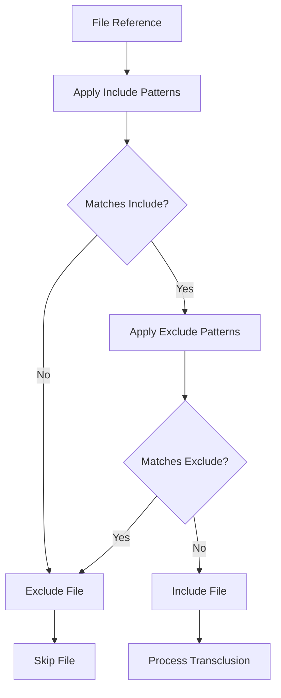
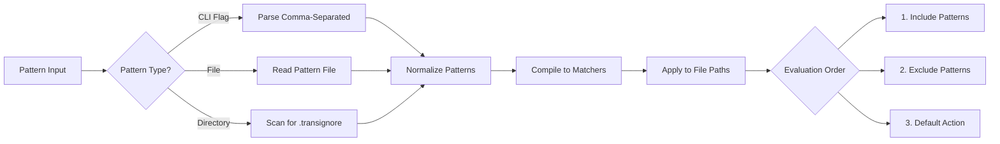

# Include/Exclude Patterns

## Overview

Enable selective file processing through include and exclude pattern specifications. This allows authors to filter transclusion operations based on file paths, names, or content patterns, providing fine-grained control over which files participate in documentation generation workflows.

## User Story

As a **documentation maintainer**, I want to exclude certain files (like drafts, private notes, or temporary files) from transclusion processing so that I can maintain clean documentation output while keeping working files in the same directory structure.

## Acceptance Criteria

- [ ] Support `--exclude` flag with glob patterns: `--exclude "*.draft.md,*.private.md"`
- [ ] Support `--include` flag with glob patterns: `--include "docs/**/*.md"`
- [ ] Support multiple pattern specifications: `--exclude "*.tmp" --exclude "drafts/**"`
- [ ] Apply patterns to both direct file references and directory scanning
- [ ] Support .gitignore-style pattern files: `--exclude-from .transignore`
- [ ] Handle pattern conflicts (include vs exclude) with clear precedence rules
- [ ] Provide pattern validation and helpful error messages
- [ ] Support content-based exclusion patterns for advanced filtering

## Technical Design

### CLI Usage

```bash
# Exclude specific patterns
markdown-transclusion docs.md --exclude "*.draft.md,*.private.md"

# Include only specific patterns  
markdown-transclusion docs.md --include "docs/**/*.md"

# Multiple exclude patterns
markdown-transclusion docs.md --exclude "*.tmp" --exclude "drafts/**"

# Use pattern file
markdown-transclusion docs.md --exclude-from .transignore

# Combined patterns
markdown-transclusion docs.md --include "**/*.md" --exclude "*.private.md"
```

### Pattern Processing Flow



### Pattern Resolution Strategy



## Notes

### Pattern Syntax Support

```bash
# Glob patterns
*.draft.md              # Files ending with .draft.md
**/*.private.md         # Private files in any subdirectory
docs/**/temp/**         # Temp directories under docs
!important.draft.md     # Negation (include despite other excludes)

# Path-based patterns
/absolute/path/**       # Absolute path patterns
./relative/path/**      # Relative path patterns
**/node_modules/**      # Common exclusion patterns
```

### .transignore File Format

```gitignore
# Transclusion ignore patterns
# Comments start with #

# Exclude draft files
*.draft.md
*.wip.md

# Exclude private directories
private/**
internal/**

# Exclude temporary files
*.tmp
*.bak
*~

# Include exceptions (negate with !)
!important.draft.md
!public/private/shared.md
```

### Precedence Rules

1. **Explicit include patterns** (if specified) must match first
2. **Explicit exclude patterns** override includes
3. **Default behavior**: include all files if no patterns specified
4. **Negation patterns** (`!pattern`) override previous exclusions

### Example Processing

```markdown
Files in directory:
- docs/api.md ✓
- docs/tutorial.md ✓  
- docs/api.draft.md ❌ (excluded by *.draft.md)
- internal/secrets.md ❌ (excluded by internal/**)
- drafts/feature.md ❌ (excluded by drafts/**)
- important.draft.md ✓ (included by !important.draft.md)

Command: --include "docs/**" --exclude "*.draft.md" --exclude "internal/**"
```

### Implementation Strategy

1. **Pattern Compilation**: Use `minimatch` or `picomatch` for glob pattern matching
2. **File Discovery**: Apply patterns during file system traversal
3. **Caching**: Cache compiled patterns for performance
4. **Validation**: Validate pattern syntax and warn about potential issues

### Configuration Options

```typescript
interface PatternOptions {
  include: string[];
  exclude: string[];
  excludeFrom?: string;        // Path to ignore file
  caseSensitive: boolean;      // Default: true on Linux/Mac, false on Windows
  followSymlinks: boolean;     // Default: false
  dotfiles: boolean;          // Include hidden files, default: false
}
```

### Error Handling

```bash
# Invalid pattern syntax
$ markdown-transclusion docs.md --exclude "[invalid"
Error: Invalid glob pattern: [invalid
       Missing closing bracket

# Conflicting patterns
$ markdown-transclusion docs.md --include "*.md" --exclude "**/*.md"
Warning: Exclude pattern '**/*.md' may override all includes
         No files will be processed

# Pattern file not found  
$ markdown-transclusion docs.md --exclude-from missing.ignore
Error: Pattern file not found: missing.ignore
```

### Performance Considerations

1. **Early Filtering**: Apply patterns during file discovery, not after content loading
2. **Pattern Compilation**: Compile patterns once, reuse for multiple files
3. **Directory Pruning**: Skip entire directories that match exclude patterns
4. **Memory Efficiency**: Stream file lists rather than loading all paths

### Integration Points

1. **File Resolution**: Integrate with existing path resolution logic
2. **Directory Scanning**: Enhance directory traversal with pattern filtering
3. **Error Reporting**: Include pattern match information in error messages
4. **Caching**: Compatible with existing file caching mechanisms

### Future Enhancements

- **Content-based patterns**: Exclude files based on frontmatter or content patterns
- **Date-based filtering**: Include/exclude based on file modification times
- **Size-based filtering**: Skip files above/below certain size thresholds
- **Interactive pattern building**: CLI helper to build patterns interactively