# Conditional Transclusion

## Overview

Enable conditional inclusion of content based on variable values, environment settings, or file properties. This allows authors to create adaptive documentation that includes different content for different contexts (development vs production, different languages, feature flags, etc.) while maintaining a single source of truth.

## User Story

As a **multilingual content creator**, I want to conditionally include content based on variables or environment settings so that I can generate different versions of documentation (language-specific, environment-specific, or feature-specific) from the same source files.

## Acceptance Criteria

- [ ] Support conditional syntax: `![[file.md?condition=value]]`
- [ ] Support multiple conditions: `![[file.md?env=prod&feature=enabled]]`
- [ ] Support negation: `![[file.md?!debug]]` (include when debug is false/unset)
- [ ] Support existence checks: `![[file.md?var]]` (include when var exists)
- [ ] Support comparison operators: `![[file.md?version>=2.0]]`
- [ ] Handle missing conditions gracefully with configurable behavior
- [ ] Support condition evaluation from CLI variables and environment variables
- [ ] Allow default fallback files: `![[file.md?env=dev]] || ![[fallback.md]]`

## Technical Design

### Conditional Syntax

```markdown
<!-- Simple existence check -->
![[features.md?premium]]

<!-- Value comparison -->
![[setup-guide.md?env=production]]

<!-- Multiple conditions (AND) -->
![[advanced-config.md?env=prod&feature=beta]]

<!-- Negation -->
![[debug-info.md?!production]]

<!-- Comparison operators -->
![[migration-guide.md?version>=2.0]]

<!-- Fallback chains -->
![[content-{{lang}}.md?lang]] || ![[content-en.md]]
```

### Condition Evaluation Flow

```mermaid
flowchart TD
    A[Parse Transclusion] --> B{Has Conditions?}
    B -->|No| C[Normal Processing]
    B -->|Yes| D[Parse Condition String]
    D --> E[Evaluate Each Condition]
    E --> F{All Conditions True?}
    F -->|Yes| G[Include File]
    F -->|No| H{Has Fallback?}
    H -->|Yes| I[Try Next Option]
    H -->|No| J[Skip/Generate Comment]
    I --> A
    G --> K[Process Content]
    J --> L[Continue Processing]
```



### Condition Types


## Notes

### Condition Grammar

```
conditional_ref := "![[" file_path "?" condition_expr "]]" fallback?
condition_expr  := condition ("&" condition)*
condition       := negation? variable comparison? value?
negation        := "!"
comparison      := "=" | "!=" | ">" | "<" | ">=" | "<="
fallback        := " || " conditional_ref
```

### Variable Sources

1. **CLI Variables**: From `--variables` flag
2. **Environment Variables**: From `process.env`
3. **File Properties**: File metadata (size, date, etc.)
4. **Computed Values**: Dynamic values (current date, version, etc.)

```typescript
interface ConditionContext {
  variables: Record<string, string>;     // CLI variables
  environment: Record<string, string>;   // Environment variables
  file: {                               // File metadata
    path: string;
    size: number;
    modified: Date;
  };
  computed: {                           // Computed values
    date: string;
    timestamp: number;
  };
}
```

### Example Usage Scenarios

#### Multi-Environment Documentation

```markdown
# Setup Guide

![[setup-local.md?env=development]]
![[setup-staging.md?env=staging]]
![[setup-production.md?env=production]]

## Configuration

![[config-dev.md?env=development]]
![[config-prod.md?env=production]]
```

#### Feature Flag Documentation

```markdown
# Features

## Core Features
![[core-features.md]]

## Beta Features
![[beta-features.md?beta_enabled]]

## Premium Features  
![[premium-features.md?plan=premium]]
```

#### Version-Specific Content

```markdown
# Migration Guide

![[migrate-v1-to-v2.md?from_version<2.0]]
![[migrate-v2-to-v3.md?from_version>=2.0&from_version<3.0]]
![[migrate-v3-plus.md?from_version>=3.0]]
```

### Implementation Strategy

1. **Condition Parsing**: Extend existing transclusion reference parser
2. **Variable Resolution**: Create variable context from multiple sources
3. **Condition Evaluation**: Implement boolean expression evaluator
4. **Fallback Handling**: Support fallback chains with recursive evaluation

### Error Handling

```markdown
<!-- Undefined variable with strict mode -->
![[file.md?undefined_var=value]]
<!-- Result in strict mode: -->
<!-- Error: Condition variable 'undefined_var' not defined -->

<!-- Undefined variable with lenient mode -->
<!-- Result: File skipped, no error -->

<!-- Invalid comparison -->
![[file.md?version>="not_a_number"]]
<!-- Result: -->
<!-- Error: Invalid comparison: cannot compare version with "not_a_number" -->
```

### Performance Considerations

1. **Condition Caching**: Cache parsed conditions for repeated evaluation
2. **Variable Resolution**: Resolve variables once per processing session
3. **Short-circuit Evaluation**: Stop on first false condition in AND chains
4. **File System Access**: Only attempt file access if conditions pass

### Configuration Options

```typescript
interface ConditionalOptions {
  undefinedBehavior: 'error' | 'skip' | 'include';  // Default: 'skip'
  caseSensitive: boolean;                           // Default: true
  numericComparison: boolean;                       // Default: true (try numeric first)
  allowEnvironmentVariables: boolean;               // Default: true
}
```

### Future Enhancements

- **Complex Expressions**: Support `||` (OR) and parentheses in conditions
- **Regular Expressions**: Pattern matching conditions: `![[file.md?path~=/docs\/.*\/]`
- **Date/Time Conditions**: Time-based inclusion: `![[schedule.md?hour>=9&hour<17]]`
- **Content-based Conditions**: Conditional inclusion based on file content or frontmatter
- **Condition Debugging**: `--debug-conditions` flag to show evaluation results