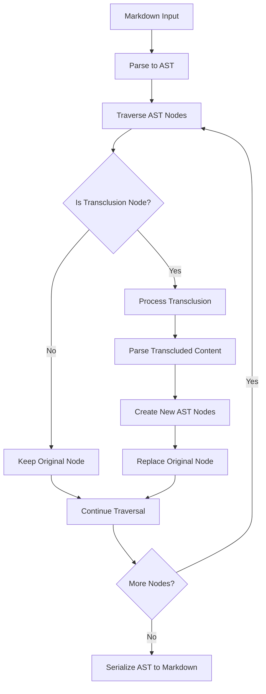

# AST-Based Parsing

## Overview

Replace the current regex-based transclusion parsing with Abstract Syntax Tree (AST) based parsing for more robust and extensible content processing. This enables better handling of complex markdown structures, improved error reporting, and easier implementation of advanced features while maintaining backward compatibility.

## User Story

As a **library maintainer**, I want to use AST-based parsing instead of regex so that the system can handle complex markdown structures more reliably, provide better error messages, and support advanced features without fragile pattern matching.

## Acceptance Criteria

- [ ] Parse markdown into AST using established markdown parser (remark/unified)
- [ ] Identify transclusion nodes within the AST structure
- [ ] Process transclusions while preserving AST node relationships
- [ ] Maintain backward compatibility with existing transclusion syntax
- [ ] Provide enhanced error reporting with precise line/column information
- [ ] Support plugin architecture for extending parsing capabilities
- [ ] Handle nested markdown structures correctly (lists, tables, code blocks)
- [ ] Preserve markdown formatting and structure integrity

## Technical Design

### Architecture Overview



### AST Node Processing

```mermaid
flowchart LR
    A[AST Tree] --> B[Text Nodes]
    A --> C[Paragraph Nodes]
    A --> D[List Nodes]
    A --> E[Code Block Nodes]
    
    B --> F[Scan for ![[...]] Pattern]
    C --> F
    D --> F
    E --> G[Skip Processing]
    
    F --> H[Create Transclusion Node]
    H --> I[Process & Replace]
    G --> J[Preserve Original]
    I --> K[Updated AST]
    J --> K
```

### Plugin Architecture

```mermaid
flowchart TD
    A[Unified Processor] --> B[Remark Parser]
    B --> C[Transclusion Plugin]
    C --> D[Variable Plugin]
    D --> E[Heading Plugin]
    E --> F[Line Range Plugin]
    F --> G[Code Block Plugin]
    G --> H[Remark Stringify]
    
    C --> I[Process ![[...]] Syntax]
    D --> J[Handle {{var}} Substitution]
    E --> K[Extract Heading Sections]
    F --> L[Apply Line Ranges]
    G --> M[Extract Code Blocks]
```

## Notes

### Implementation Strategy

1. **Parser Selection**: Use `remark` (unified ecosystem) for robust markdown parsing
2. **Plugin Development**: Create custom plugins for transclusion processing
3. **Node Transformation**: Transform AST nodes rather than string manipulation
4. **Error Handling**: Leverage AST position information for precise error reporting

### Dependencies

```json
{
  "dependencies": {
    "remark": "^15.0.0",
    "remark-parse": "^11.0.0", 
    "remark-stringify": "^11.0.0",
    "unified": "^11.0.0",
    "unist-util-visit": "^5.0.0",
    "unist-util-position": "^5.0.0"
  }
}
```

### AST Node Structure

```typescript
interface TransclusionNode extends Node {
  type: 'transclusion';
  value: string;                    // Original ![[...]] text
  reference: {
    file: string;
    heading?: string;
    lineRange?: [number, number];
    variables?: Record<string, string>;
    conditions?: ConditionExpression[];
  };
  position: Position;               // Line/column information
}
```

### Processing Pipeline

```typescript
import { unified } from 'unified';
import remarkParse from 'remark-parse';
import remarkStringify from 'remark-stringify';
import { transclusionPlugin } from './plugins/transclusion';

const processor = unified()
  .use(remarkParse)
  .use(transclusionPlugin, {
    basePath: options.basePath,
    variables: options.variables,
    // ... other options
  })
  .use(remarkStringify);

const result = await processor.process(content);
```

### Enhanced Error Reporting

```typescript
// Before (regex-based)
Error: File not found: missing.md

// After (AST-based)
Error: File not found: missing.md
  at line 15, column 3-25
  in ![[missing.md#section]]
     ^^^^^^^^^^^^^^^^^^^^^
  Context: ## Installation section
```

### Benefits of AST Approach

1. **Robustness**: Handle complex markdown structures correctly
2. **Precision**: Exact error locations with line/column information
3. **Extensibility**: Plugin architecture for new features
4. **Standards Compliance**: Use established markdown parsing libraries
5. **Performance**: More efficient processing of large documents
6. **Maintainability**: Cleaner code separation and testing

### Migration Strategy

1. **Gradual Migration**: Implement AST parsing alongside existing regex system
2. **Feature Flag**: Allow users to opt into AST mode for testing
3. **Compatibility Testing**: Ensure identical output for existing use cases
4. **Performance Benchmarking**: Compare processing speed and memory usage
5. **Documentation Updates**: Update examples to leverage new capabilities

### Advanced Features Enabled

With AST-based parsing, these features become much more feasible:

- **Markdown-aware processing**: Respect code block boundaries, link contexts
- **Precise positioning**: Error messages with exact line/column locations
- **Structure preservation**: Maintain proper nesting and formatting
- **Plugin ecosystem**: Leverage existing remark plugins for additional features
- **Streaming support**: Process large documents efficiently

### Performance Considerations

1. **Memory Usage**: AST requires more memory than string processing
2. **Processing Speed**: Initial parsing overhead, but more efficient transformations
3. **Caching**: Cache parsed AST for repeated processing
4. **Optimization**: Use visitor patterns for efficient tree traversal

### Future Enhancements

- **Custom Node Types**: Define specific AST nodes for different transclusion types
- **Validation Plugins**: AST-based validation of transclusion references
- **Transformation Plugins**: Pre/post-processing transformations
- **Integration**: Better integration with other remark/unified ecosystem tools