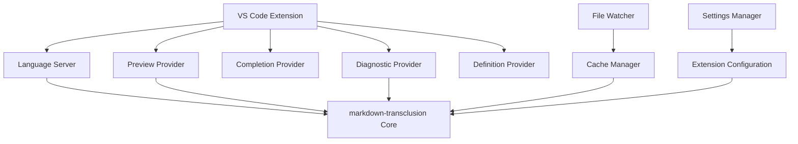

# VS Code Extension for Transclusion Preview

## Overview

Create a VS Code extension that provides real-time preview, syntax highlighting, and intelligent editing features for markdown files using transclusion syntax, enhancing the developer experience for documentation workflows.

## User Story

As a **documentation author using VS Code**, I want an extension that shows transclusion previews inline and provides intelligent editing features so that I can write and maintain complex documentation more efficiently.

## Acceptance Criteria

- [ ] Real-time transclusion preview in editor
- [ ] Syntax highlighting for `![[]]` transclusion syntax
- [ ] IntelliSense for file paths and heading names
- [ ] Click-to-navigate to transcluded files
- [ ] Inline error display for broken transclusions
- [ ] Command palette integration
- [ ] Settings for customization
- [ ] Support for all transclusion features (headings, variables, ranges)

## Technical Design

### Extension Architecture



### Core Features

#### 1. Transclusion Preview
```typescript
class TransclusionPreviewProvider implements vscode.CodeLensProvider {
  async provideCodeLenses(
    document: vscode.TextDocument,
    token: vscode.CancellationToken
  ): Promise<vscode.CodeLens[]> {
    const transclusions = await this.findTransclusions(document);
    
    return transclusions.map(transclusion => new vscode.CodeLens(
      transclusion.range,
      {
        title: "📄 Preview Transclusion",
        command: "markdownTransclusion.preview",
        arguments: [transclusion]
      }
    ));
  }
}
```

#### 2. Syntax Highlighting
```json
{
  "contributes": {
    "grammars": [{
      "language": "markdown",
      "scopeName": "text.html.markdown.transclusion",
      "path": "./syntaxes/markdown-transclusion.tmLanguage.json",
      "injectTo": ["text.html.markdown"]
    }]
  }
}
```

#### 3. File Path Completion
```typescript
class TransclusionCompletionProvider implements vscode.CompletionItemProvider {
  async provideCompletionItems(
    document: vscode.TextDocument,
    position: vscode.Position,
    token: vscode.CancellationToken
  ): Promise<vscode.CompletionItem[]> {
    const line = document.lineAt(position);
    const transclusionMatch = line.text.match(/!\[\[([^\]]*)/);
    
    if (!transclusionMatch) return [];
    
    const partialPath = transclusionMatch[1];
    const files = await this.findMatchingFiles(partialPath);
    
    return files.map(file => {
      const item = new vscode.CompletionItem(file.path, vscode.CompletionItemKind.File);
      item.detail = file.description;
      item.insertText = file.path;
      return item;
    });
  }
}
```

#### 4. Heading Completion
```typescript
class HeadingCompletionProvider implements vscode.CompletionItemProvider {
  async provideCompletionItems(
    document: vscode.TextDocument,
    position: vscode.Position
  ): Promise<vscode.CompletionItem[]> {
    const line = document.lineAt(position);
    const headingMatch = line.text.match(/!\[\[([^#]*#)([^\]]*)/);
    
    if (!headingMatch) return [];
    
    const filePath = headingMatch[1].slice(0, -1); // Remove #
    const partialHeading = headingMatch[2];
    
    const headings = await this.extractHeadings(filePath);
    
    return headings
      .filter(h => h.toLowerCase().includes(partialHeading.toLowerCase()))
      .map(heading => {
        const item = new vscode.CompletionItem(heading, vscode.CompletionItemKind.Reference);
        item.insertText = heading;
        item.detail = `Heading in ${filePath}`;
        return item;
      });
  }
}
```

### User Interface Features

#### 1. Inline Preview (CodeLens)
```typescript
class InlinePreviewCodeLens extends vscode.CodeLens {
  constructor(
    range: vscode.Range,
    private transclusion: TransclusionReference
  ) {
    super(range, {
      title: `📄 ${transclusion.targetFile}${transclusion.heading ? '#' + transclusion.heading : ''}`,
      command: 'markdownTransclusion.showPreview',
      arguments: [transclusion]
    });
  }
}
```

#### 2. Hover Preview
```typescript
class TransclusionHoverProvider implements vscode.HoverProvider {
  async provideHover(
    document: vscode.TextDocument,
    position: vscode.Position
  ): Promise<vscode.Hover | undefined> {
    const transclusion = this.getTransclusionAtPosition(document, position);
    if (!transclusion) return undefined;
    
    try {
      const content = await this.resolveTransclusion(transclusion);
      const preview = content.substring(0, 200) + (content.length > 200 ? '...' : '');
      
      return new vscode.Hover([
        new vscode.MarkdownString(`**Preview:** ${transclusion.reference}`),
        new vscode.MarkdownString('```markdown\n' + preview + '\n```')
      ]);
    } catch (error) {
      return new vscode.Hover([
        new vscode.MarkdownString(`❌ **Error:** ${error.message}`)
      ]);
    }
  }
}
```

#### 3. Diagnostics (Error Highlighting)
```typescript
class TransclusionDiagnosticProvider {
  async updateDiagnostics(document: vscode.TextDocument): Promise<void> {
    const diagnostics: vscode.Diagnostic[] = [];
    const transclusions = await this.findTransclusions(document);
    
    for (const transclusion of transclusions) {
      try {
        await this.validateTransclusion(transclusion);
      } catch (error) {
        diagnostics.push(new vscode.Diagnostic(
          transclusion.range,
          error.message,
          vscode.DiagnosticSeverity.Error
        ));
      }
    }
    
    this.diagnosticCollection.set(document.uri, diagnostics);
  }
}
```

### Commands and Features

#### Command Palette Commands
```json
{
  "contributes": {
    "commands": [
      {
        "command": "markdownTransclusion.preview",
        "title": "Preview Transclusion",
        "category": "Markdown Transclusion"
      },
      {
        "command": "markdownTransclusion.refreshCache",
        "title": "Refresh File Cache",
        "category": "Markdown Transclusion"
      },
      {
        "command": "markdownTransclusion.validateAll",
        "title": "Validate All Transclusions",
        "category": "Markdown Transclusion"
      },
      {
        "command": "markdownTransclusion.insertTransclusion",
        "title": "Insert Transclusion Reference",
        "category": "Markdown Transclusion"
      }
    ]
  }
}
```

#### Context Menu Integration
```json
{
  "contributes": {
    "menus": {
      "editor/context": [
        {
          "command": "markdownTransclusion.preview",
          "when": "editorTextFocus && resourceExtname == .md"
        }
      ],
      "explorer/context": [
        {
          "command": "markdownTransclusion.insertTransclusion",
          "when": "resourceExtname == .md"
        }
      ]
    }
  }
}
```

### Settings Configuration

```json
{
  "contributes": {
    "configuration": {
      "title": "Markdown Transclusion",
      "properties": {
        "markdownTransclusion.enablePreview": {
          "type": "boolean",
          "default": true,
          "description": "Enable inline transclusion preview"
        },
        "markdownTransclusion.basePath": {
          "type": "string",
          "default": "",
          "description": "Base path for resolving transclusion references"
        },
        "markdownTransclusion.maxPreviewLength": {
          "type": "number",
          "default": 200,
          "description": "Maximum length of hover preview content"
        },
        "markdownTransclusion.enableDiagnostics": {
          "type": "boolean",
          "default": true,
          "description": "Show error diagnostics for broken transclusions"
        },
        "markdownTransclusion.refreshInterval": {
          "type": "number",
          "default": 1000,
          "description": "File cache refresh interval in milliseconds"
        }
      }
    }
  }
}
```

### File Tree Integration

#### File Explorer Context Menu
```typescript
class FileExplorerIntegration {
  registerCommands(context: vscode.ExtensionContext) {
    context.subscriptions.push(
      vscode.commands.registerCommand(
        'markdownTransclusion.insertTransclusionFromExplorer',
        (uri: vscode.Uri) => this.insertTransclusionReference(uri)
      )
    );
  }
  
  private async insertTransclusionReference(uri: vscode.Uri) {
    const editor = vscode.window.activeTextEditor;
    if (!editor) return;
    
    const relativePath = vscode.workspace.asRelativePath(uri);
    const reference = `![[${relativePath}]]`;
    
    await editor.edit(editBuilder => {
      editBuilder.insert(editor.selection.active, reference);
    });
  }
}
```

### Preview Panel

#### Dedicated Preview Tab
```typescript
class TransclusionPreviewPanel {
  private static currentPanel: TransclusionPreviewPanel | undefined;
  
  public static createOrShow(extensionUri: vscode.Uri, transclusion: TransclusionReference) {
    const column = vscode.window.activeTextEditor
      ? vscode.window.activeTextEditor.viewColumn
      : undefined;
    
    if (TransclusionPreviewPanel.currentPanel) {
      TransclusionPreviewPanel.currentPanel.panel.reveal(column);
      TransclusionPreviewPanel.currentPanel.update(transclusion);
      return;
    }
    
    const panel = vscode.window.createWebviewPanel(
      'transclusionPreview',
      'Transclusion Preview',
      column || vscode.ViewColumn.One,
      {
        enableScripts: true,
        localResourceRoots: [vscode.Uri.joinPath(extensionUri, 'media')]
      }
    );
    
    TransclusionPreviewPanel.currentPanel = new TransclusionPreviewPanel(panel, extensionUri);
    TransclusionPreviewPanel.currentPanel.update(transclusion);
  }
  
  private async update(transclusion: TransclusionReference) {
    const content = await this.resolveTransclusion(transclusion);
    this.panel.webview.html = this.getWebviewContent(content);
  }
}
```

### Language Server Integration

#### LSP Server
```typescript
class TransclusionLanguageServer {
  connection: lsp.Connection;
  documents: lsp.TextDocuments<lsp.TextDocument>;
  
  constructor() {
    this.connection = lsp.createConnection(lsp.ProposedFeatures.all);
    this.documents = new lsp.TextDocuments(lsp.TextDocument);
    
    this.documents.onDidChangeContent(this.validateDocument.bind(this));
    this.connection.onCompletion(this.onCompletion.bind(this));
    this.connection.onDefinition(this.onDefinition.bind(this));
    this.connection.onHover(this.onHover.bind(this));
  }
  
  private async validateDocument(change: lsp.TextDocumentChangeEvent<lsp.TextDocument>) {
    const diagnostics = await this.validateTransclusions(change.document);
    this.connection.sendDiagnostics({ uri: change.document.uri, diagnostics });
  }
}
```

## Implementation Strategy

### Phase 1: Basic Extension
1. Extension scaffolding and manifest
2. Basic syntax highlighting
3. Simple transclusion detection
4. File path completion

### Phase 2: Core Features
1. Inline preview (CodeLens)
2. Hover preview
3. Error diagnostics
4. Click-to-navigate

### Phase 3: Advanced Features
1. Heading completion
2. Variable support
3. Settings configuration
4. Command palette integration

### Phase 4: Polish
1. Preview panel
2. File explorer integration
3. Language server
4. Performance optimization

## Testing Strategy

### Unit Tests
- Transclusion parsing
- Completion providers
- Diagnostic generation
- Settings management

### Integration Tests
- VS Code API integration
- File system operations
- Extension activation
- Command execution

### Manual Tests
- User experience scenarios
- Performance with large files
- Error handling
- Cross-platform compatibility

## Distribution

### VS Code Marketplace
- Extension packaging
- Marketplace metadata
- Screenshots and documentation
- Version management

### GitHub Releases
- Open source repository
- Issue tracking
- Contributing guidelines
- Release automation

## Future Enhancements

- Multi-workspace support
- Collaborative editing features
- Integration with Git workflow
- Advanced search and navigation
- Custom theme support
- Plugin system integration