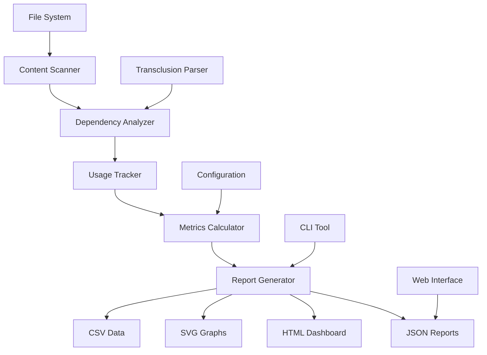

# Content Analytics & Dependency Graphs

## Overview

Implement comprehensive content analytics and dependency visualization tools that provide insights into documentation structure, usage patterns, and relationships between files, enabling better content organization and maintenance.

## User Story

As a **documentation maintainer**, I want to visualize and analyze the relationships between my documentation files so that I can identify dependencies, unused content, and optimization opportunities.

## Acceptance Criteria

- [ ] Generate dependency graphs showing file relationships
- [ ] Analyze transclusion usage patterns and statistics
- [ ] Detect circular dependencies and orphaned files
- [ ] Provide content complexity metrics
- [ ] Export analytics in multiple formats (JSON, HTML, SVG)
- [ ] CLI commands for analytics generation
- [ ] Interactive web-based dependency viewer
- [ ] Integration with documentation workflows

## Technical Design

### Analytics Engine Architecture



### Core Analytics Components

#### 1. Dependency Graph Generator

```typescript
interface FileDependency {
  source: string;
  target: string;
  type: 'transclusion' | 'heading' | 'variable';
  reference: string;
  line: number;
  confidence: number;
}

interface DependencyGraph {
  nodes: FileNode[];
  edges: FileDependency[];
  clusters: FileCluster[];
  metrics: GraphMetrics;
}

class DependencyAnalyzer {
  async analyzeDependencies(basePath: string): Promise<DependencyGraph> {
    const files = await this.scanMarkdownFiles(basePath);
    const dependencies: FileDependency[] = [];
    
    for (const file of files) {
      const transclusions = await this.extractTransclusions(file);
      dependencies.push(...transclusions);
    }
    
    return {
      nodes: this.createNodes(files, dependencies),
      edges: dependencies,
      clusters: this.detectClusters(dependencies),
      metrics: this.calculateMetrics(files, dependencies)
    };
  }
}
```

#### 2. Usage Pattern Analysis

```typescript
interface UsageStats {
  totalFiles: number;
  totalTransclusions: number;
  mostReferencedFiles: FileUsage[];
  leastReferencedFiles: FileUsage[];
  orphanedFiles: string[];
  circularDependencies: CircularDependency[];
  deepestNesting: number;
  averageFileSize: number;
}

interface FileUsage {
  filePath: string;
  incomingReferences: number;
  outgoingReferences: number;
  transclusionTypes: Record<string, number>;
  lastModified: Date;
  size: number;
}

class UsageAnalyzer {
  analyzeUsagePatterns(graph: DependencyGraph): UsageStats {
    const fileUsage = this.calculateFileUsage(graph);
    const orphans = this.findOrphanedFiles(graph);
    const circular = this.detectCircularDependencies(graph);
    
    return {
      totalFiles: graph.nodes.length,
      totalTransclusions: graph.edges.length,
      mostReferencedFiles: fileUsage.sort((a, b) => b.incomingReferences - a.incomingReferences).slice(0, 10),
      leastReferencedFiles: fileUsage.filter(f => f.incomingReferences === 0),
      orphanedFiles: orphans,
      circularDependencies: circular,
      deepestNesting: this.calculateMaxDepth(graph),
      averageFileSize: this.calculateAverageSize(fileUsage)
    };
  }
}
```

#### 3. Content Complexity Metrics

```typescript
interface ComplexityMetrics {
  files: FileComplexity[];
  overall: OverallComplexity;
}

interface FileComplexity {
  filePath: string;
  lines: number;
  headings: number;
  transclusionCount: number;
  variableCount: number;
  nestingDepth: number;
  cyclomaticComplexity: number;
  maintainabilityIndex: number;
}

class ComplexityAnalyzer {
  calculateComplexity(basePath: string): Promise<ComplexityMetrics> {
    // Calculate various complexity metrics for each file
    // Similar to code complexity but for documentation
  }
}
```

### Visualization Components

#### 1. Interactive Dependency Graph

```typescript
class InteractiveDependencyViewer {
  private svg: d3.Selection<SVGGElement, unknown, null, undefined>;
  private simulation: d3.Simulation<FileNode, FileDependency>;
  
  render(graph: DependencyGraph, container: HTMLElement) {
    this.svg = d3.select(container)
      .append('svg')
      .attr('width', '100%')
      .attr('height', '100%');
    
    this.simulation = d3.forceSimulation(graph.nodes)
      .force('link', d3.forceLink(graph.edges).id(d => d.id))
      .force('charge', d3.forceManyBody().strength(-300))
      .force('center', d3.forceCenter(400, 300));
    
    this.renderNodes(graph.nodes);
    this.renderEdges(graph.edges);
    this.addInteractivity();
  }
  
  private addInteractivity() {
    // Zoom, pan, click handlers
    // Node highlighting on hover
    // Edge filtering by type
    // Search functionality
  }
}
```

#### 2. Analytics Dashboard

```html
<!DOCTYPE html>
<html>
<head>
  <title>Documentation Analytics Dashboard</title>
  <script src="https://d3js.org/d3.v7.min.js"></script>
  <link rel="stylesheet" href="dashboard.css">
</head>
<body>
  <div class="dashboard">
    <header>
      <h1>Documentation Analytics</h1>
      <div class="filters">
        <select id="fileFilter">
          <option value="all">All Files</option>
          <option value="referenced">Referenced Only</option>
          <option value="orphaned">Orphaned Only</option>
        </select>
      </div>
    </header>
    
    <div class="metrics-grid">
      <div class="metric-card">
        <h3>Total Files</h3>
        <span class="metric-value" id="totalFiles">0</span>
      </div>
      <div class="metric-card">
        <h3>Total Transclusions</h3>
        <span class="metric-value" id="totalTransclusions">0</span>
      </div>
      <div class="metric-card">
        <h3>Orphaned Files</h3>
        <span class="metric-value" id="orphanedFiles">0</span>
      </div>
      <div class="metric-card">
        <h3>Circular Dependencies</h3>
        <span class="metric-value" id="circularDeps">0</span>
      </div>
    </div>
    
    <div class="visualization-container">
      <div class="graph-panel">
        <h2>Dependency Graph</h2>
        <div id="dependencyGraph"></div>
      </div>
      
      <div class="analysis-panel">
        <h2>Usage Analysis</h2>
        <div id="usageCharts"></div>
      </div>
    </div>
    
    <div class="details-panel">
      <h2>File Details</h2>
      <table id="fileTable">
        <thead>
          <tr>
            <th>File</th>
            <th>Size</th>
            <th>Incoming Refs</th>
            <th>Outgoing Refs</th>
            <th>Complexity</th>
            <th>Last Modified</th>
          </tr>
        </thead>
        <tbody></tbody>
      </table>
    </div>
  </div>
  
  <script src="dashboard.js"></script>
</body>
</html>
```

### CLI Integration

#### Analytics Commands

```typescript
// CLI commands for analytics
export const analyticsCommands = {
  'analyze': {
    description: 'Generate comprehensive documentation analytics',
    options: {
      '--output': 'Output format (json|html|csv)',
      '--include-graphs': 'Include dependency graphs in output',
      '--depth': 'Maximum analysis depth',
      '--exclude': 'Patterns to exclude from analysis'
    },
    handler: async (args: AnalyticsArgs) => {
      const analyzer = new DocumentationAnalyzer();
      const results = await analyzer.analyze(args.basePath, args);
      await this.exportResults(results, args.output);
    }
  },
  
  'graph': {
    description: 'Generate dependency graph visualization',
    options: {
      '--format': 'Output format (svg|png|html)',
      '--layout': 'Graph layout algorithm (force|hierarchy|circular)',
      '--interactive': 'Generate interactive HTML graph'
    },
    handler: async (args: GraphArgs) => {
      const grapher = new DependencyGrapher();
      await grapher.generateGraph(args.basePath, args);
    }
  },
  
  'stats': {
    description: 'Show quick statistics about documentation',
    handler: async (args: StatsArgs) => {
      const stats = await this.calculateQuickStats(args.basePath);
      console.table(stats);
    }
  }
};
```

#### Usage Examples

```bash
# Generate comprehensive analytics report
markdown-transclusion analyze docs/ --output html --include-graphs

# Create interactive dependency graph
markdown-transclusion graph docs/ --format html --interactive

# Show quick statistics
markdown-transclusion stats docs/

# Export dependency data as JSON
markdown-transclusion analyze docs/ --output json > analytics.json

# Generate SVG dependency graph
markdown-transclusion graph docs/ --format svg --layout hierarchy > deps.svg
```

### Export Formats

#### 1. JSON Analytics Report

```json
{
  "metadata": {
    "generated": "2025-06-18T21:00:00Z",
    "basePath": "/docs",
    "totalFiles": 150,
    "version": "1.0.0"
  },
  "dependencies": {
    "nodes": [
      {
        "id": "index.md",
        "path": "/docs/index.md",
        "size": 2048,
        "type": "markdown",
        "lastModified": "2025-06-15T10:30:00Z"
      }
    ],
    "edges": [
      {
        "source": "index.md",
        "target": "getting-started.md",
        "type": "transclusion",
        "reference": "![[getting-started.md]]",
        "line": 15
      }
    ]
  },
  "usage": {
    "mostReferenced": [
      {
        "file": "shared/header.md",
        "references": 25
      }
    ],
    "orphaned": [
      "old/deprecated.md",
      "drafts/unfinished.md"
    ],
    "circular": [
      {
        "cycle": ["a.md", "b.md", "c.md", "a.md"],
        "depth": 3
      }
    ]
  },
  "complexity": {
    "averageFileSize": 1024,
    "maxNestingDepth": 5,
    "totalTransclusions": 89
  }
}
```

#### 2. CSV Export

```csv
File,Size,Incoming_Refs,Outgoing_Refs,Complexity_Score,Last_Modified
index.md,2048,0,5,3.2,2025-06-15T10:30:00Z
getting-started.md,1024,3,2,2.1,2025-06-14T15:20:00Z
api/reference.md,4096,8,0,4.5,2025-06-16T09:45:00Z
```

#### 3. HTML Dashboard Export

Self-contained HTML file with embedded D3.js visualizations, CSS styling, and interactive features.

### Integration Opportunities

#### CI/CD Integration

```yaml
# .github/workflows/docs-analytics.yml
name: Documentation Analytics

on:
  push:
    paths:
      - 'docs/**'
  pull_request:
    paths:
      - 'docs/**'

jobs:
  analyze:
    runs-on: ubuntu-latest
    steps:
      - uses: actions/checkout@v3
      
      - name: Setup Node.js
        uses: actions/setup-node@v3
        with:
          node-version: '18'
      
      - name: Install markdown-transclusion
        run: npm install -g markdown-transclusion
      
      - name: Generate analytics
        run: |
          markdown-transclusion analyze docs/ --output json > analytics.json
          markdown-transclusion graph docs/ --format svg > dependency-graph.svg
      
      - name: Upload analytics artifacts
        uses: actions/upload-artifact@v3
        with:
          name: documentation-analytics
          path: |
            analytics.json
            dependency-graph.svg
      
      - name: Comment on PR
        if: github.event_name == 'pull_request'
        uses: actions/github-script@v6
        with:
          script: |
            const fs = require('fs');
            const analytics = JSON.parse(fs.readFileSync('analytics.json', 'utf8'));
            
            const comment = `
            📊 **Documentation Analytics**
            
            - Total files: ${analytics.metadata.totalFiles}
            - Total transclusions: ${analytics.complexity.totalTransclusions}
            - Orphaned files: ${analytics.usage.orphaned.length}
            - Circular dependencies: ${analytics.usage.circular.length}
            
            [View full report](${process.env.GITHUB_SERVER_URL}/${process.env.GITHUB_REPOSITORY}/actions/runs/${process.env.GITHUB_RUN_ID})
            `;
            
            github.rest.issues.createComment({
              issue_number: context.issue.number,
              owner: context.repo.owner,
              repo: context.repo.repo,
              body: comment
            });
```

## Implementation Strategy

### Phase 1: Core Analytics
1. File scanning and dependency extraction
2. Basic graph generation
3. Usage statistics calculation
4. JSON export format

### Phase 2: Visualization
1. SVG graph generation
2. Interactive HTML dashboard
3. D3.js integration
4. CSS styling and responsive design

### Phase 3: CLI Integration
1. Analytics command implementation
2. Multiple export formats
3. Configuration options
4. Performance optimization

### Phase 4: Advanced Features
1. Real-time analytics updates
2. Historical trend analysis
3. CI/CD integration templates
4. Custom metric plugins

## Testing Strategy

### Unit Tests
- Dependency detection accuracy
- Graph algorithm correctness
- Metrics calculation validation
- Export format compliance

### Integration Tests
- Large documentation set analysis
- Performance with complex graphs
- CLI command functionality
- Export format compatibility

### Visual Tests
- Graph rendering accuracy
- Dashboard functionality
- Interactive feature behavior
- Cross-browser compatibility

## Performance Considerations

- Incremental analysis for large document sets
- Caching of computed graphs
- Streaming processing for large files
- Memory-efficient graph algorithms

## Future Enhancements

- Machine learning for content recommendations
- Integration with popular documentation platforms
- Real-time collaboration analytics
- Custom visualization plugins
- API for third-party integrations