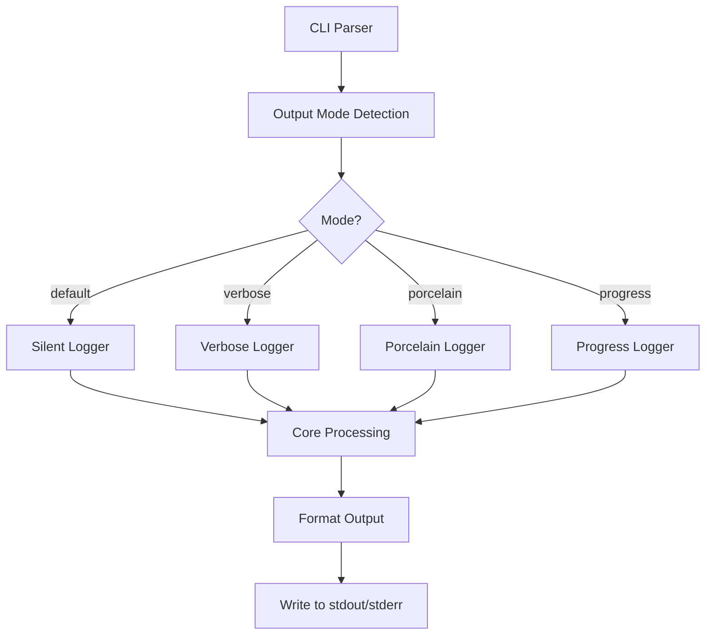

# CLI Output Control

## Overview

Implement comprehensive CLI output control following Unix principles with `--verbose`, `--porcelain`, and `--progress` flags, providing appropriate output for different use cases from scripts to interactive sessions.

## User Story

As a **developer integrating markdown-transclusion into scripts and CI/CD pipelines**, I want fine-grained control over output verbosity so that I can get the right amount of information for each context.

## Acceptance Criteria

- [ ] `--verbose` flag provides detailed operation information
- [ ] `--porcelain` flag provides machine-readable, stable output format
- [ ] `--progress` flag shows real-time processing progress
- [ ] Default mode follows "silence is golden" - minimal output
- [ ] All flags compatible with existing options (`--dry-run`, `--validate-only`, etc.)
- [ ] Consistent output formatting across all modes
- [ ] Proper stderr/stdout separation (errors to stderr, content to stdout)
- [ ] Exit codes remain unchanged (0=success, 1=error)

## Technical Design

### Output Modes

#### Default Mode (Silent)
```bash
$ markdown-transclusion docs.md
# No output unless errors occur
# Processed content goes to stdout if no --output specified
```

#### Verbose Mode
```bash
$ markdown-transclusion docs.md --verbose
📖 Reading: docs.md (2.1KB)
🔍 Found 3 transclusion references
📄 Processing: ![[sections/intro.md]]
  ├─ Reading: sections/intro.md (854B)
  ├─ Found 1 nested reference
  └─ Processing: ![[shared/header.md]]
📄 Processing: ![[api/methods.md#Authentication]]
  ├─ Reading: api/methods.md (3.2KB)
  └─ Extracting heading: Authentication
📄 Processing: ![[examples/basic.md]]
  └─ Reading: examples/basic.md (1.1KB)
✅ Processed 4 files, resolved 3 transclusions
⏱️  Completed in 0.15s
```

#### Porcelain Mode (Machine-readable)
```bash
$ markdown-transclusion docs.md --porcelain
READ docs.md 2134
PROCESS sections/intro.md
READ sections/intro.md 854
PROCESS shared/header.md
READ shared/header.md 412
PROCESS api/methods.md
READ api/methods.md 3276
EXTRACT Authentication
PROCESS examples/basic.md
READ examples/basic.md 1089
COMPLETE files=4 transclusions=3 time=0.15
```

#### Progress Mode
```bash
$ markdown-transclusion docs.md --progress
Processing... [████████████████████████████████████████] 100% (4/4 files)
```

### Flag Combinations

| Flags | Behavior |
|-------|----------|
| `(default)` | Silent operation, content to stdout |
| `--verbose` | Detailed human-readable progress |
| `--porcelain` | Machine-readable status lines |
| `--progress` | Progress bar only |
| `--verbose --progress` | Detailed info + progress bar |
| `--porcelain --progress` | Machine format + progress bar |
| `--dry-run --verbose` | Verbose dry run with preview |
| `--validate-only --porcelain` | Machine-readable validation results |

### Output Format Specifications

#### Porcelain Format
```
READ <filepath> <bytes>
PROCESS <filepath>
EXTRACT <heading>
VARIABLE <key>=<value>
ERROR <error-code> <message>
WARN <warning-code> <message>
COMPLETE files=<n> transclusions=<n> errors=<n> warnings=<n> time=<seconds>
```

#### Progress Format
- Uses stderr to avoid interfering with stdout content
- Updates in-place using ANSI escape codes
- Falls back to simple dots on non-TTY terminals

## Implementation Strategy

### Code Structure



### Logger Interface

```typescript
interface OutputLogger {
  fileRead(path: string, bytes: number): void;
  processStart(reference: string): void;
  headingExtract(heading: string): void;
  variableSubstitute(key: string, value: string): void;
  error(code: string, message: string): void;
  warn(code: string, message: string): void;
  complete(stats: ProcessingStats): void;
}

class VerboseLogger implements OutputLogger { /* ... */ }
class PorcelainLogger implements OutputLogger { /* ... */ }
class SilentLogger implements OutputLogger { /* ... */ }
class ProgressLogger implements OutputLogger { /* ... */ }
```

## Error Handling

### Error Output (stderr)
```bash
# Verbose errors
ERROR: File not found: missing-file.md
  at reference: ![[missing-file.md]]
  in file: docs.md:15

# Porcelain errors  
ERROR FILE_NOT_FOUND missing-file.md docs.md:15
```

### Exit Codes
- `0`: Success (no errors)
- `1`: Processing errors (maintains existing behavior)
- `2`: Invalid arguments (new - for malformed flags)

## Testing Strategy

### Unit Tests
- Logger implementations for each mode
- Output formatting functions
- Flag combination validation

### Integration Tests
- CLI with each output mode
- Flag combinations with existing features
- Error output formatting

### Acceptance Tests
- Script integration scenarios
- CI/CD pipeline usage
- Interactive terminal usage

## Compatibility

### Breaking Changes
- None - all changes are additive
- Default behavior remains unchanged

### Migration Path
- Users can adopt new flags incrementally
- Existing scripts continue to work unchanged

## Future Enhancements

- `--json` output format for structured data
- `--quiet` flag to suppress all output (stricter than default)
- Output templates: `--format="{{.files}} files processed"`
- Integration with popular CI/CD systems (GitHub Actions, GitLab CI)