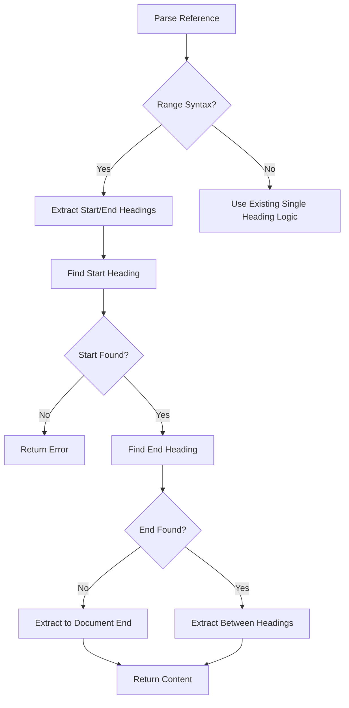

# Heading Range Extraction

## Overview

Extend heading-specific transclusion to support extracting content between two headings using range syntax `![[file#start:end]]`, enabling precise content selection for documentation composition.

## User Story

As a **technical writer**, I want to extract content between specific headings so that I can include precise sections without manual editing or overly broad inclusions.

## Acceptance Criteria

- [ ] Support `![[file#start:end]]` syntax for heading ranges
- [ ] Extract content from start heading until (but not including) end heading
- [ ] Handle cases where end heading is not found (extract to end of document)
- [ ] Support mixed heading levels in ranges (e.g., `#Introduction:##Conclusion`)
- [ ] Case-insensitive matching for both start and end headings
- [ ] Error gracefully when start heading is not found
- [ ] Compatible with existing single heading extraction `![[file#heading]]`
- [ ] Work with recursive transclusions and variable substitution

## Technical Design

### Syntax Examples

```markdown
![[api-docs#Authentication:Authorization]]  # Between two headings
![[tutorial#Getting Started:]]              # From heading to end
![[guide#:Troubleshooting]]                 # Beginning to heading (edge case)
![[docs#Setup:##Advanced Configuration]]    # Mixed heading levels
```

### Implementation Strategy



### Error Handling

- **Start heading not found**: `<!-- Error: Start heading "StartName" not found in file.md -->`
- **Invalid range syntax**: `<!-- Error: Invalid range syntax in "file#start:end" -->`
- **Empty range**: `<!-- Error: No content found between "Start" and "End" headings -->`

## Implementation Notes

### Code Changes Required

1. **Parser Updates** (`parserUtils.ts`):
   - Detect `:` in heading references
   - Split into start/end heading components

2. **Heading Extractor** (`headingExtractor.ts`):
   - New function: `extractHeadingRange(content, startHeading, endHeading?)`
   - Enhance existing logic to support range extraction

3. **Integration** (`transclusionProcessor.ts`):
   - Route range requests to new extraction logic
   - Maintain error handling patterns

### Edge Cases

```markdown
# Document with various heading levels

## Section A
Content A

### Subsection A1
Sub content A1

## Section B  
Content B

# Top Level
Top content

## Section C
Content C
```

**Test Cases**:
- `![[doc#Section A:Section B]]` → Includes "Content A" and "Subsection A1"
- `![[doc#Section B:Top Level]]` → Includes only "Content B"
- `![[doc#Subsection A1:Section C]]` → Includes from A1 through Section B and Top Level
- `![[doc#Section C:]]` → Includes "Content C" to end of document

## Testing Strategy

### Unit Tests
- Range syntax parsing
- Heading range extraction logic
- Error case handling

### Integration Tests
- Range extraction with recursive transclusions
- Range extraction with variable substitution
- Performance with large documents

### Acceptance Tests
- User workflow scenarios
- Mixed with existing single heading extraction
- Complex document structures

## Related Features

- Builds on F006 - Heading-Specific Transclusion
- Compatible with F005 - Variable Substitution
- Works with F002 - Recursive Transclusion

## Future Enhancements

- Line number ranges: `![[file:10:50]]`
- Regex-based heading matching: `![[file#/^API.*/:]]`
- Multiple non-contiguous ranges: `![[file#intro,conclusion]]`