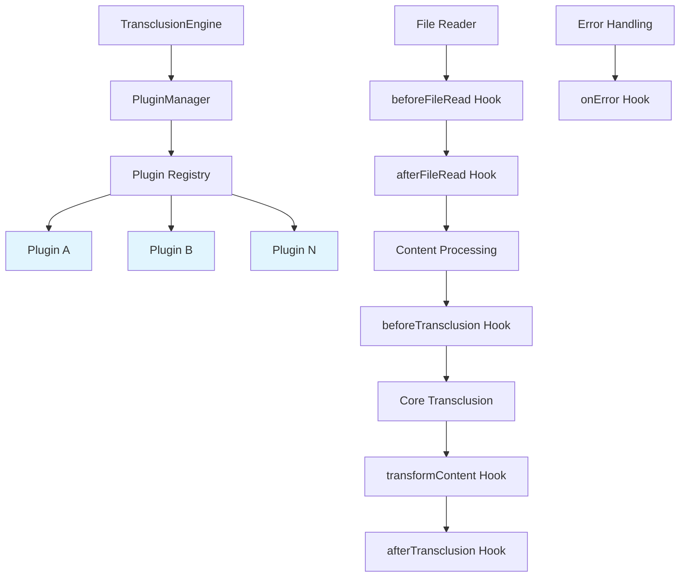

# Plugin System for Custom Transformers

## Overview

Implement an extensible plugin system that allows users to create custom content transformers and processors, enabling specialized use cases while maintaining the core transclusion functionality.

## User Story

As a **developer integrating markdown-transclusion**, I want to create custom content transformers so that I can adapt the tool to my specific documentation workflows and processing requirements.

## Acceptance Criteria

- [ ] Plugin interface for custom content transformers
- [ ] Plugin lifecycle management (load, initialize, process, cleanup)
- [ ] Configuration system for plugin settings
- [ ] Plugin discovery and registration mechanisms
- [ ] Error isolation between plugins and core system
- [ ] Plugin metadata and versioning support
- [ ] CLI support for loading plugins
- [ ] API support for programmatic plugin use
- [ ] Built-in plugin examples for common use cases

## Technical Design

### Plugin Interface

```typescript
interface TransclusionPlugin {
  name: string;
  version: string;
  description?: string;
  
  // Plugin lifecycle
  initialize?(config: PluginConfig): Promise<void>;
  cleanup?(): Promise<void>;
  
  // Content transformation hooks
  beforeTransclusion?(context: TransclusionContext): Promise<TransclusionContext>;
  afterTransclusion?(result: TransclusionResult): Promise<TransclusionResult>;
  transformContent?(content: string, context: TransclusionContext): Promise<string>;
  
  // File processing hooks
  beforeFileRead?(filePath: string): Promise<string>;
  afterFileRead?(content: string, filePath: string): Promise<string>;
  
  // Error handling
  onError?(error: Error, context: TransclusionContext): Promise<void>;
}

interface PluginConfig {
  [key: string]: any;
}

interface TransclusionContext {
  filePath: string;
  reference: string;
  variables: Record<string, string>;
  depth: number;
  parentContext?: TransclusionContext;
}
```

### Plugin Manager

```typescript
class PluginManager {
  private plugins: Map<string, TransclusionPlugin> = new Map();
  private configs: Map<string, PluginConfig> = new Map();
  
  async loadPlugin(plugin: TransclusionPlugin, config?: PluginConfig): Promise<void>;
  async unloadPlugin(name: string): Promise<void>;
  
  async executeHook<T>(
    hookName: keyof TransclusionPlugin,
    context: any,
    ...args: any[]
  ): Promise<T>;
  
  getLoadedPlugins(): string[];
  getPluginInfo(name: string): PluginMetadata;
}
```

### Plugin Architecture



### Built-in Plugin Examples

#### 1. Code Syntax Highlighter
```typescript
class SyntaxHighlighterPlugin implements TransclusionPlugin {
  name = 'syntax-highlighter';
  version = '1.0.0';
  
  async transformContent(content: string, context: TransclusionContext): Promise<string> {
    // Apply syntax highlighting to code blocks
    return content.replace(/```(\w+)\n([\s\S]*?)```/g, (match, lang, code) => {
      return `\`\`\`${lang}\n${this.highlight(code, lang)}\`\`\``;
    });
  }
  
  private highlight(code: string, language: string): string {
    // Implement syntax highlighting logic
    return code;
  }
}
```

#### 2. Link Validator
```typescript
class LinkValidatorPlugin implements TransclusionPlugin {
  name = 'link-validator';
  version = '1.0.0';
  
  async afterTransclusion(result: TransclusionResult): Promise<TransclusionResult> {
    const links = this.extractLinks(result.content);
    const brokenLinks = await this.validateLinks(links);
    
    if (brokenLinks.length > 0) {
      result.warnings.push(...brokenLinks.map(link => ({
        type: 'BROKEN_LINK',
        message: `Broken link detected: ${link}`,
        context: result.filePath
      })));
    }
    
    return result;
  }
  
  private extractLinks(content: string): string[] {
    // Extract markdown links
    return [];
  }
  
  private async validateLinks(links: string[]): Promise<string[]> {
    // Validate links are accessible
    return [];
  }
}
```

#### 3. Variable Injector
```typescript
class VariableInjectorPlugin implements TransclusionPlugin {
  name = 'variable-injector';
  version = '1.0.0';
  
  async beforeTransclusion(context: TransclusionContext): Promise<TransclusionContext> {
    // Inject additional variables based on context
    const additionalVars = this.generateContextVariables(context);
    
    return {
      ...context,
      variables: { ...context.variables, ...additionalVars }
    };
  }
  
  private generateContextVariables(context: TransclusionContext): Record<string, string> {
    return {
      current_file: context.filePath,
      current_depth: context.depth.toString(),
      timestamp: new Date().toISOString()
    };
  }
}
```

### Plugin Configuration

#### CLI Configuration
```bash
# Load plugins from directory
markdown-transclusion docs.md --plugins ./plugins/

# Load specific plugin with config
markdown-transclusion docs.md --plugin syntax-highlighter --plugin-config syntax-highlighter.json

# Multiple plugins
markdown-transclusion docs.md --plugins ./plugins/ --plugin-config plugins.json
```

#### Configuration File (plugins.json)
```json
{
  "plugins": {
    "syntax-highlighter": {
      "enabled": true,
      "theme": "github",
      "languages": ["javascript", "typescript", "python"]
    },
    "link-validator": {
      "enabled": true,
      "timeout": 5000,
      "followRedirects": true
    },
    "variable-injector": {
      "enabled": true,
      "additionalVars": {
        "project_name": "markdown-transclusion",
        "version": "1.0.0"
      }
    }
  }
}
```

#### Programmatic Configuration
```typescript
import { transclude, PluginManager } from 'markdown-transclusion';
import { SyntaxHighlighterPlugin } from './plugins/syntax-highlighter';

const pluginManager = new PluginManager();
await pluginManager.loadPlugin(new SyntaxHighlighterPlugin(), {
  theme: 'dark',
  languages: ['typescript']
});

const result = await transclude('docs.md', {
  pluginManager,
  // other options
});
```

### Plugin Discovery

#### Directory-based Discovery
```
plugins/
├── syntax-highlighter/
│   ├── index.js
│   ├── package.json
│   └── config.schema.json
├── link-validator/
│   ├── index.js
│   └── package.json
└── custom-transformer/
    ├── index.js
    └── package.json
```

#### NPM Package Discovery
```bash
# Install plugin as npm package
npm install markdown-transclusion-plugin-highlighter

# Auto-discover in node_modules
markdown-transclusion docs.md --auto-discover-plugins
```

### Error Isolation

```typescript
class SafePluginExecutor {
  async executeHook<T>(
    plugin: TransclusionPlugin,
    hookName: keyof TransclusionPlugin,
    ...args: any[]
  ): Promise<T | undefined> {
    try {
      const hook = plugin[hookName] as Function;
      if (typeof hook === 'function') {
        return await hook.apply(plugin, args);
      }
    } catch (error) {
      this.logger.error(`Plugin ${plugin.name} failed in ${hookName}:`, error);
      
      // Isolate plugin error - don't crash main process
      if (plugin.onError) {
        await plugin.onError(error, args[0]);
      }
    }
    
    return undefined;
  }
}
```

## Implementation Strategy

### Phase 1: Core Infrastructure
1. Define plugin interfaces
2. Implement PluginManager class
3. Add hook execution system
4. Basic error isolation

### Phase 2: CLI Integration
1. Add --plugins flag
2. Plugin configuration loading
3. Plugin discovery mechanisms
4. Help system for plugins

### Phase 3: Built-in Examples
1. Syntax highlighter plugin
2. Link validator plugin
3. Variable injector plugin
4. Documentation and examples

### Phase 4: Advanced Features
1. Plugin dependency management
2. Plugin versioning and compatibility
3. Hot plugin reloading
4. Plugin marketplace/registry

## Testing Strategy

### Unit Tests
- Plugin interface implementations
- PluginManager functionality
- Hook execution system
- Error isolation

### Integration Tests
- Plugin loading and configuration
- Hook execution in real scenarios
- Error handling with faulty plugins
- Performance with multiple plugins

### Plugin Tests
- Built-in plugin functionality
- Plugin lifecycle testing
- Configuration validation
- Real-world use cases

## Security Considerations

- Plugin code sandboxing
- Configuration validation
- Resource usage limits
- File system access controls

## Performance Impact

- Lazy plugin loading
- Hook execution optimization
- Memory usage monitoring
- Plugin performance profiling

## Future Enhancements

- Visual plugin editor/builder
- Plugin marketplace
- Plugin analytics and monitoring
- Community plugin repository
- Plugin development CLI tools