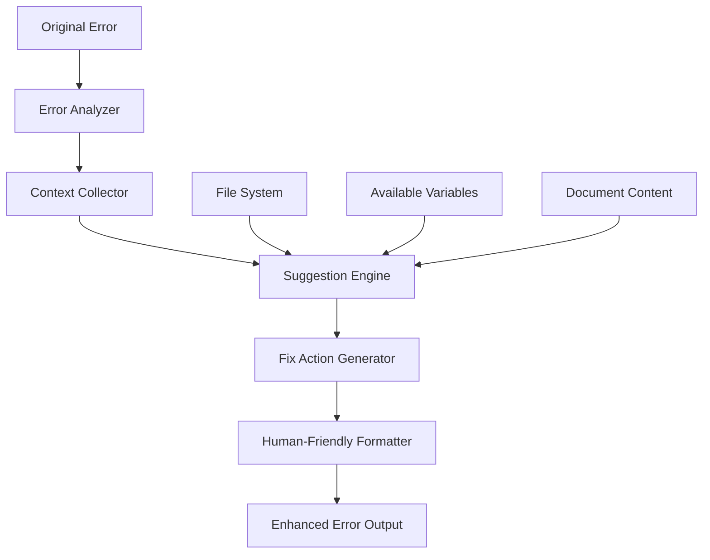

# Enhanced Error Recovery with Suggestions

## Overview

Implement intelligent error recovery with human-friendly error messages and actionable suggestions for common mistakes, improving the developer experience and reducing debugging time.

## User Story

As a **documentation author**, I want clear, helpful error messages with suggestions when transclusions fail so that I can quickly identify and fix issues without extensive debugging.

## Acceptance Criteria

- [ ] Human-friendly error messages with context and suggestions
- [ ] Fuzzy matching for file name typos with "did you mean?" suggestions
- [ ] Smart suggestions for common path resolution issues
- [ ] Heading name suggestions when heading extraction fails
- [ ] Variable name suggestions for undefined variables
- [ ] Comprehensive error context (file, line number, surrounding content)
- [ ] Actionable fix suggestions in error output
- [ ] Integration with existing error handling system

## Technical Design

### Error Categories & Suggestions

#### 1. File Not Found Errors
```markdown
❌ Error: File not found: 'sectons/intro.md'
📍 Referenced in: docs/main.md:15
🔍 Did you mean: 'sections/intro.md'?
💡 Suggestions:
   • Check file path spelling
   • Verify file exists in base directory: /path/to/project
   • Use --base-path if files are in different directory
```

#### 2. Heading Not Found Errors
```markdown
❌ Error: Heading 'Instalation' not found in 'setup.md'
📍 Referenced in: docs/guide.md:23 → ![[setup.md#Instalation]]
🔍 Available headings in setup.md:
   • Installation (87% match) ← Did you mean this?
   • Configuration
   • Troubleshooting
💡 Suggestion: Use ![[setup.md#Installation]]
```

#### 3. Variable Errors
```markdown
❌ Error: Variable 'langue' is undefined
📍 Referenced in: template.md:8 → ![[content-{{langue}}.md]]
🔍 Available variables:
   • lang=en (91% match) ← Did you mean this?
   • version=2.0
   • env=production
💡 Suggestion: Use ![[content-{{lang}}.md]] or define --variables langue=en
```

#### 4. Path Resolution Errors
```markdown
❌ Error: Path resolves outside base directory
📍 Referenced in: docs/chapter1.md:12 → ![[../../secrets/config.md]]
🛡️  Security: Path traversal blocked for safety
💡 Suggestions:
   • Use --base-path to allow broader file access
   • Move target file within project directory
   • Use relative paths within allowed directories
```

#### 5. Circular Reference Errors
```markdown
❌ Error: Circular reference detected
📍 Reference chain: 
   fileA.md → fileB.md → fileC.md → fileA.md
💡 Suggestions:
   • Break the circular dependency
   • Use conditional transclusion with variables
   • Restructure content hierarchy
```

### Fuzzy Matching Algorithm

```typescript
interface SuggestionEngine {
  findSimilarFiles(target: string, availableFiles: string[]): FileSuggestion[];
  findSimilarHeadings(target: string, headings: string[]): HeadingSuggestion[];
  findSimilarVariables(target: string, variables: Record<string, string>): VariableSuggestion[];
}

interface Suggestion {
  text: string;
  confidence: number; // 0-100%
  type: 'file' | 'heading' | 'variable' | 'path';
}
```

### Enhanced Error Context

```typescript
interface EnhancedError {
  code: string;
  message: string;
  context: {
    file: string;
    line: number;
    column?: number;
    reference: string;
    surroundingLines?: string[];
  };
  suggestions: Suggestion[];
  fixActions: FixAction[];
}

interface FixAction {
  description: string;
  command?: string; // CLI command to fix
  autofix?: boolean; // Can be automatically fixed
}
```

## Implementation Strategy

### 1. Error Enhancement Pipeline



### 2. Suggestion Algorithms

#### File Similarity (Levenshtein + Context)
```typescript
function findSimilarFiles(target: string, availableFiles: string[]): FileSuggestion[] {
  return availableFiles
    .map(file => ({
      file,
      distance: levenshteinDistance(target, file),
      contextScore: calculateContextScore(target, file),
      pathSimilarity: comparePaths(target, file)
    }))
    .filter(s => s.distance <= 3 || s.contextScore > 0.7)
    .sort((a, b) => (a.distance - b.distance) + (b.contextScore - a.contextScore))
    .slice(0, 3);
}
```

#### Heading Similarity (Fuzzy + Semantic)
```typescript
function findSimilarHeadings(target: string, headings: string[]): HeadingSuggestion[] {
  return headings
    .map(heading => ({
      heading,
      similarity: fuzzyMatch(target.toLowerCase(), heading.toLowerCase()),
      wordOverlap: calculateWordOverlap(target, heading)
    }))
    .filter(s => s.similarity > 0.6 || s.wordOverlap > 0.5)
    .sort((a, b) => (b.similarity + b.wordOverlap) - (a.similarity + a.wordOverlap))
    .slice(0, 3);
}
```

### 3. Error Recovery Modes

#### Strict Mode (Default)
- Fails fast with enhanced errors
- No automatic fixes
- Maximum context and suggestions

#### Tolerant Mode (`--tolerant`)
- Continues processing with best-guess fixes
- Logs attempted fixes
- Shows what would be fixed in dry-run

#### Auto-fix Mode (`--auto-fix`)
- Automatically applies high-confidence fixes
- Creates backup of original files
- Logs all changes made

## Output Examples

### Terminal Output (Colorized)
```bash
🔴 Error in docs/api.md:15

   13 │ ## Authentication
   14 │ 
 → 15 │ ![[endponts/auth.md#Login]]
   16 │ 
   17 │ The login process requires...

❌ File not found: 'endponts/auth.md'
🔍 Did you mean: 'endpoints/auth.md'? (89% match)
💡 Run: markdown-transclusion docs/api.md --auto-fix
```

### JSON Output (`--porcelain --format=json`)
```json
{
  "errors": [{
    "code": "FILE_NOT_FOUND",
    "message": "File not found: 'endponts/auth.md'",
    "context": {
      "file": "docs/api.md",
      "line": 15,
      "reference": "![[endponts/auth.md#Login]]"
    },
    "suggestions": [{
      "text": "endpoints/auth.md",
      "confidence": 89,
      "type": "file"
    }],
    "fixActions": [{
      "description": "Replace with suggested file name",
      "command": "sed -i 's/endponts/endpoints/' docs/api.md",
      "autofix": true
    }]
  }]
}
```

## Testing Strategy

### Unit Tests
- Fuzzy matching algorithms
- Suggestion ranking
- Error message formatting

### Integration Tests
- Error recovery in various scenarios
- Suggestion accuracy with real-world typos
- Performance with large file sets

### User Experience Tests
- Error message clarity studies
- Time-to-fix measurements
- Common mistake scenarios

## Performance Considerations

- Cache file system scans for suggestions
- Limit suggestion search scope
- Lazy-load heading extraction for suggestions
- Configurable suggestion limits

## Future Enhancements

- AI-powered semantic suggestions
- Integration with IDE error reporting
- Batch error fixing mode
- Learning from user corrections
- Custom suggestion dictionaries