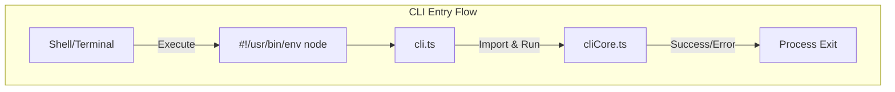
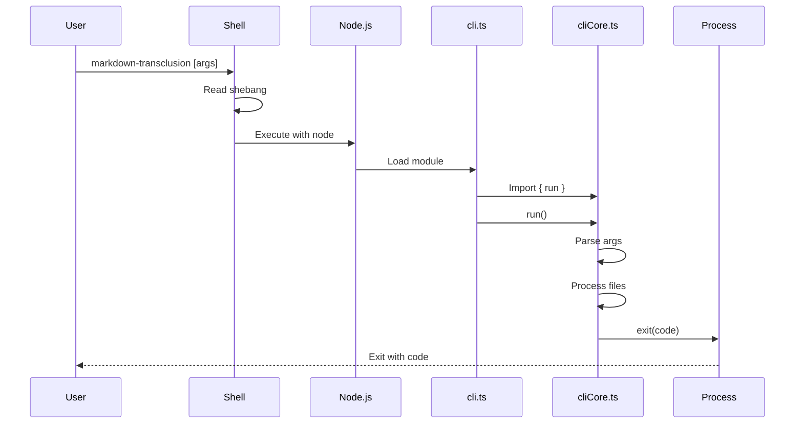
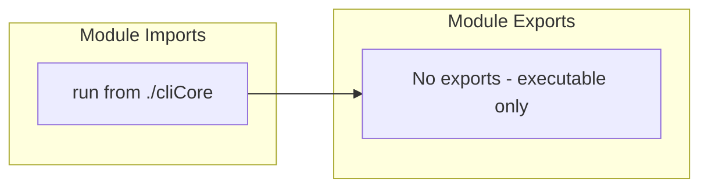

# cli.ts - Command-Line Interface Entry Point

## Overview

The `cli.ts` module serves as the executable entry point for the markdown-transclusion command-line tool. It provides the shebang line and bootstraps the CLI application by delegating to the core CLI implementation.

## Rationale

This module exists to:
1. Provide the executable entry point with proper shebang
2. Separate executable concerns from implementation logic
3. Enable the CLI to be run directly via `npx` or global installation
4. Handle top-level async execution
5. Ensure proper error propagation and exit codes

## Architecture

The module follows a minimal bootstrap pattern:



## Dependencies

### Internal Dependencies
- `./cliCore` - Core CLI implementation

### External Dependencies
None directly (Node.js environment implied by shebang)

## API Reference

### Module Structure

```typescript
#!/usr/bin/env node

import { run } from './cliCore';

// Execute the CLI
run();
```

### Shebang Line
```
#!/usr/bin/env node
```

**Purpose:**
- Tells the system to execute this file with Node.js
- Uses `env` to find node in PATH (portable)
- Enables direct execution without `node` prefix

### Execution Flow

1. **System Invocation**
   - User runs `markdown-transclusion` command
   - System reads shebang and invokes Node.js
   - Node.js loads and executes the module

2. **Module Loading**
   - TypeScript compiled to JavaScript at build time
   - Imports the `run` function from `cliCore`
   - Executes the function immediately

3. **Error Handling**
   - Uncaught errors bubble up to Node.js
   - Process exit code set by cliCore
   - Stack traces preserved for debugging

## Data Flow



## Class Diagrams

Since this is a simple entry point module, there are no classes:



## Error Handling

Error handling is delegated to the cliCore module:

```mermaid
graph TB
    subgraph "Error Flow"
        CLI[cli.ts]
        Core[cliCore.run()]
        
        CoreError[Core handles errors]
        CoreExit[Core sets exit code]
        
        UncaughtError[Uncaught errors]
        NodeError[Node.js error handler]
        NodeExit[Process exits with code 1]
    end
    
    CLI --> Core
    Core --> CoreError
    CoreError --> CoreExit
    
    CLI --> UncaughtError
    UncaughtError --> NodeError
    NodeError --> NodeExit
```

## Performance Considerations

1. **Minimal Overhead**
   - No logic in entry point
   - Direct delegation to core
   - Fast startup time

2. **Build-Time Compilation**
   - TypeScript compiled to JavaScript
   - No runtime transpilation
   - Optimized for production

3. **Lazy Loading**
   - Core module loaded on demand
   - Reduces initial parse time
   - Better for simple `--help` calls

## Test Coverage

### Testing Approach

Since this is an entry point, testing focuses on:

1. **Build Verification**
   ```json
   // package.json
   {
     "bin": {
       "markdown-transclusion": "dist/cli.js"
     }
   }
   ```

2. **Shebang Preservation**
   ```bash
   # Verify shebang in built file
   head -1 dist/cli.js
   # Should output: #!/usr/bin/env node
   ```

3. **Integration Tests**
   ```typescript
   // Test via child process
   import { spawn } from 'child_process';
   
   describe('CLI entry point', () => {
     it('should execute without errors', (done) => {
       const proc = spawn('node', ['dist/cli.js', '--help']);
       
       proc.on('exit', (code) => {
         expect(code).toBe(0);
         done();
       });
     });
   });
   ```

### Build-Time Checks

```typescript
// Ensure proper compilation
describe('CLI build', () => {
  it('should have executable permissions', () => {
    const stats = fs.statSync('dist/cli.js');
    expect(stats.mode & 0o111).toBeTruthy(); // Has execute bit
  });
  
  it('should have shebang line', () => {
    const content = fs.readFileSync('dist/cli.js', 'utf8');
    expect(content).toStartWith('#!/usr/bin/env node');
  });
});
```

## Usage Examples

### Direct Execution
```bash
# After npm install -g markdown-transclusion
markdown-transclusion input.md -o output.md

# Or with npx
npx markdown-transclusion input.md

# Or from project
./node_modules/.bin/markdown-transclusion input.md
```

### Package.json Scripts
```json
{
  "scripts": {
    "docs:build": "markdown-transclusion docs/index.md -o dist/docs.md",
    "validate": "markdown-transclusion **/*.md --validate-only"
  }
}
```

### Programmatic Execution
```typescript
// Not recommended - use API instead
import { spawn } from 'child_process';

const proc = spawn('markdown-transclusion', ['input.md'], {
  stdio: 'pipe'
});

let output = '';
proc.stdout.on('data', (data) => {
  output += data.toString();
});

proc.on('exit', (code) => {
  if (code === 0) {
    console.log('Success:', output);
  }
});
```

## Platform Considerations

### Unix/Linux/macOS
- Shebang works natively
- Execute permissions required
- Line endings must be LF

### Windows
- Shebang ignored by Windows
- npm creates `.cmd` wrapper
- Works via `markdown-transclusion.cmd`

### Cross-Platform Setup
```json
// package.json ensures cross-platform compatibility
{
  "bin": {
    "markdown-transclusion": "dist/cli.js"
  },
  "scripts": {
    "postbuild": "chmod +x dist/cli.js"
  }
}
```

## Build Configuration

### TypeScript Compilation
```json
// tsconfig.json considerations
{
  "compilerOptions": {
    "target": "ES2020",
    "module": "commonjs",
    "outDir": "./dist"
  },
  "include": ["src/**/*"]
}
```

### Build Process
1. TypeScript compiles `src/cli.ts` to `dist/cli.js`
2. Shebang line preserved in output
3. Execute permissions set (Unix-like systems)
4. npm/yarn handle bin linking

## Debugging

### Debug Execution
```bash
# Debug with Node.js inspector
node --inspect dist/cli.js input.md

# Debug with verbose logging
DEBUG=* markdown-transclusion input.md

# Debug with breakpoints
node --inspect-brk dist/cli.js input.md
```

### Common Issues

1. **Permission Denied**
   ```bash
   # Fix execute permissions
   chmod +x dist/cli.js
   ```

2. **Command Not Found**
   ```bash
   # Ensure global installation
   npm install -g markdown-transclusion
   
   # Or use npx
   npx markdown-transclusion
   ```

3. **Wrong Node Version**
   ```bash
   # Check Node.js version
   node --version
   # Should be >= 18.18.0
   ```

## Future Considerations

### Potential Enhancements
1. **Version Check** - Ensure minimum Node.js version
2. **Update Notifier** - Check for CLI updates
3. **Telemetry** - Optional usage statistics
4. **Auto-Update** - Self-updating capability

### Example Enhanced Entry Point
```typescript
#!/usr/bin/env node

// Future enhancement example
import { satisfies } from 'semver';
import { run } from './cliCore';

// Check Node.js version
const nodeVersion = process.version;
const requiredVersion = '>=18.18.0';

if (!satisfies(nodeVersion, requiredVersion)) {
  console.error(`Node.js ${requiredVersion} required, but ${nodeVersion} found.`);
  process.exit(1);
}

// Run CLI
run().catch((error) => {
  console.error('Fatal error:', error);
  process.exit(1);
});
```