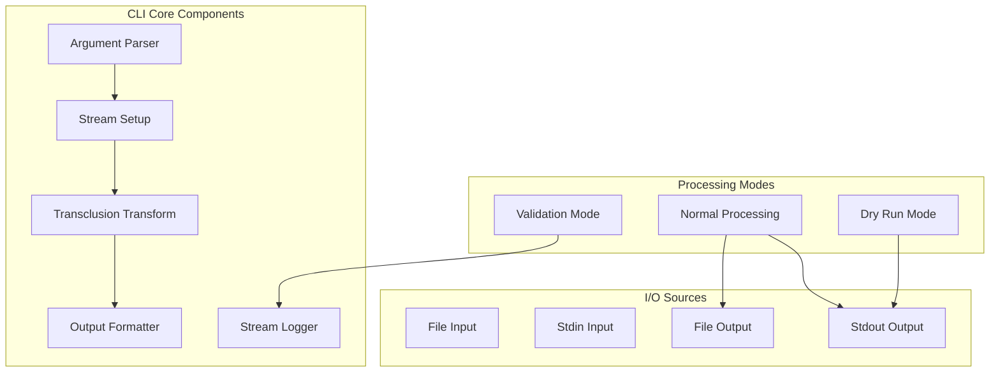
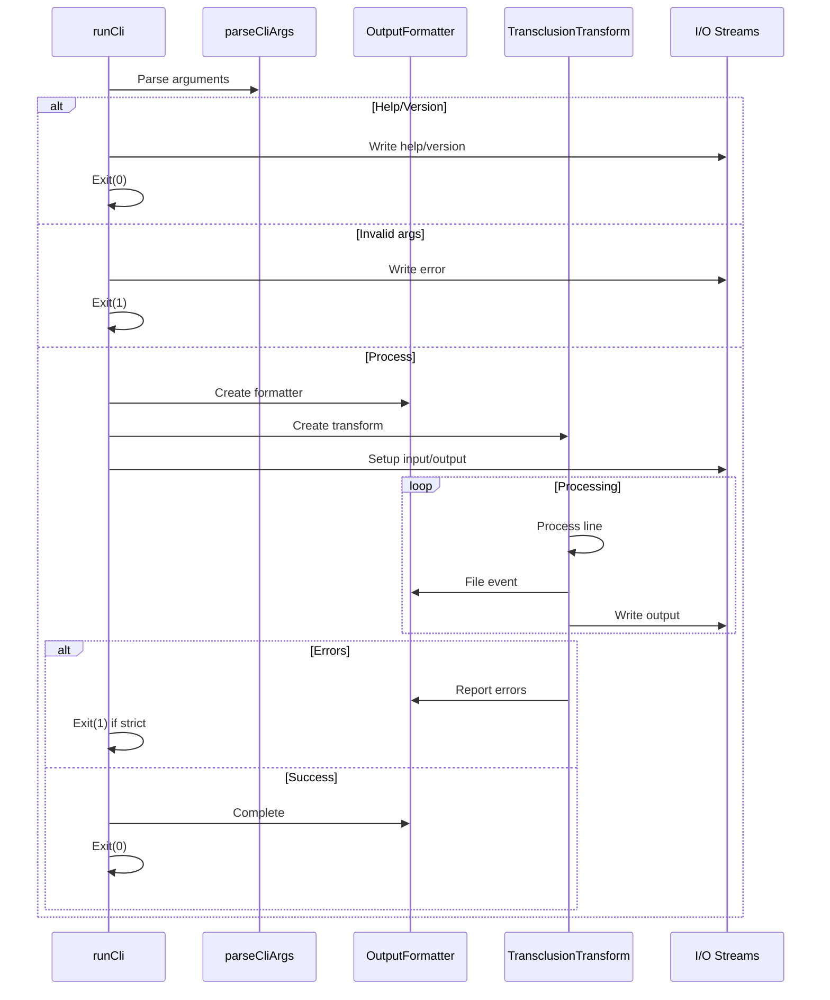
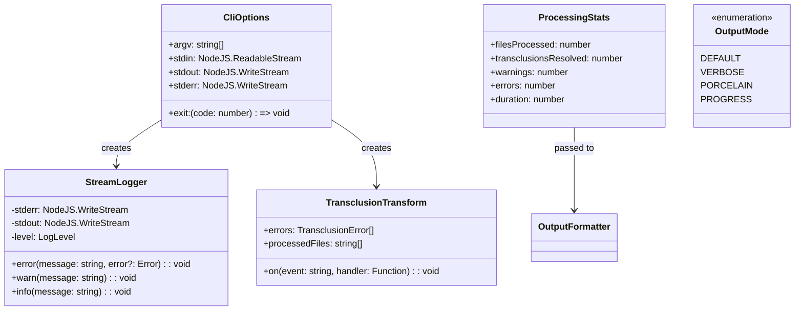
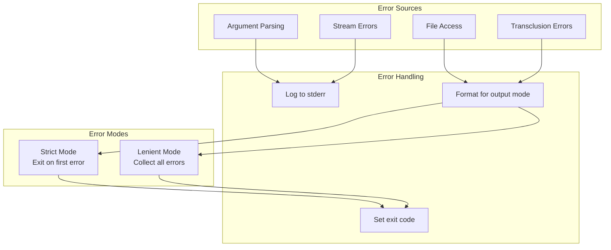

# cliCore.ts - Core CLI Functionality

## Overview

The `cliCore.ts` module contains the core implementation of the markdown-transclusion command-line interface. It handles argument parsing, stream setup, processing orchestration, and output formatting while maintaining testability through dependency injection.

## Rationale

This module exists to:
1. Separate CLI logic from the executable entry point
2. Enable comprehensive testing through dependency injection
3. Handle all CLI workflows (normal processing, dry run, validation)
4. Provide flexible output modes (default, verbose, porcelain, progress)
5. Manage stream pipelines and error handling
6. Support both file and stdin/stdout processing

## Architecture

The module orchestrates multiple components to provide CLI functionality:



## Dependencies

### Internal Dependencies
- `./stream` - TransclusionTransform for processing
- `./utils/cliArgs` - CLI argument parsing
- `./utils/logger` - Logging functionality
- `./utils/outputFormatter` - Output formatting
- `./types` - TypeScript type definitions

### External Dependencies
- `fs` - File system operations
- `path` - Path resolution
- `stream` - Stream utilities
- `stream/promises` - Promisified pipeline

## API Reference

### Interfaces

#### CliOptions
```typescript
export interface CliOptions {
  argv: string[];
  stdin: NodeJS.ReadableStream;
  stdout: NodeJS.WriteStream;
  stderr: NodeJS.WriteStream;
  exit: (code: number) => void;
}
```

Options for CLI execution with dependency injection.

**Properties:**
- `argv` - Command line arguments
- `stdin` - Input stream (injectable for testing)
- `stdout` - Output stream (injectable for testing)
- `stderr` - Error stream (injectable for testing)
- `exit` - Exit function (injectable for testing)

### Functions

#### runCli
```typescript
export async function runCli(options: CliOptions): Promise<void>
```

Core CLI logic with dependency injection for testability.

**Parameters:**
- `options` - CLI options with injected dependencies

**Features:**
- Argument parsing and validation
- Help and version display
- Stream pipeline setup
- Error handling and reporting
- Multiple output modes
- Dry run and validation modes

#### gracefulExit (Internal)
```typescript
async function gracefulExit(code: number, exit: (code: number) => void): Promise<void>
```

Gracefully exit after flushing streams.

**Purpose:**
- Ensures all output is written before exit
- Sets process exit code
- Allows time for stream flushing

## Data Flow



## Class Diagrams



## Error Handling

The module implements comprehensive error handling:



### Error Handling Strategy

1. **Argument Errors** - Exit immediately with help text
2. **File Access Errors** - Report and exit with code 1
3. **Transclusion Errors** - Collect and report based on mode
4. **Stream Errors** - Fatal errors, always exit

## Performance Considerations

1. **Stream Processing**
   - No full file buffering except in dry run
   - Constant memory usage for large files
   - Efficient pipeline processing

2. **Output Formatting**
   - Minimal overhead in default mode
   - Progress updates throttled
   - Buffered writes for efficiency

3. **Error Collection**
   - Errors collected without interrupting flow
   - Single pass processing
   - Deferred error reporting

## Test Coverage

### Unit Test Scenarios

1. **Argument Handling**
   ```typescript
   describe('runCli', () => {
     it('should show help when --help flag is present', async () => {
       const mockStdout = new MockWriteStream();
       const mockExit = jest.fn();
       
       await runCli({
         argv: ['node', 'cli.js', '--help'],
         stdin: process.stdin,
         stdout: mockStdout,
         stderr: process.stderr,
         exit: mockExit
       });
       
       expect(mockStdout.getOutput()).toContain('Usage:');
       expect(mockExit).toHaveBeenCalledWith(0);
     });

     it('should handle invalid arguments', async () => {
       const mockStderr = new MockWriteStream();
       const mockExit = jest.fn();
       
       await runCli({
         argv: ['node', 'cli.js', '--invalid-flag'],
         stdin: process.stdin,
         stdout: process.stdout,
         stderr: mockStderr,
         exit: mockExit
       });
       
       expect(mockStderr.getOutput()).toContain('Unknown option');
       expect(mockExit).toHaveBeenCalledWith(1);
     });
   });
   ```

2. **Processing Modes**
   ```typescript
   describe('processing modes', () => {
     it('should process file input to file output', async () => {
       await runCli({
         argv: ['node', 'cli.js', 'input.md', '-o', 'output.md'],
         stdin: process.stdin,
         stdout: process.stdout,
         stderr: process.stderr,
         exit: jest.fn()
       });
       
       expect(fs.existsSync('output.md')).toBe(true);
     });

     it('should handle stdin to stdout', async () => {
       const mockStdin = new MockReadStream('![[file.md]]');
       const mockStdout = new MockWriteStream();
       
       await runCli({
         argv: ['node', 'cli.js'],
         stdin: mockStdin,
         stdout: mockStdout,
         stderr: process.stderr,
         exit: jest.fn()
       });
       
       expect(mockStdout.getOutput()).toContain('transcluded content');
     });
   });
   ```

3. **Dry Run Mode**
   ```typescript
   describe('dry run mode', () => {
     it('should not write to output file', async () => {
       await runCli({
         argv: ['node', 'cli.js', 'input.md', '-o', 'output.md', '--dry-run'],
         stdin: process.stdin,
         stdout: process.stdout,
         stderr: process.stderr,
         exit: jest.fn()
       });
       
       expect(fs.existsSync('output.md')).toBe(false);
     });

     it('should show processing summary', async () => {
       const mockStdout = new MockWriteStream();
       
       await runCli({
         argv: ['node', 'cli.js', 'input.md', '--dry-run'],
         stdin: process.stdin,
         stdout: mockStdout,
         stderr: process.stderr,
         exit: jest.fn()
       });
       
       const output = mockStdout.getOutput();
       expect(output).toContain('DRY RUN MODE');
       expect(output).toContain('Files processed:');
       expect(output).toContain('Transclusions resolved:');
     });
   });
   ```

4. **Output Modes**
   ```typescript
   describe('output modes', () => {
     it('should use verbose output', async () => {
       const mockStderr = new MockWriteStream();
       
       await runCli({
         argv: ['node', 'cli.js', 'input.md', '--verbose'],
         stdin: process.stdin,
         stdout: process.stdout,
         stderr: mockStderr,
         exit: jest.fn()
       });
       
       expect(mockStderr.getOutput()).toContain('Processing started');
     });

     it('should use porcelain output', async () => {
       const mockStderr = new MockWriteStream();
       
       await runCli({
         argv: ['node', 'cli.js', 'input.md', '--porcelain'],
         stdin: process.stdin,
         stdout: process.stdout,
         stderr: mockStderr,
         exit: jest.fn()
       });
       
       expect(mockStderr.getOutput()).toMatch(/^PROCESS\tSTART/);
     });
   });
   ```

### Integration Tests

```typescript
describe('CLI integration', () => {
  it('should handle complex transclusion chains', async () => {
    // Test with real files and complex scenarios
  });

  it('should respect all options', async () => {
    await runCli({
      argv: [
        'node', 'cli.js', 'input.md',
        '--output', 'output.md',
        '--base-path', '/docs',
        '--extensions', 'md,markdown,txt',
        '--max-depth', '5',
        '--strict',
        '--strip-frontmatter'
      ],
      stdin: process.stdin,
      stdout: process.stdout,
      stderr: process.stderr,
      exit: jest.fn()
    });
    
    // Verify all options were applied
  });
});
```

## Usage Examples

### Basic CLI Usage
```typescript
// Normal execution from cli.ts
import { runCli } from './cliCore';

export async function run(): Promise<void> {
  await runCli({
    argv: process.argv,
    stdin: process.stdin,
    stdout: process.stdout,
    stderr: process.stderr,
    exit: process.exit.bind(process)
  });
}
```

### Testing with Mocks
```typescript
import { runCli } from './cliCore';
import { MockReadStream, MockWriteStream } from './test-utils';

test('CLI behavior', async () => {
  const stdin = new MockReadStream('input content');
  const stdout = new MockWriteStream();
  const stderr = new MockWriteStream();
  const exit = jest.fn();
  
  await runCli({
    argv: ['node', 'test', '--verbose'],
    stdin,
    stdout,
    stderr,
    exit
  });
  
  expect(stdout.getOutput()).toContain('expected output');
  expect(exit).toHaveBeenCalledWith(0);
});
```

### Custom Integration
```typescript
// Use CLI core in a custom tool
import { runCli } from 'markdown-transclusion/dist/cliCore';

async function customProcessor() {
  const customArgs = [
    'node',
    'custom-tool',
    'input.md',
    '--output', 'processed.md',
    '--variables', 'VERSION=1.0.0'
  ];
  
  await runCli({
    argv: customArgs,
    stdin: process.stdin,
    stdout: process.stdout,
    stderr: process.stderr,
    exit: (code) => {
      console.log(`Processing completed with code: ${code}`);
      process.exit(code);
    }
  });
}
```

## Output Mode Details

### Default Mode
- Minimal output to stderr
- Content to stdout
- Only errors shown

### Verbose Mode
- Detailed progress to stderr
- File processing events
- Complete statistics

### Porcelain Mode
- Machine-readable format
- Tab-separated values
- Predictable structure

### Progress Mode
- Real-time progress bar
- File counter
- Current file display

## Exit Codes

- `0` - Success
- `1` - Error (argument parsing, file access, or transclusion errors in strict mode)

The module ensures consistent exit codes across all execution paths.