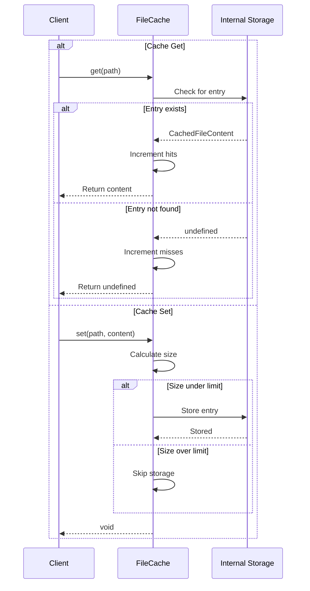
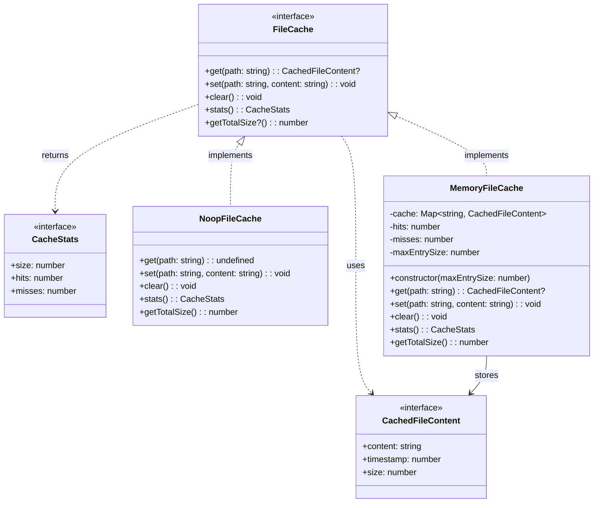
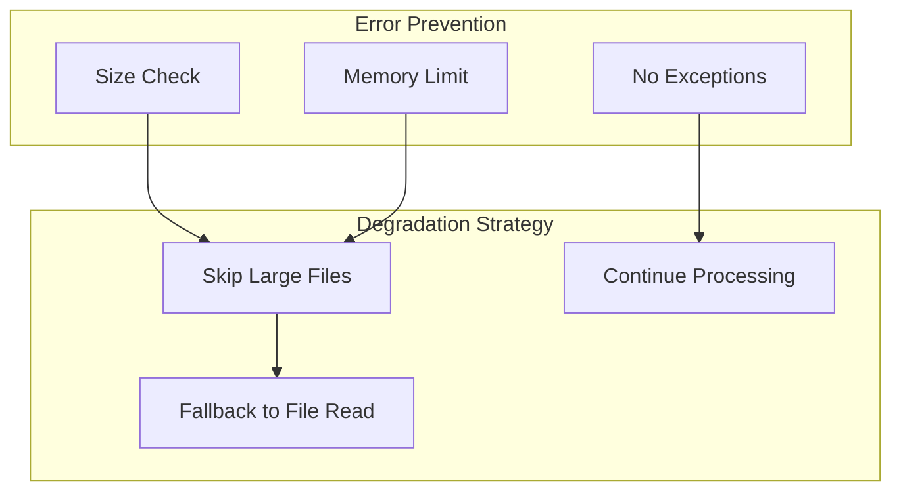

# fileCache.ts - File Caching Implementations

## Overview

The `fileCache.ts` module provides caching implementations for file content to improve performance when processing documents with repeated transclusions. It includes both a no-operation cache for when caching is disabled and an in-memory cache for storing file contents.

## Rationale

This module exists to:
1. Improve performance by avoiding repeated file reads
2. Provide a pluggable caching interface
3. Support different caching strategies
4. Reduce I/O operations for recursive transclusions
5. Enable memory-conscious caching with size limits

## Architecture

The module implements the Strategy pattern with different cache implementations:

```mermaid
graph TB
    subgraph "Cache Interface"
        FileCache[FileCache Interface]
    end
    
    subgraph "Implementations"
        NoopCache[NoopFileCache<br/>No caching]
        MemoryCache[MemoryFileCache<br/>In-memory storage]
        Future[Future Implementations<br/>Redis, Disk, etc.]
    end
    
    subgraph "Cache Operations"
        Get[get(path)]
        Set[set(path, content)]
        Clear[clear()]
        Stats[stats()]
        Size[getTotalSize()]
    end
    
    FileCache --> NoopCache
    FileCache --> MemoryCache
    FileCache -.-> Future
    
    NoopCache --> Get
    NoopCache --> Set
    MemoryCache --> Get
    MemoryCache --> Set
    MemoryCache --> Clear
    MemoryCache --> Stats
    MemoryCache --> Size
```

## Dependencies

### Internal Dependencies
- `./types` - TypeScript type definitions (`FileCache`, `CachedFileContent`)

### External Dependencies
None - Pure JavaScript/TypeScript implementation

## API Reference

### Interfaces

#### FileCache
```typescript
export interface FileCache {
  get(path: string): CachedFileContent | undefined;
  set(path: string, content: string): void;
  clear(): void;
  stats(): { size: number; hits: number; misses: number };
  getTotalSize?(): number;
}
```

Common interface for all cache implementations.

#### CachedFileContent
```typescript
export interface CachedFileContent {
  content: string;
  timestamp: number;
  size: number;
}
```

Structure for cached file data.

### Classes

#### NoopFileCache
```typescript
export class NoopFileCache implements FileCache
```

No-operation cache implementation that doesn't store anything.

**Use Case:** Default behavior when caching is disabled.

**Methods:**
- `get(path)` - Always returns `undefined`
- `set(path, content)` - Does nothing
- `clear()` - Does nothing
- `stats()` - Returns zeros
- `getTotalSize()` - Returns 0

#### MemoryFileCache
```typescript
export class MemoryFileCache implements FileCache {
  constructor(maxEntrySize: number = 1024 * 1024)
}
```

In-memory cache implementation using a Map.

**Constructor Parameters:**
- `maxEntrySize` - Maximum size in bytes for a single cache entry (default: 1MB)

**Features:**
- Stores content in memory
- Tracks cache hits and misses
- Enforces per-entry size limits
- Provides cache statistics

**Methods:**
- `get(path)` - Returns cached content or `undefined`
- `set(path, content)` - Stores content if under size limit
- `clear()` - Removes all cached entries
- `stats()` - Returns cache statistics
- `getTotalSize()` - Returns total bytes cached

## Data Flow



## Class Diagrams



## Error Handling

The cache implementations are designed to be fault-tolerant:

1. **No Exceptions** - Cache operations never throw
2. **Size Limits** - Silently skip entries over size limit
3. **Memory Safety** - Automatic size enforcement
4. **Graceful Degradation** - System works without cache



## Performance Considerations

1. **Memory Management**
   - Per-entry size limits prevent memory bloat
   - Total size tracking for monitoring
   - No automatic eviction (kept simple)

2. **O(1) Operations**
   - Map-based storage for fast lookups
   - Constant time get/set operations
   - No iteration except for stats

3. **Size Calculation**
   - UTF-8 byte length calculation
   - Cached size in metadata
   - One-time calculation on set

4. **Hit Rate Tracking**
   - Helps optimize cache usage
   - Identifies caching effectiveness
   - No performance overhead

## Test Coverage

### Unit Test Scenarios

1. **NoopFileCache Tests**
   ```typescript
   describe('NoopFileCache', () => {
     let cache: NoopFileCache;
     
     beforeEach(() => {
       cache = new NoopFileCache();
     });

     it('should always return undefined on get', () => {
       cache.set('/path/file.md', 'content');
       expect(cache.get('/path/file.md')).toBeUndefined();
     });

     it('should return zero stats', () => {
       cache.set('/path/file.md', 'content');
       cache.get('/path/file.md');
       
       const stats = cache.stats();
       expect(stats.size).toBe(0);
       expect(stats.hits).toBe(0);
       expect(stats.misses).toBe(0);
     });

     it('should return zero total size', () => {
       expect(cache.getTotalSize()).toBe(0);
     });
   });
   ```

2. **MemoryFileCache Tests**
   ```typescript
   describe('MemoryFileCache', () => {
     let cache: MemoryFileCache;
     
     beforeEach(() => {
       cache = new MemoryFileCache();
     });

     it('should cache and retrieve content', () => {
       cache.set('/path/file.md', 'test content');
       const cached = cache.get('/path/file.md');
       
       expect(cached).toBeDefined();
       expect(cached?.content).toBe('test content');
       expect(cached?.size).toBe(12); // UTF-8 bytes
     });

     it('should track hits and misses', () => {
       cache.set('/path/file.md', 'content');
       
       cache.get('/path/file.md'); // hit
       cache.get('/path/missing.md'); // miss
       cache.get('/path/file.md'); // hit
       
       const stats = cache.stats();
       expect(stats.hits).toBe(2);
       expect(stats.misses).toBe(1);
     });

     it('should respect size limits', () => {
       const smallCache = new MemoryFileCache(10); // 10 bytes max
       
       smallCache.set('/small.md', 'tiny'); // 4 bytes - OK
       smallCache.set('/large.md', 'this is too large'); // 17 bytes - skipped
       
       expect(smallCache.get('/small.md')).toBeDefined();
       expect(smallCache.get('/large.md')).toBeUndefined();
     });

     it('should clear all entries', () => {
       cache.set('/file1.md', 'content1');
       cache.set('/file2.md', 'content2');
       
       cache.clear();
       
       expect(cache.get('/file1.md')).toBeUndefined();
       expect(cache.get('/file2.md')).toBeUndefined();
       expect(cache.stats().size).toBe(0);
     });

     it('should calculate total size', () => {
       cache.set('/file1.md', 'hello'); // 5 bytes
       cache.set('/file2.md', 'world!'); // 6 bytes
       
       expect(cache.getTotalSize()).toBe(11);
     });
   });
   ```

3. **Unicode and Size Tests**
   ```typescript
   describe('size calculations', () => {
     it('should handle Unicode correctly', () => {
       const cache = new MemoryFileCache();
       
       cache.set('/emoji.md', '👍'); // 4 bytes in UTF-8
       cache.set('/chinese.md', '你好'); // 6 bytes in UTF-8
       
       expect(cache.get('/emoji.md')?.size).toBe(4);
       expect(cache.get('/chinese.md')?.size).toBe(6);
     });

     it('should timestamp entries', () => {
       const cache = new MemoryFileCache();
       const before = Date.now();
       
       cache.set('/file.md', 'content');
       
       const after = Date.now();
       const cached = cache.get('/file.md');
       
       expect(cached?.timestamp).toBeGreaterThanOrEqual(before);
       expect(cached?.timestamp).toBeLessThanOrEqual(after);
     });
   });
   ```

### Integration Tests

```typescript
describe('cache integration', () => {
  it('should work with file reader', async () => {
    const cache = new MemoryFileCache();
    
    // First read - cache miss
    const content1 = await readFile('/path/file.md', cache);
    expect(cache.stats().misses).toBe(1);
    
    // Second read - cache hit
    const content2 = await readFile('/path/file.md', cache);
    expect(cache.stats().hits).toBe(1);
    expect(content1).toBe(content2);
  });

  it('should improve performance for repeated reads', async () => {
    const cache = new MemoryFileCache();
    const path = '/large/file.md';
    
    // Time first read
    const start1 = Date.now();
    await readFile(path, cache);
    const time1 = Date.now() - start1;
    
    // Time cached read
    const start2 = Date.now();
    await readFile(path, cache);
    const time2 = Date.now() - start2;
    
    // Cached read should be much faster
    expect(time2).toBeLessThan(time1 / 10);
  });
});
```

### Performance Benchmarks

```typescript
describe('performance', () => {
  it('should handle many entries efficiently', () => {
    const cache = new MemoryFileCache();
    const entries = 10000;
    
    const start = Date.now();
    
    // Add many entries
    for (let i = 0; i < entries; i++) {
      cache.set(`/file${i}.md`, `content${i}`);
    }
    
    // Random access
    for (let i = 0; i < 1000; i++) {
      const idx = Math.floor(Math.random() * entries);
      cache.get(`/file${idx}.md`);
    }
    
    const elapsed = Date.now() - start;
    expect(elapsed).toBeLessThan(100); // Should be very fast
  });
});
```

## Usage Examples

### Basic Caching
```typescript
import { MemoryFileCache } from './fileCache';

const cache = new MemoryFileCache();

// Store content
cache.set('/docs/file.md', 'File content here');

// Retrieve content
const cached = cache.get('/docs/file.md');
if (cached) {
  console.log(`Content: ${cached.content}`);
  console.log(`Cached at: ${new Date(cached.timestamp)}`);
  console.log(`Size: ${cached.size} bytes`);
}
```

### With File Reader
```typescript
import { readFile } from './fileReader';
import { MemoryFileCache } from './fileCache';

const cache = new MemoryFileCache();

// First read - from disk
const content1 = await readFile('/docs/guide.md', cache);

// Subsequent reads - from cache
const content2 = await readFile('/docs/guide.md', cache);

console.log(cache.stats());
// { size: 1, hits: 1, misses: 1 }
```

### Size-Limited Cache
```typescript
// Create cache with 5MB limit per entry
const cache = new MemoryFileCache(5 * 1024 * 1024);

// Large files over 5MB won't be cached
cache.set('/huge-file.md', veryLargeContent);

// But smaller files will be
cache.set('/normal-file.md', normalContent);
```

### Cache Monitoring
```typescript
const cache = new MemoryFileCache();

// Use cache for a while...

// Check cache effectiveness
const stats = cache.stats();
const hitRate = stats.hits / (stats.hits + stats.misses) * 100;

console.log(`Cache hit rate: ${hitRate.toFixed(2)}%`);
console.log(`Entries cached: ${stats.size}`);
console.log(`Total memory used: ${cache.getTotalSize()} bytes`);

// Clear if needed
if (cache.getTotalSize() > 50 * 1024 * 1024) { // 50MB
  console.log('Clearing cache due to size');
  cache.clear();
}
```

### Custom Cache Implementation
```typescript
import { FileCache, CachedFileContent } from './types';

class RedisFileCache implements FileCache {
  private redis: RedisClient;
  
  constructor(redis: RedisClient) {
    this.redis = redis;
  }
  
  async get(path: string): Promise<CachedFileContent | undefined> {
    const data = await this.redis.get(path);
    return data ? JSON.parse(data) : undefined;
  }
  
  async set(path: string, content: string): Promise<void> {
    const entry: CachedFileContent = {
      content,
      timestamp: Date.now(),
      size: Buffer.byteLength(content, 'utf8')
    };
    await this.redis.setex(path, 3600, JSON.stringify(entry));
  }
  
  // ... other methods
}
```