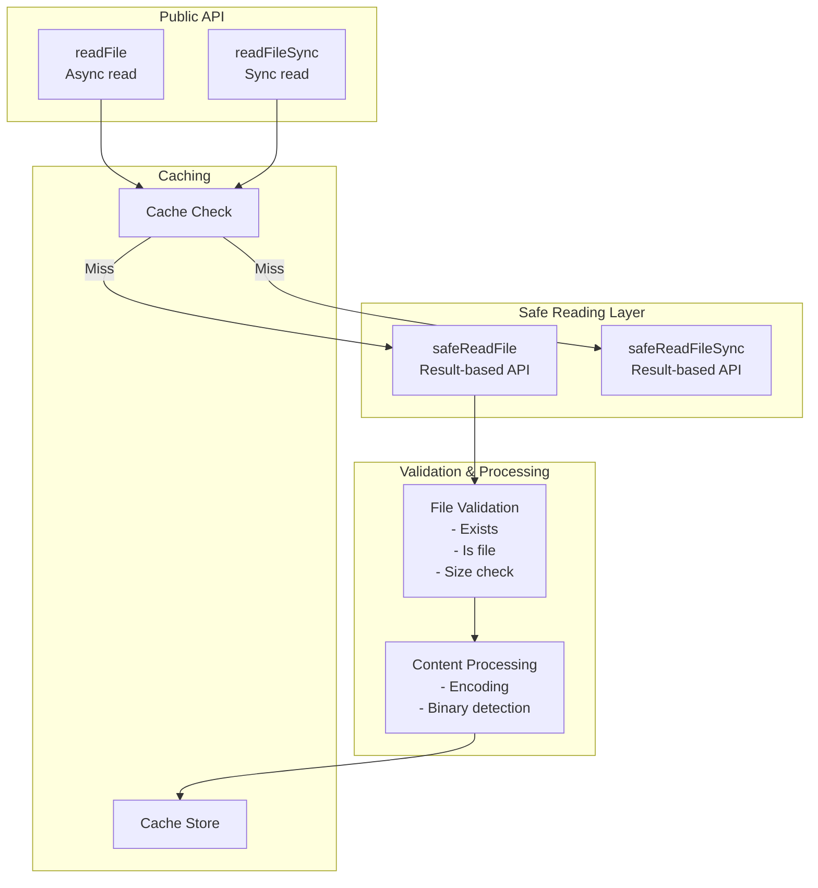
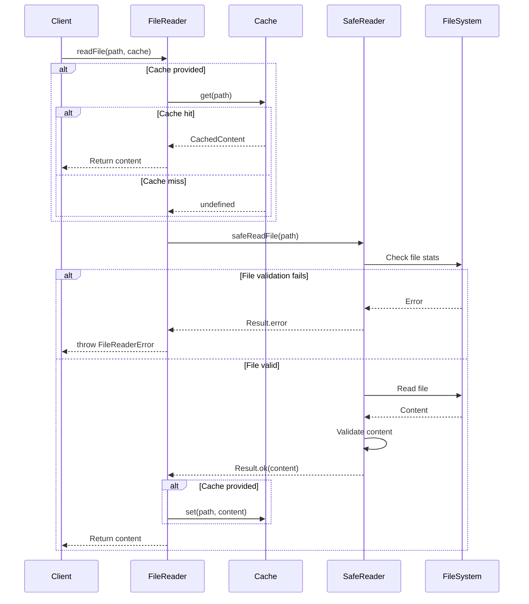
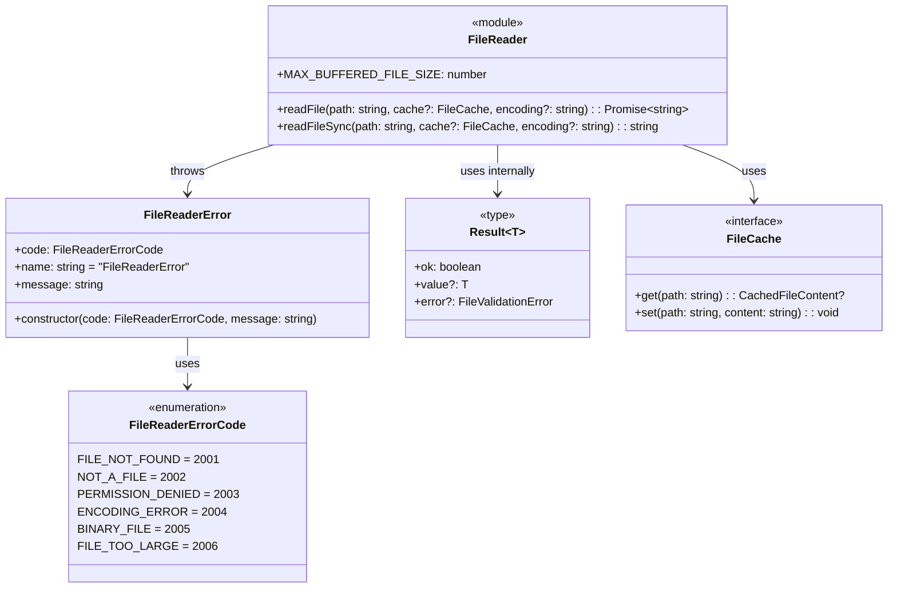
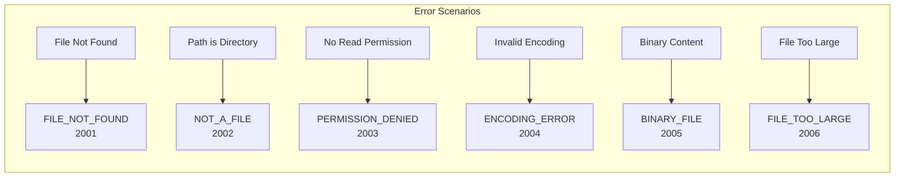
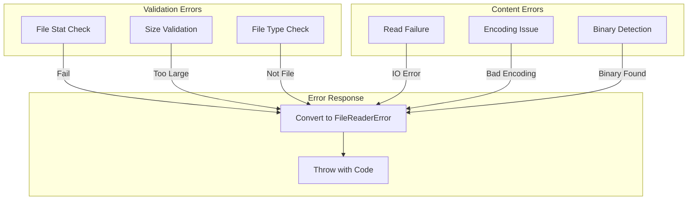

# fileReader.ts - File Reading Operations

## Overview

The `fileReader.ts` module provides safe file reading operations with built-in validation, error handling, and caching support. It ensures that only valid text files within size limits are read, protecting against various file system issues.

## Rationale

This module exists to:
1. Provide a safe, validated interface for file reading
2. Enforce size limits to prevent memory issues
3. Detect and reject binary files
4. Support optional caching for performance
5. Provide detailed error information for different failure modes
6. Offer both async and sync APIs for different use cases

## Architecture

The module implements a layered approach with validation before reading:



## Dependencies

### Internal Dependencies
- `./types` - FileCache interface
- `./utils/safeFileReader` - Safe file reading utilities
- `./utils/fileValidation` - File validation types

### External Dependencies
None directly (utilities handle Node.js fs module)

## API Reference

### Constants

```typescript
const MAX_BUFFERED_FILE_SIZE = 1024 * 1024; // 1MB
```

Maximum file size for buffered reading. Larger files should use streaming.

### Enums

#### FileReaderErrorCode
```typescript
export enum FileReaderErrorCode {
  FILE_NOT_FOUND = 2001,
  NOT_A_FILE = 2002,
  PERMISSION_DENIED = 2003,
  ENCODING_ERROR = 2004,
  BINARY_FILE = 2005,
  FILE_TOO_LARGE = 2006
}
```

Error codes for different file reading failures.

### Classes

#### FileReaderError
```typescript
export class FileReaderError extends Error {
  code: FileReaderErrorCode;
  
  constructor(code: FileReaderErrorCode, message: string);
}
```

File reading error with specific error code.

### Functions

#### readFile
```typescript
export async function readFile(
  path: string,
  cache?: FileCache,
  encoding: BufferEncoding = 'utf8'
): Promise<string>
```

Read entire file into memory with optional caching.

**Parameters:**
- `path` - The file path to read
- `cache` - Optional cache to use
- `encoding` - File encoding (default: 'utf8')

**Returns:** File content as string

**Throws:** `FileReaderError` if file is too large or other errors occur

**Features:**
- Cache-first reading
- Size validation (max 1MB)
- Binary file detection
- Detailed error reporting

#### readFileSync
```typescript
export function readFileSync(
  path: string,
  cache?: FileCache,
  encoding: BufferEncoding = 'utf8'
): string
```

Synchronously read entire file into memory with optional caching.

**Parameters:** Same as `readFile`

**Returns:** File content as string

**Throws:** `FileReaderError` if file is too large or other errors occur

### Re-exported Types

```typescript
export { safeReadFile, safeReadFileSync } from './utils/safeFileReader';
export type { FileReadResult } from './utils/safeFileReader';
export type { FileValidationError } from './utils/fileValidation';
```

Result-based APIs for users who prefer explicit error handling.

## Data Flow



## Class Diagrams



## Error Handling

### Error Code Mapping



### Error Handling Flow



## Performance Considerations

1. **Cache-First Strategy**
   - Check cache before any file operations
   - Eliminates redundant reads
   - Significant speedup for repeated access

2. **Size Limits**
   - 1MB limit prevents memory issues
   - Suitable for typical Markdown files
   - Larger files need streaming approach

3. **Binary Detection**
   - Early detection prevents processing
   - Avoids encoding errors
   - Saves processing time

4. **Sync vs Async**
   - Async preferred for I/O operations
   - Sync provided for CLI tools
   - Same validation logic

## Test Coverage

### Unit Test Scenarios

1. **Basic File Reading**
   ```typescript
   describe('readFile', () => {
     it('should read text file content', async () => {
       const content = await readFile('/test/file.md');
       expect(content).toBe('File content');
     });

     it('should use cache when provided', async () => {
       const cache = new MemoryFileCache();
       
       // First read
       await readFile('/test/file.md', cache);
       expect(cache.stats().misses).toBe(1);
       
       // Second read from cache
       await readFile('/test/file.md', cache);
       expect(cache.stats().hits).toBe(1);
     });

     it('should support different encodings', async () => {
       const content = await readFile('/test/latin1.txt', undefined, 'latin1');
       expect(content).toContain('special characters');
     });
   });
   ```

2. **Error Handling**
   ```typescript
   describe('error handling', () => {
     it('should throw FILE_NOT_FOUND for missing files', async () => {
       await expect(readFile('/nonexistent.md'))
         .rejects.toThrow(FileReaderError);
       
       try {
         await readFile('/nonexistent.md');
       } catch (error) {
         expect(error.code).toBe(FileReaderErrorCode.FILE_NOT_FOUND);
       }
     });

     it('should throw NOT_A_FILE for directories', async () => {
       await expect(readFile('/test/directory'))
         .rejects.toThrow(new FileReaderError(
           FileReaderErrorCode.NOT_A_FILE,
           'Path is not a file'
         ));
     });

     it('should throw FILE_TOO_LARGE for big files', async () => {
       // Create a file larger than 1MB
       await expect(readFile('/test/large.md'))
         .rejects.toThrow(new FileReaderError(
           FileReaderErrorCode.FILE_TOO_LARGE,
           'File exceeds maximum size'
         ));
     });

     it('should throw BINARY_FILE for binary content', async () => {
       await expect(readFile('/test/image.jpg'))
         .rejects.toThrow(new FileReaderError(
           FileReaderErrorCode.BINARY_FILE,
           'Binary files are not supported'
         ));
     });
   });
   ```

3. **Sync API Tests**
   ```typescript
   describe('readFileSync', () => {
     it('should read file synchronously', () => {
       const content = readFileSync('/test/file.md');
       expect(content).toBe('File content');
     });

     it('should work with cache', () => {
       const cache = new MemoryFileCache();
       
       readFileSync('/test/file.md', cache);
       const cached = cache.get('/test/file.md');
       expect(cached).toBeDefined();
     });

     it('should throw same errors as async version', () => {
       expect(() => readFileSync('/nonexistent.md'))
         .toThrow(FileReaderError);
     });
   });
   ```

4. **Cache Integration**
   ```typescript
   describe('cache integration', () => {
     it('should not cache files that fail validation', async () => {
       const cache = new MemoryFileCache();
       
       try {
         await readFile('/test/binary.jpg', cache);
       } catch (error) {
         // Expected to fail
       }
       
       expect(cache.get('/test/binary.jpg')).toBeUndefined();
     });

     it('should update cache on successful read', async () => {
       const cache = new MemoryFileCache();
       const content = await readFile('/test/file.md', cache);
       
       const cached = cache.get('/test/file.md');
       expect(cached?.content).toBe(content);
       expect(cached?.size).toBe(Buffer.byteLength(content, 'utf8'));
     });
   });
   ```

### Edge Cases

```typescript
describe('edge cases', () => {
  it('should handle empty files', async () => {
    const content = await readFile('/test/empty.md');
    expect(content).toBe('');
  });

  it('should handle files with special characters', async () => {
    const content = await readFile('/test/unicode.md');
    expect(content).toContain('🎉');
    expect(content).toContain('你好');
  });

  it('should handle files at size boundary', async () => {
    // File exactly 1MB
    const content = await readFile('/test/exactly-1mb.md');
    expect(content.length).toBe(1024 * 1024);
  });

  it('should handle symbolic links', async () => {
    const content = await readFile('/test/symlink.md');
    expect(content).toBe('Target file content');
  });
});
```

### Performance Tests

```typescript
describe('performance', () => {
  it('should be fast with cache', async () => {
    const cache = new MemoryFileCache();
    const iterations = 1000;
    
    // Warm up cache
    await readFile('/test/file.md', cache);
    
    const start = Date.now();
    for (let i = 0; i < iterations; i++) {
      await readFile('/test/file.md', cache);
    }
    const elapsed = Date.now() - start;
    
    // Should be very fast with cache
    expect(elapsed).toBeLessThan(50); // <50ms for 1000 reads
  });
});
```

## Usage Examples

### Basic File Reading
```typescript
import { readFile } from './fileReader';

try {
  const content = await readFile('/docs/guide.md');
  console.log(content);
} catch (error) {
  if (error instanceof FileReaderError) {
    switch (error.code) {
      case FileReaderErrorCode.FILE_NOT_FOUND:
        console.error('File not found');
        break;
      case FileReaderErrorCode.FILE_TOO_LARGE:
        console.error('File is too large, use streaming instead');
        break;
      default:
        console.error(`Read error: ${error.message}`);
    }
  }
}
```

### With Caching
```typescript
import { readFile, MemoryFileCache } from 'markdown-transclusion';

const cache = new MemoryFileCache();

// Multiple reads of the same file
const tasks = [
  readFile('/docs/api.md', cache),
  readFile('/docs/api.md', cache),
  readFile('/docs/api.md', cache)
];

const results = await Promise.all(tasks);
console.log(cache.stats()); // { size: 1, hits: 2, misses: 1 }
```

### Result-Based API
```typescript
import { safeReadFile } from './fileReader';

const result = await safeReadFile('/docs/guide.md');

if (result.ok) {
  console.log(`Content: ${result.value.content}`);
  console.log(`Size: ${result.value.size} bytes`);
} else {
  console.error(`Error: ${result.error.message}`);
  console.error(`Code: ${result.error.code}`);
}
```

### Error Recovery
```typescript
async function readWithFallback(
  primaryPath: string,
  fallbackPath: string,
  cache?: FileCache
): Promise<string> {
  try {
    return await readFile(primaryPath, cache);
  } catch (error) {
    if (error instanceof FileReaderError && 
        error.code === FileReaderErrorCode.FILE_NOT_FOUND) {
      // Try fallback
      return await readFile(fallbackPath, cache);
    }
    throw error;
  }
}
```

### CLI Usage
```typescript
import { readFileSync } from './fileReader';

// Synchronous for CLI tools
function processFile(path: string): void {
  try {
    const content = readFileSync(path);
    console.log(`File has ${content.split('\n').length} lines`);
  } catch (error) {
    console.error(`Failed to read ${path}: ${error.message}`);
    process.exit(1);
  }
}
```