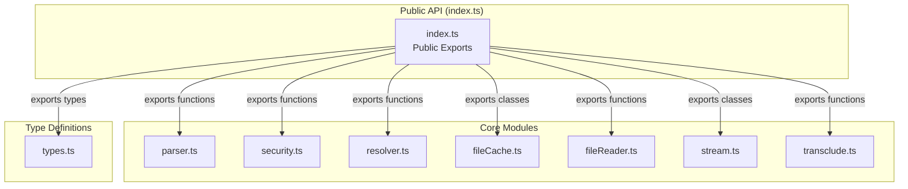
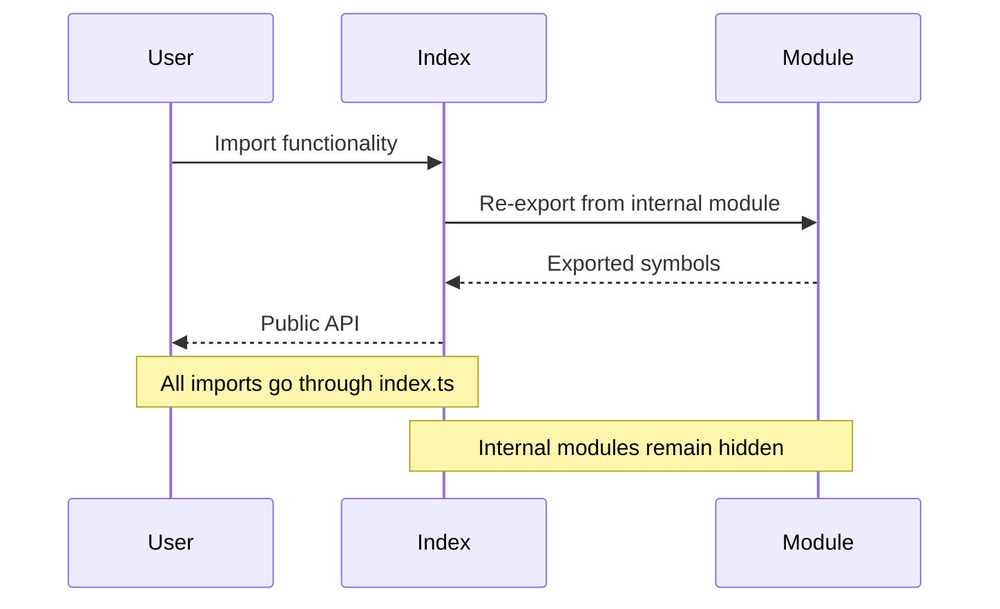
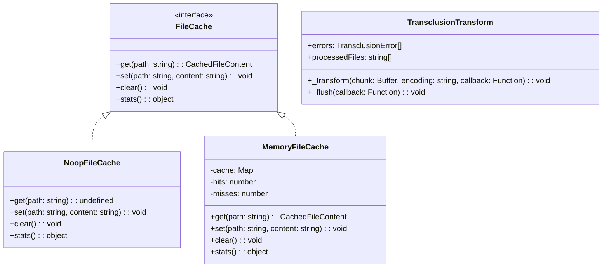

# index.ts - Main API Entry Point

## Overview

The `index.ts` module serves as the main entry point for the markdown-transclusion library. It provides a clean, consolidated API by re-exporting all public functionality from internal modules.

## Rationale

This module exists to:
1. Provide a single, clean import point for library consumers
2. Hide internal module structure from external users
3. Control which APIs are exposed publicly
4. Enable future refactoring without breaking external interfaces
5. Simplify the import statements for users of the library

## Architecture

The module follows a facade pattern, presenting a unified interface to the library's functionality:



## Dependencies

### Direct Dependencies
- `./types` - TypeScript type definitions
- `./parser` - Transclusion reference parsing
- `./security` - Path security validation
- `./resolver` - Path resolution and variable substitution
- `./fileCache` - File caching implementations
- `./fileReader` - File reading operations
- `./stream` - Streaming transforms
- `./transclude` - Core transclusion functionality

### No External Dependencies
The module itself has no external dependencies, only re-exports from internal modules.

## API Reference

### Exported Types
```typescript
export type {
  TransclusionOptions,
  TransclusionError,
  TransclusionResult,
  TransclusionToken,
  FileResolution,
  CachedFileContent,
  FileCache
} from './types';
```

### Exported Functions

#### Parser Module
- `parseTransclusionReferences` - Parse transclusion tokens from text

#### Security Module
- `validatePath` - Validate path for security issues
- `isWithinBasePath` - Check if path is within allowed directory
- `SecurityError` - Security validation error class
- `SecurityErrorCode` - Security error code enumeration

#### Resolver Module
- `resolvePath` - Resolve transclusion reference to file path
- `substituteVariables` - Replace variables in paths

#### File Cache Module
- `NoopFileCache` - No-operation cache implementation
- `MemoryFileCache` - In-memory cache implementation

#### File Reader Module
- `readFile` - Asynchronously read file contents
- `readFileSync` - Synchronously read file contents
- `FileReaderError` - File reading error class
- `FileReaderErrorCode` - File reader error codes

#### Stream Module
- `TransclusionTransform` - Transform stream for processing
- `createTransclusionStream` - Factory for creating transform streams

#### Transclude Module
- `processLine` - Process single line with transclusions
- `transclude` - Process complete text with transclusions
- `transcludeFile` - Process file with transclusions

## Data Flow



## Class Diagrams

Since this is primarily an export module, it doesn't define its own classes. However, it exposes the following class hierarchy:



## Error Handling

The module re-exports error classes from internal modules:

1. **SecurityError** - Path security violations
   - `ABSOLUTE_PATH` - Absolute paths not allowed
   - `PATH_TRAVERSAL` - Path traversal attempts
   - `NULL_BYTE` - Null bytes in paths
   - `INVALID_CHARACTERS` - Invalid path characters
   - `OUTSIDE_BASE` - Path outside base directory

2. **FileReaderError** - File reading failures
   - `FILE_NOT_FOUND` - File doesn't exist
   - `NOT_A_FILE` - Path is not a file
   - `PERMISSION_DENIED` - No read permission
   - `ENCODING_ERROR` - Encoding issues
   - `BINARY_FILE` - Binary file detected
   - `FILE_TOO_LARGE` - File exceeds size limit

## Performance Considerations

1. **Zero Runtime Overhead** - Pure re-export module with no runtime logic
2. **Tree Shaking** - Modern bundlers can eliminate unused exports
3. **Type-Only Exports** - Type exports have no runtime cost
4. **Lazy Loading** - Modules are loaded only when their exports are used

## Test Coverage

### Test Plan

Since this is a pure export module, testing focuses on:

1. **Export Verification**
   - Verify all expected exports are present
   - Ensure no internal modules are accidentally exposed
   - Check that exported types match their sources

2. **Integration Tests**
   - Test that all exported functions work correctly
   - Verify error classes can be caught properly
   - Ensure type exports work with TypeScript

3. **Regression Tests**
   - Monitor for accidental API changes
   - Verify backward compatibility
   - Check for unintended export additions

### Test Implementation
```typescript
describe('index.ts exports', () => {
  it('should export all public types', () => {
    // Verify type exports (compile-time check)
    const options: TransclusionOptions = {};
    expect(options).toBeDefined();
  });

  it('should export all public functions', () => {
    expect(parseTransclusionReferences).toBeDefined();
    expect(validatePath).toBeDefined();
    expect(resolvePath).toBeDefined();
    expect(readFile).toBeDefined();
    expect(transclude).toBeDefined();
  });

  it('should export all public classes', () => {
    expect(NoopFileCache).toBeDefined();
    expect(MemoryFileCache).toBeDefined();
    expect(TransclusionTransform).toBeDefined();
    expect(SecurityError).toBeDefined();
    expect(FileReaderError).toBeDefined();
  });

  it('should not export internal utilities', () => {
    // Ensure internal modules aren't exposed
    expect((module as any).internalFunction).toBeUndefined();
  });
});
```

## Usage Examples

```typescript
// Import everything needed from the main entry point
import {
  transclude,
  transcludeFile,
  createTransclusionStream,
  TransclusionOptions,
  TransclusionError,
  MemoryFileCache
} from 'markdown-transclusion';

// Use the library
const options: TransclusionOptions = {
  basePath: '/docs',
  cache: new MemoryFileCache(),
  maxDepth: 5
};

// Process a string
const result = await transclude(markdownText, options);

// Process a file
const fileResult = await transcludeFile('/docs/main.md', options);

// Use streaming interface
const stream = createTransclusionStream(options);
```