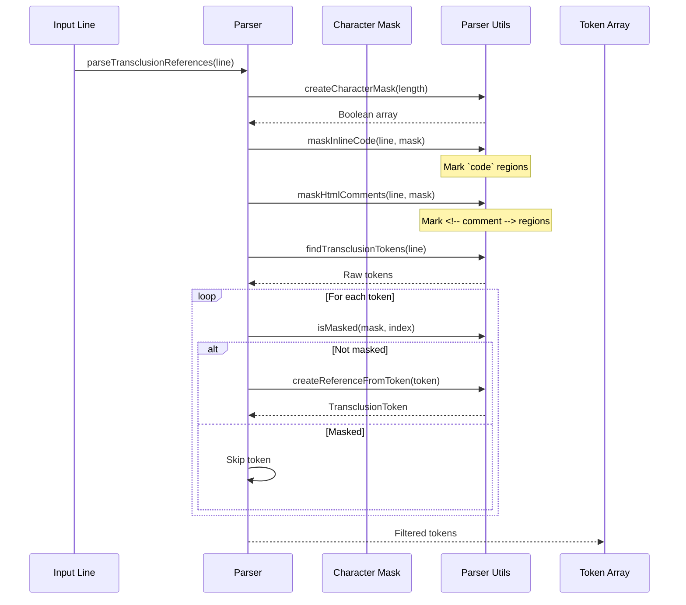
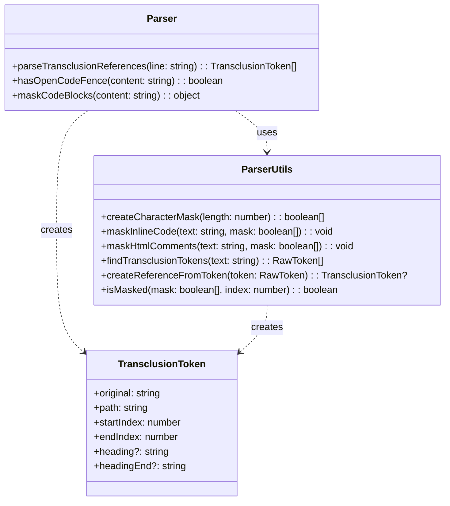
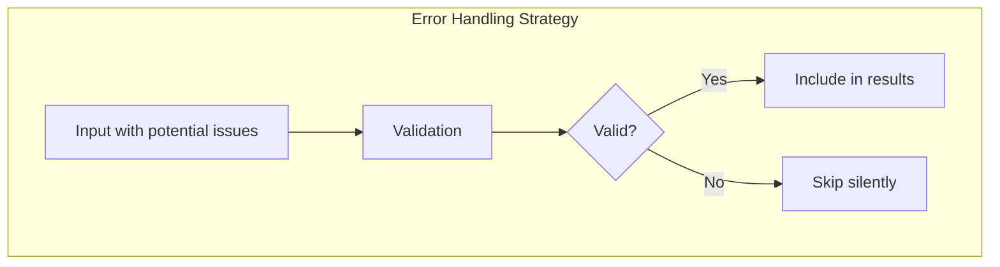

# parser.ts - Transclusion Reference Parsing

## Overview

The `parser.ts` module is responsible for parsing transclusion references from Markdown text. It identifies and extracts transclusion tokens (like `![[file.md]]`) while respecting Markdown syntax rules, ignoring references within code blocks and HTML comments.

## Rationale

This module exists to:
1. Accurately identify transclusion references in Markdown text
2. Respect Markdown syntax by ignoring references in code blocks
3. Handle edge cases like HTML comments and inline code
4. Provide detailed token information for processing
5. Support heading extraction syntax (`![[file#heading]]`)

## Architecture

The parser uses a multi-stage approach with character masking to ensure accurate parsing:

```mermaid
graph TB
    subgraph "Parsing Pipeline"
        Input[Input Line]
        Mask[Character Mask]
        TokenFind[Find Tokens]
        TokenFilter[Filter Masked]
        TokenConvert[Convert to References]
        Output[TransclusionToken[]]
    end
    
    subgraph "Masking Operations"
        MaskCode[Mask Inline Code]
        MaskHTML[Mask HTML Comments]
        MaskCheck[Check if Masked]
    end
    
    subgraph "Token Processing"
        FindTokens[Find ![[...]] patterns]
        ValidateToken[Validate Token]
        ExtractParts[Extract Path & Heading]
    end
    
    Input --> Mask
    Mask --> MaskCode
    Mask --> MaskHTML
    
    Input --> TokenFind
    TokenFind --> FindTokens
    
    TokenFilter --> MaskCheck
    MaskCheck --> TokenConvert
    
    TokenConvert --> ValidateToken
    TokenConvert --> ExtractParts
    TokenConvert --> Output
```

## Dependencies

### Internal Dependencies
- `./utils/parserUtils` - Low-level parsing utilities
  - `createCharacterMask` - Create boolean mask for characters
  - `maskInlineCode` - Mark inline code regions
  - `maskHtmlComments` - Mark HTML comment regions
  - `findTransclusionTokens` - Find all potential tokens
  - `createReferenceFromToken` - Convert token to reference
  - `isMasked` - Check if position is masked

### External Dependencies
None - Pure JavaScript/TypeScript implementation

## API Reference

### Main Functions

#### parseTransclusionReferences
```typescript
export function parseTransclusionReferences(line: string): TransclusionToken[]
```

Parse transclusion references from a line of text.

**Parameters:**
- `line` - The line to parse

**Returns:** Array of parsed transclusion tokens

**Algorithm:**
1. Create character mask for the line
2. Mask regions to ignore (inline code, HTML comments)
3. Find all potential transclusion tokens
4. Filter out tokens in masked regions
5. Convert valid tokens to references

#### hasOpenCodeFence
```typescript
export function hasOpenCodeFence(content: string): boolean
```

Check if content contains unclosed code fences.

**Parameters:**
- `content` - The content to check

**Returns:** True if content contains unclosed code fences

**Use Case:** Helps with multi-line content processing to detect if a line is inside a code block.

#### maskCodeBlocks
```typescript
export function maskCodeBlocks(content: string): { masked: string; blocks: string[] }
```

Remove code blocks from content before processing.

**Parameters:**
- `content` - The content to process

**Returns:** Object with masked content and extracted blocks

**Use Case:** Pre-processing for multi-line content to handle code blocks that span multiple lines.

### Regular Expressions

```typescript
const CODE_FENCE_PATTERN = /^```[\s\S]*?^```/gm;
```

Matches code blocks that start and end with triple backticks at line start.

## Data Flow



## Class Diagrams



## Error Handling

The parser is designed to be resilient and doesn't throw errors. Instead:

1. **Invalid Syntax** - Malformed references are ignored
2. **Edge Cases** - Handles empty strings, special characters
3. **Masked Regions** - References in code/comments are silently skipped



## Performance Considerations

1. **Single Pass Parsing**
   - Line processed only once
   - Efficient character masking
   - No backtracking required

2. **Memory Efficiency**
   - Boolean array for masking (1 bit per character conceptually)
   - No string copying during masking
   - Tokens store only necessary data

3. **Regex Optimization**
   - Compiled regex patterns
   - Non-greedy matching
   - Multiline flag for efficiency

4. **Early Termination**
   - Skip processing if no `![[` found
   - Quick validation checks

## Test Coverage

### Unit Test Scenarios

1. **Basic Parsing**
   ```typescript
   describe('parseTransclusionReferences', () => {
     it('should parse simple transclusion', () => {
       const tokens = parseTransclusionReferences('![[file.md]]');
       expect(tokens).toHaveLength(1);
       expect(tokens[0].path).toBe('file.md');
     });

     it('should parse multiple transclusions', () => {
       const tokens = parseTransclusionReferences('![[a.md]] text ![[b.md]]');
       expect(tokens).toHaveLength(2);
     });

     it('should extract heading references', () => {
       const tokens = parseTransclusionReferences('![[file.md#heading]]');
       expect(tokens[0].heading).toBe('heading');
     });

     it('should extract heading ranges', () => {
       const tokens = parseTransclusionReferences('![[file.md#start:end]]');
       expect(tokens[0].heading).toBe('start');
       expect(tokens[0].headingEnd).toBe('end');
     });
   });
   ```

2. **Masking Tests**
   ```typescript
   describe('masking', () => {
     it('should ignore transclusions in inline code', () => {
       const tokens = parseTransclusionReferences('Text `![[file.md]]` more');
       expect(tokens).toHaveLength(0);
     });

     it('should ignore transclusions in HTML comments', () => {
       const tokens = parseTransclusionReferences('<!-- ![[file.md]] -->');
       expect(tokens).toHaveLength(0);
     });

     it('should handle nested backticks correctly', () => {
       const tokens = parseTransclusionReferences('``![[file.md]]``');
       expect(tokens).toHaveLength(0);
     });
   });
   ```

3. **Edge Cases**
   ```typescript
   describe('edge cases', () => {
     it('should handle empty input', () => {
       expect(parseTransclusionReferences('')).toHaveLength(0);
     });

     it('should handle malformed references', () => {
       expect(parseTransclusionReferences('![[]]')).toHaveLength(0);
       expect(parseTransclusionReferences('![[')).toHaveLength(0);
       expect(parseTransclusionReferences('![[incomplete')).toHaveLength(0);
     });

     it('should handle special characters in paths', () => {
       const tokens = parseTransclusionReferences('![[path/to/file.md]]');
       expect(tokens[0].path).toBe('path/to/file.md');
     });
   });
   ```

4. **Code Block Tests**
   ```typescript
   describe('code blocks', () => {
     it('should detect open code fences', () => {
       expect(hasOpenCodeFence('```\ncode')).toBe(true);
       expect(hasOpenCodeFence('```\ncode\n```')).toBe(false);
     });

     it('should mask code blocks', () => {
       const content = '```\n![[file.md]]\n```\n![[other.md]]';
       const { masked } = maskCodeBlocks(content);
       expect(masked).not.toContain('![[file.md]]');
       expect(masked).toContain('\0');
     });
   });
   ```

### Integration Test Scenarios

1. **Complex Markdown**
   - Mixed content with code, comments, and transclusions
   - Real-world Markdown documents
   - Performance with large inputs

2. **Syntax Variations**
   - Different transclusion formats
   - Unicode in paths
   - Windows vs Unix paths

3. **Performance Tests**
   - Large lines (10KB+)
   - Many transclusions per line
   - Deeply nested code blocks

### Property-Based Testing

```typescript
import fc from 'fast-check';

describe('property-based tests', () => {
  it('should never throw errors', () => {
    fc.assert(
      fc.property(fc.string(), (input) => {
        expect(() => parseTransclusionReferences(input)).not.toThrow();
      })
    );
  });

  it('should preserve token positions', () => {
    fc.assert(
      fc.property(fc.string(), (prefix) => {
        const line = prefix + '![[file.md]]';
        const tokens = parseTransclusionReferences(line);
        if (tokens.length > 0) {
          expect(line.substring(tokens[0].startIndex, tokens[0].endIndex))
            .toBe('![[file.md]]');
        }
      })
    );
  });
});
```

## Usage Examples

### Basic Usage
```typescript
import { parseTransclusionReferences } from './parser';

const line = 'Here is a transclusion: ![[example.md]] and some text.';
const tokens = parseTransclusionReferences(line);

for (const token of tokens) {
  console.log(`Found transclusion: ${token.path}`);
  console.log(`Position: ${token.startIndex}-${token.endIndex}`);
  if (token.heading) {
    console.log(`Heading: ${token.heading}`);
  }
}
```

### Processing Markdown Document
```typescript
import { parseTransclusionReferences, maskCodeBlocks } from './parser';

function processMarkdown(content: string) {
  // First, handle multi-line code blocks
  const { masked, blocks } = maskCodeBlocks(content);
  
  // Process each line
  const lines = masked.split('\n');
  const allTokens: TransclusionToken[] = [];
  
  for (const line of lines) {
    const tokens = parseTransclusionReferences(line);
    allTokens.push(...tokens);
  }
  
  return allTokens;
}
```

### Custom Token Processing
```typescript
import { parseTransclusionReferences } from './parser';

function replaceTransclusions(line: string, resolver: (path: string) => string): string {
  const tokens = parseTransclusionReferences(line);
  
  // Process tokens in reverse order to maintain positions
  let result = line;
  for (const token of tokens.reverse()) {
    const replacement = resolver(token.path);
    result = result.substring(0, token.startIndex) + 
             replacement + 
             result.substring(token.endIndex);
  }
  
  return result;
}
```