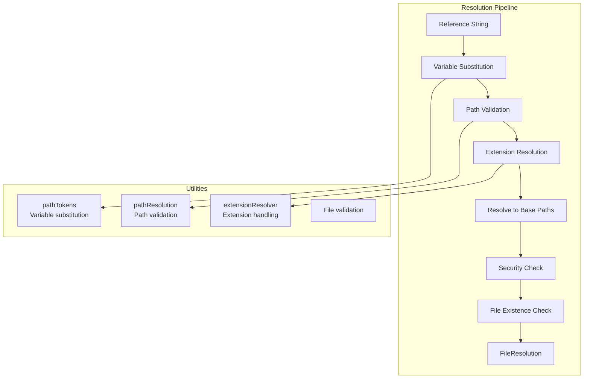
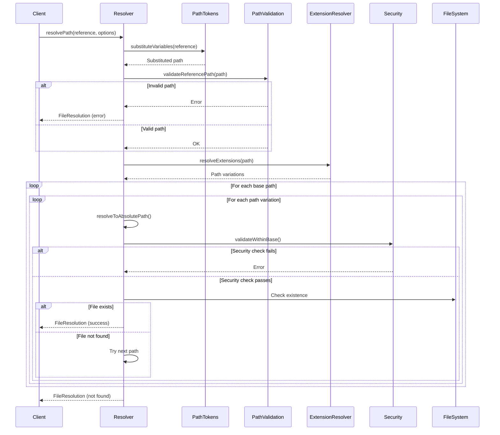
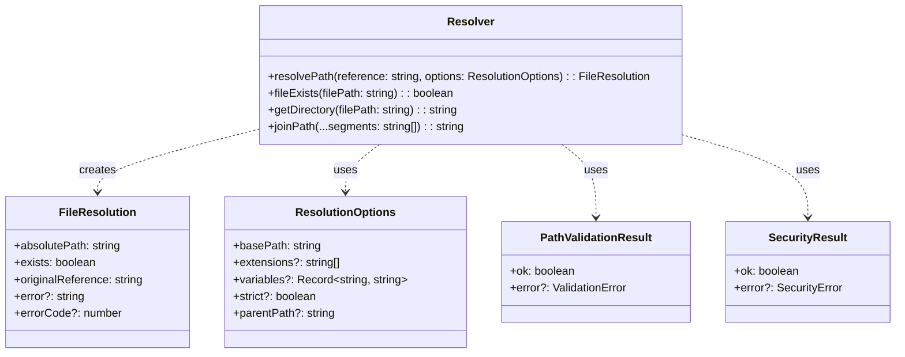
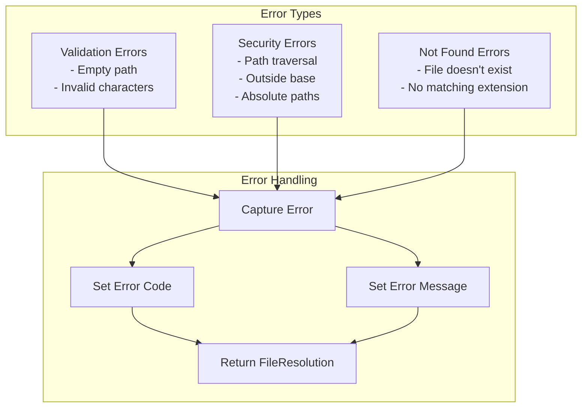

# resolver.ts - Path Resolution Logic

## Overview

The `resolver.ts` module handles the resolution of transclusion references to absolute file paths. It manages variable substitution, file extension resolution, security validation, and path normalization to ensure references are correctly resolved to existing files.

## Rationale

This module exists to:
1. Convert relative references to absolute paths safely
2. Support variable substitution in paths (e.g., `${VERSION}`)
3. Try multiple file extensions when none specified
4. Enforce security constraints (no path traversal)
5. Handle both parent-relative and base-relative resolution
6. Provide detailed error information for resolution failures

## Architecture

The resolver implements a multi-stage resolution pipeline:



## Dependencies

### Internal Dependencies
- `./utils/pathResolution` - Path validation and resolution utilities
- `./utils/pathTokens` - Variable substitution functionality
- `./utils/extensionResolver` - File extension resolution
- `./types` - TypeScript type definitions

### External Dependencies
- `path` (Node.js built-in) - Path manipulation
- `fs` (Node.js built-in) - File system operations

## API Reference

### Constants

```typescript
const DEFAULT_EXTENSIONS = ['.md', '.markdown'];
```

Default file extensions to try when no extension is provided.

### Main Functions

#### resolvePath
```typescript
export function resolvePath(
  reference: string,
  options: {
    basePath: string;
    extensions?: string[];
    variables?: Record<string, string>;
    strict?: boolean;
    parentPath?: string;
  }
): FileResolution
```

Resolve a transclusion reference to an absolute file path.

**Parameters:**
- `reference` - The reference path from the transclusion
- `options` - Resolution options
  - `basePath` - Base directory for resolution
  - `extensions` - File extensions to try (default: `['.md', '.markdown']`)
  - `variables` - Variables for substitution
  - `strict` - Strict mode for variable substitution
  - `parentPath` - Parent file path for relative resolution

**Returns:** `FileResolution` object with resolution result

**Resolution Order:**
1. Substitute variables in the reference
2. Validate the reference path
3. Generate paths with different extensions
4. Try resolution relative to parent (if provided)
5. Try resolution relative to base path
6. Perform security validation
7. Check file existence

#### substituteVariables
```typescript
export function substituteVariables(
  template: string,
  variables: Record<string, string>,
  strict?: boolean
): string
```

Re-exported from `./utils/pathTokens` for backward compatibility.

#### fileExists
```typescript
export function fileExists(filePath: string): boolean
```

Check if a file exists and is accessible.

**Parameters:**
- `filePath` - The path to check

**Returns:** True if file exists and is readable

#### getDirectory
```typescript
export function getDirectory(filePath: string): string
```

Get the directory name from a file path.

**Parameters:**
- `filePath` - The file path

**Returns:** Directory name

#### joinPath
```typescript
export function joinPath(...segments: string[]): string
```

Join path segments safely.

**Parameters:**
- `segments` - Path segments to join

**Returns:** Joined path

## Data Flow



## Class Diagrams



## Error Handling

The resolver provides detailed error information through the `FileResolution` object:



### Error Codes
- Validation errors: Custom codes from validation
- Security errors: `1001-1005` range
- File not found: No specific code
- Unexpected errors: Preserved from original error

## Performance Considerations

1. **File System Caching**
   - Results can be cached by consumers
   - Multiple existence checks minimized
   - Stat calls only when necessary

2. **Path Resolution Order**
   - Parent-relative tried first (more likely)
   - Base-relative as fallback
   - Early termination on success

3. **Extension Resolution**
   - Smart ordering of extensions
   - Skip if extension already present
   - Configurable extension list

4. **Security Validation**
   - Fast path checks before file system
   - Normalized paths for comparison
   - Single validation per candidate

## Test Coverage

### Unit Test Scenarios

1. **Basic Resolution**
   ```typescript
   describe('resolvePath', () => {
     it('should resolve relative path to absolute', () => {
       const result = resolvePath('file.md', {
         basePath: '/docs'
       });
       expect(result.absolutePath).toBe('/docs/file.md');
     });

     it('should try default extensions', () => {
       // When file.md doesn't exist but file.markdown does
       const result = resolvePath('file', {
         basePath: '/docs',
         extensions: ['.md', '.markdown']
       });
       expect(result.absolutePath).toBe('/docs/file.markdown');
     });

     it('should resolve parent-relative paths first', () => {
       const result = resolvePath('../shared/file.md', {
         basePath: '/docs',
         parentPath: '/docs/sub/current.md'
       });
       expect(result.absolutePath).toBe('/docs/shared/file.md');
     });
   });
   ```

2. **Variable Substitution**
   ```typescript
   describe('variable substitution', () => {
     it('should substitute variables in path', () => {
       const result = resolvePath('${VERSION}/file.md', {
         basePath: '/docs',
         variables: { VERSION: 'v1.0' }
       });
       expect(result.absolutePath).toBe('/docs/v1.0/file.md');
     });

     it('should handle strict mode', () => {
       const result = resolvePath('${UNKNOWN}/file.md', {
         basePath: '/docs',
         variables: {},
         strict: true
       });
       expect(result.error).toContain('Unknown variable');
     });
   });
   ```

3. **Security Tests**
   ```typescript
   describe('security', () => {
     it('should reject absolute paths', () => {
       const result = resolvePath('/etc/passwd', {
         basePath: '/docs'
       });
       expect(result.error).toContain('Absolute paths');
       expect(result.errorCode).toBe(1001);
     });

     it('should reject path traversal', () => {
       const result = resolvePath('../../etc/passwd', {
         basePath: '/docs'
       });
       expect(result.error).toContain('outside of base');
     });

     it('should handle encoded traversal attempts', () => {
       const result = resolvePath('..%2F..%2Fetc%2Fpasswd', {
         basePath: '/docs'
       });
       expect(result.exists).toBe(false);
     });
   });
   ```

4. **Error Handling**
   ```typescript
   describe('error handling', () => {
     it('should provide detailed error for missing files', () => {
       const result = resolvePath('nonexistent.md', {
         basePath: '/docs'
       });
       expect(result.exists).toBe(false);
       expect(result.error).toContain('File not found');
     });

     it('should preserve original reference', () => {
       const result = resolvePath('${VAR}/file.md', {
         basePath: '/docs',
         variables: { VAR: 'value' }
       });
       expect(result.originalReference).toBe('${VAR}/file.md');
     });
   });
   ```

### Integration Tests

1. **Complex Path Resolution**
   - Nested directories
   - Symbolic links
   - Cross-platform paths

2. **Extension Priority**
   - Multiple matching files
   - Custom extension order
   - No extension provided

3. **Real File System**
   - Actual file operations
   - Permission errors
   - Large directory structures

### Property-Based Testing

```typescript
describe('property-based tests', () => {
  it('should always return valid FileResolution', () => {
    fc.assert(
      fc.property(
        fc.string(),
        fc.record({
          basePath: fc.constantFrom('/tmp', '/docs', '.'),
          extensions: fc.array(fc.string())
        }),
        (reference, options) => {
          const result = resolvePath(reference, options);
          expect(result).toHaveProperty('absolutePath');
          expect(result).toHaveProperty('exists');
          expect(result).toHaveProperty('originalReference');
        }
      )
    );
  });

  it('should preserve reference in result', () => {
    fc.assert(
      fc.property(fc.string(), (reference) => {
        const result = resolvePath(reference, { basePath: '/docs' });
        expect(result.originalReference).toBe(reference);
      })
    );
  });
});
```

## Usage Examples

### Basic Path Resolution
```typescript
import { resolvePath } from './resolver';

// Simple resolution
const result = resolvePath('introduction.md', {
  basePath: '/docs'
});

if (result.exists) {
  console.log(`Resolved to: ${result.absolutePath}`);
} else {
  console.error(`Failed to resolve: ${result.error}`);
}
```

### With Variable Substitution
```typescript
const result = resolvePath('${LANG}/docs/${VERSION}/api.md', {
  basePath: '/content',
  variables: {
    LANG: 'en',
    VERSION: 'v2.0'
  },
  strict: true
});

// Resolves to: /content/en/docs/v2.0/api.md
```

### Parent-Relative Resolution
```typescript
// When processing /docs/guide/intro.md
const result = resolvePath('../api/endpoints.md', {
  basePath: '/docs',
  parentPath: '/docs/guide/intro.md'
});

// First tries: /docs/api/endpoints.md (relative to parent)
// Then tries: /api/endpoints.md (relative to base)
```

### Custom Extensions
```typescript
const result = resolvePath('readme', {
  basePath: '/project',
  extensions: ['.md', '.markdown', '.txt', '.rst']
});

// Tries in order:
// - /project/readme.md
// - /project/readme.markdown
// - /project/readme.txt
// - /project/readme.rst
```

### Error Handling
```typescript
const result = resolvePath(userInput, {
  basePath: '/safe/docs',
  strict: true
});

if (!result.exists) {
  switch (result.errorCode) {
    case 1001:
      console.error('Security: Absolute paths not allowed');
      break;
    case 1005:
      console.error('Security: Path outside base directory');
      break;
    default:
      console.error(`Resolution failed: ${result.error}`);
  }
}
```