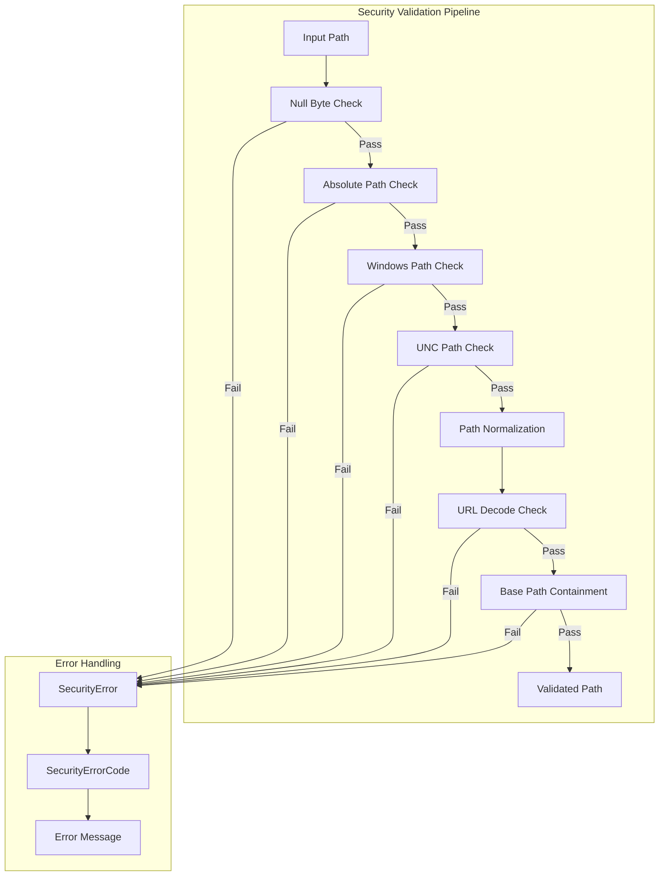
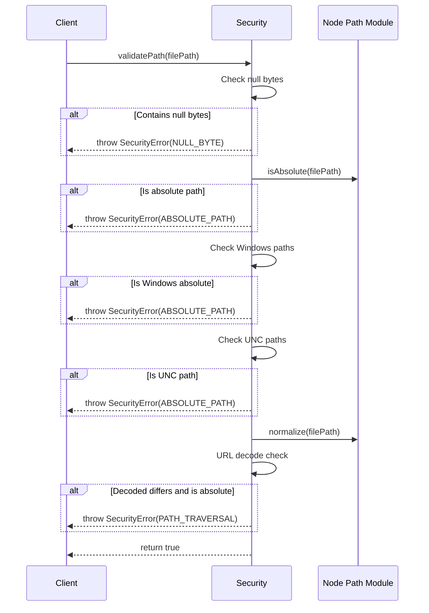
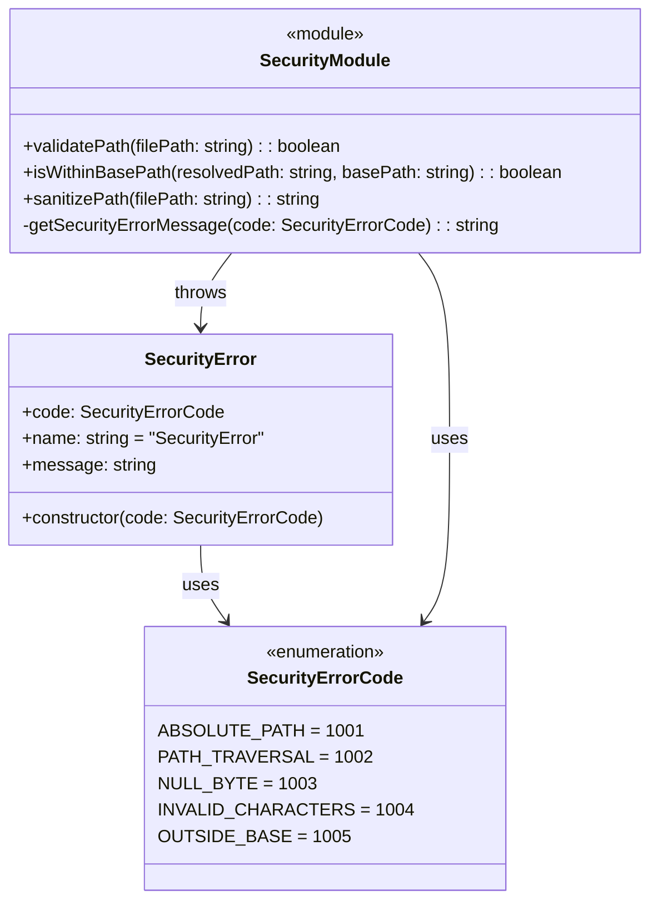
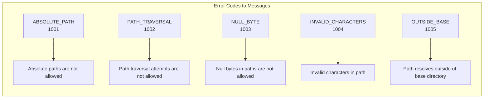

# security.ts - Security Validation

## Overview

The `security.ts` module provides security validation for file paths to prevent malicious path traversal attacks and unauthorized file access. It enforces strict security policies to ensure that transclusion operations remain within allowed boundaries.

## Rationale

This module exists to:
1. Prevent path traversal attacks (e.g., `../../etc/passwd`)
2. Block access to system files outside the allowed directory
3. Validate paths for dangerous characters (null bytes, etc.)
4. Enforce consistent security policies across the library
5. Provide clear error messages for security violations

## Architecture

The module implements a multi-layer security validation approach:



## Dependencies

### External Dependencies
- `path` (Node.js built-in) - Path manipulation and normalization

### No Internal Dependencies
This is a foundational module with no dependencies on other project modules.

## API Reference

### Enums

#### SecurityErrorCode
```typescript
export enum SecurityErrorCode {
  ABSOLUTE_PATH = 1001,
  PATH_TRAVERSAL = 1002,
  NULL_BYTE = 1003,
  INVALID_CHARACTERS = 1004,
  OUTSIDE_BASE = 1005
}
```

Security error codes for programmatic error handling.

### Classes

#### SecurityError
```typescript
export class SecurityError extends Error {
  code: SecurityErrorCode;
  
  constructor(code: SecurityErrorCode);
}
```

Security validation error with specific error code.

**Properties:**
- `code` - Specific security error code
- `name` - Always 'SecurityError'
- `message` - Human-readable error message

### Functions

#### validatePath
```typescript
export function validatePath(filePath: string): boolean
```

Validate a path for security issues.

**Parameters:**
- `filePath` - The path to validate

**Returns:** True if path is safe

**Throws:** `SecurityError` if validation fails

**Validation Steps:**
1. Check for null bytes (`\0`)
2. Check for absolute paths (`/path` or `C:\`)
3. Check for Windows absolute paths
4. Check for UNC paths (`\\server\share`)
5. Normalize the path
6. Check for URL-encoded traversal attempts

#### isWithinBasePath
```typescript
export function isWithinBasePath(
  resolvedPath: string, 
  basePath: string
): boolean
```

Check if a resolved absolute path is within the base directory.

**Parameters:**
- `resolvedPath` - The absolute path to check
- `basePath` - The base directory path

**Returns:** True if path is within base directory

**Security:**
- Handles path normalization
- Prevents traversal outside base
- Case-sensitive comparison

#### sanitizePath
```typescript
export function sanitizePath(filePath: string): string
```

Sanitize a file path by removing dangerous characters.

**Parameters:**
- `filePath` - The path to sanitize

**Returns:** Sanitized path

**Note:** This is a last resort - prefer validation and rejection.

**Operations:**
1. Remove null bytes
2. Remove control characters
3. Normalize path separators

## Data Flow



## Class Diagrams



## Error Handling

### Error Message Mapping



### Error Handling Strategy
1. **Fail Fast** - Throw immediately on security violation
2. **Clear Messages** - Human-readable error descriptions
3. **Error Codes** - Machine-readable codes for handling
4. **No Recovery** - Security errors are non-negotiable

## Performance Considerations

1. **Early Validation**
   - Quick checks (null bytes) performed first
   - More expensive checks (normalization) performed later
   - Short-circuit evaluation

2. **Switch Statement Optimization**
   - Error message lookup uses switch for performance
   - Numeric comparison faster than string lookup

3. **Path Normalization**
   - Only normalize when necessary
   - Cache normalized paths when possible

4. **Minimal Allocations**
   - Reuse error messages
   - Avoid unnecessary string operations

## Test Coverage

### Unit Test Scenarios

1. **Null Byte Detection**
   ```typescript
   describe('null byte validation', () => {
     it('should reject paths with null bytes', () => {
       expect(() => validatePath('file\0.md'))
         .toThrow(SecurityError);
       expect(() => validatePath('file\0.md'))
         .toThrow(/null bytes/i);
     });

     it('should reject encoded null bytes', () => {
       expect(() => validatePath('file%00.md'))
         .toThrow(SecurityError);
     });
   });
   ```

2. **Absolute Path Detection**
   ```typescript
   describe('absolute path validation', () => {
     it('should reject Unix absolute paths', () => {
       expect(() => validatePath('/etc/passwd'))
         .toThrow(new SecurityError(SecurityErrorCode.ABSOLUTE_PATH));
     });

     it('should reject Windows absolute paths', () => {
       expect(() => validatePath('C:\\Windows\\System32'))
         .toThrow(new SecurityError(SecurityErrorCode.ABSOLUTE_PATH));
       expect(() => validatePath('D:/Users/file.txt'))
         .toThrow(new SecurityError(SecurityErrorCode.ABSOLUTE_PATH));
     });

     it('should reject UNC paths', () => {
       expect(() => validatePath('\\\\server\\share\\file.txt'))
         .toThrow(new SecurityError(SecurityErrorCode.ABSOLUTE_PATH));
       expect(() => validatePath('//server/share/file.txt'))
         .toThrow(new SecurityError(SecurityErrorCode.ABSOLUTE_PATH));
     });
   });
   ```

3. **Path Traversal Detection**
   ```typescript
   describe('path traversal validation', () => {
     it('should allow relative paths with ..', () => {
       // These are allowed in validatePath, checked later in isWithinBasePath
       expect(() => validatePath('../sibling/file.md')).not.toThrow();
       expect(() => validatePath('../../file.md')).not.toThrow();
     });

     it('should reject URL-encoded absolute paths', () => {
       expect(() => validatePath('%2Fetc%2Fpasswd'))
         .toThrow(SecurityError);
     });
   });
   ```

4. **Base Path Containment**
   ```typescript
   describe('isWithinBasePath', () => {
     it('should accept paths within base', () => {
       expect(isWithinBasePath('/docs/file.md', '/docs')).toBe(true);
       expect(isWithinBasePath('/docs/sub/file.md', '/docs')).toBe(true);
     });

     it('should accept base path itself', () => {
       expect(isWithinBasePath('/docs', '/docs')).toBe(true);
     });

     it('should reject paths outside base', () => {
       expect(isWithinBasePath('/etc/passwd', '/docs')).toBe(false);
       expect(isWithinBasePath('/docs/../etc/passwd', '/docs')).toBe(false);
     });

     it('should handle trailing slashes correctly', () => {
       expect(isWithinBasePath('/docs/file.md', '/docs/')).toBe(true);
       expect(isWithinBasePath('/docsfile.md', '/docs')).toBe(false);
     });
   });
   ```

5. **Path Sanitization**
   ```typescript
   describe('sanitizePath', () => {
     it('should remove null bytes', () => {
       expect(sanitizePath('file\0.md')).toBe('file.md');
     });

     it('should remove control characters', () => {
       expect(sanitizePath('file\x01\x02.md')).toBe('file.md');
     });

     it('should normalize path separators', () => {
       expect(sanitizePath('path\\to\\file.md')).toBe('path/to/file.md');
       expect(sanitizePath('path//to///file.md')).toBe('path/to/file.md');
     });
   });
   ```

### Edge Case Tests

```typescript
describe('edge cases', () => {
  it('should handle empty paths', () => {
    expect(() => validatePath('')).not.toThrow();
  });

  it('should handle very long paths', () => {
    const longPath = 'a/'.repeat(1000) + 'file.md';
    expect(() => validatePath(longPath)).not.toThrow();
  });

  it('should handle Unicode in paths', () => {
    expect(() => validatePath('文档/文件.md')).not.toThrow();
    expect(() => validatePath('émojis/🎉.md')).not.toThrow();
  });

  it('should handle special characters', () => {
    expect(() => validatePath('file (1).md')).not.toThrow();
    expect(() => validatePath('file [draft].md')).not.toThrow();
    expect(() => validatePath('file@2x.md')).not.toThrow();
  });
});
```

### Security Fuzzing

```typescript
import fc from 'fast-check';

describe('security fuzzing', () => {
  it('should never allow access outside base', () => {
    fc.assert(
      fc.property(
        fc.string(),
        fc.constantFrom('/safe', '/docs', '/content'),
        (userInput, basePath) => {
          try {
            validatePath(userInput);
            const resolved = path.resolve(basePath, userInput);
            const isValid = isWithinBasePath(resolved, basePath);
            
            // If validation passes, must be within base
            if (isValid) {
              expect(resolved.startsWith(basePath)).toBe(true);
            }
          } catch (e) {
            // Security errors are expected for malicious input
            expect(e).toBeInstanceOf(SecurityError);
          }
        }
      )
    );
  });
});
```

## Usage Examples

### Basic Path Validation
```typescript
import { validatePath, SecurityError, SecurityErrorCode } from './security';

try {
  validatePath(userInput);
  // Path is safe to use
} catch (error) {
  if (error instanceof SecurityError) {
    switch (error.code) {
      case SecurityErrorCode.ABSOLUTE_PATH:
        console.error('Absolute paths not allowed');
        break;
      case SecurityErrorCode.NULL_BYTE:
        console.error('Invalid characters in path');
        break;
      default:
        console.error(`Security error: ${error.message}`);
    }
  }
}
```

### Base Path Containment Check
```typescript
import { isWithinBasePath } from './security';

const basePath = '/var/www/docs';
const resolvedPath = path.resolve(basePath, userProvidedPath);

if (!isWithinBasePath(resolvedPath, basePath)) {
  throw new Error('Access denied: Path outside allowed directory');
}

// Safe to read the file
const content = await fs.readFile(resolvedPath, 'utf8');
```

### Complete Security Flow
```typescript
import { validatePath, isWithinBasePath, SecurityError } from './security';

function secureFileAccess(userPath: string, basePath: string): string {
  // Step 1: Validate the input path
  try {
    validatePath(userPath);
  } catch (error) {
    if (error instanceof SecurityError) {
      logger.warn(`Security violation attempt: ${error.message}`, {
        code: error.code,
        path: userPath
      });
      throw new Error('Invalid file path');
    }
    throw error;
  }
  
  // Step 2: Resolve to absolute path
  const absolutePath = path.resolve(basePath, userPath);
  
  // Step 3: Verify within base directory
  if (!isWithinBasePath(absolutePath, basePath)) {
    logger.warn('Path traversal attempt', {
      requested: absolutePath,
      base: basePath
    });
    throw new Error('Access denied');
  }
  
  return absolutePath;
}
```

### Path Sanitization (Last Resort)
```typescript
import { sanitizePath } from './security';

// Only use when you cannot reject the input
// Always prefer validation and rejection
const cleaned = sanitizePath(dirtyPath);
console.log(`Sanitized: ${cleaned}`);

// Still need to validate after sanitization
validatePath(cleaned);
```