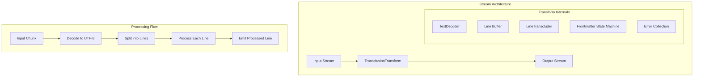
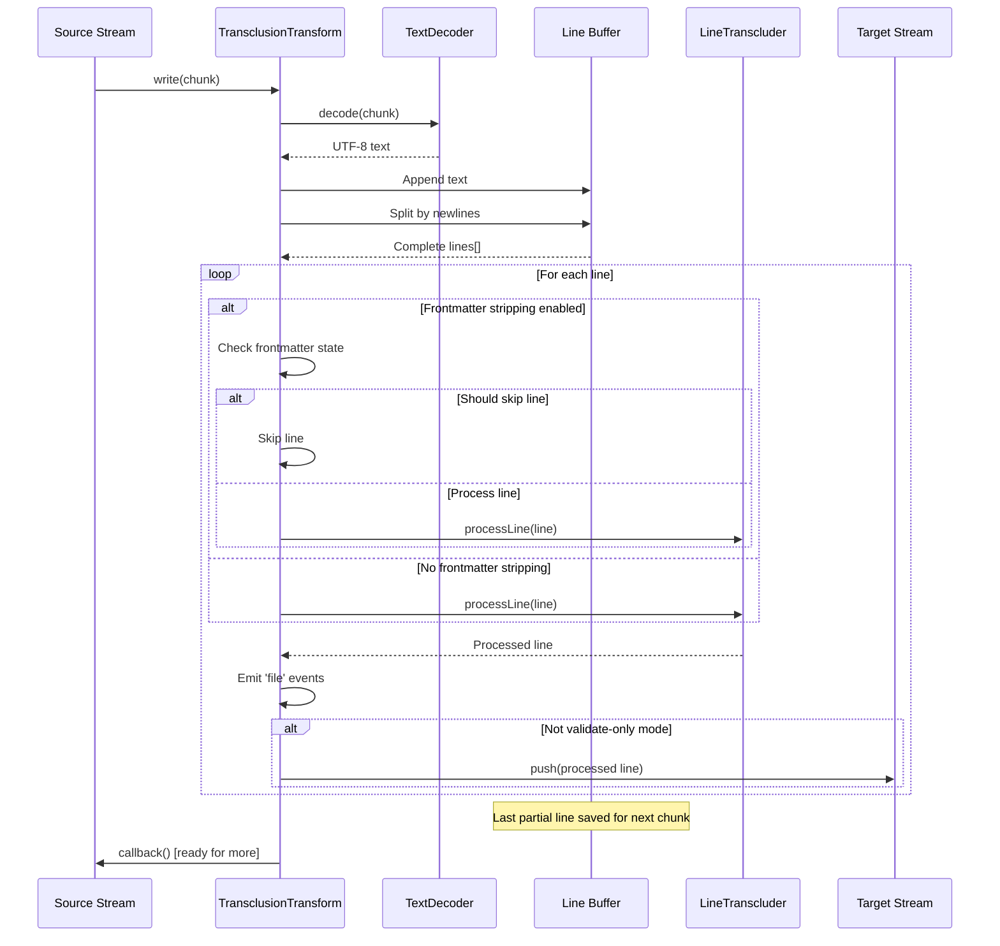
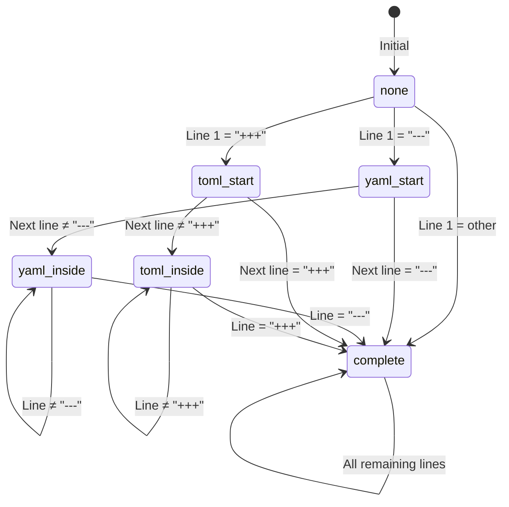
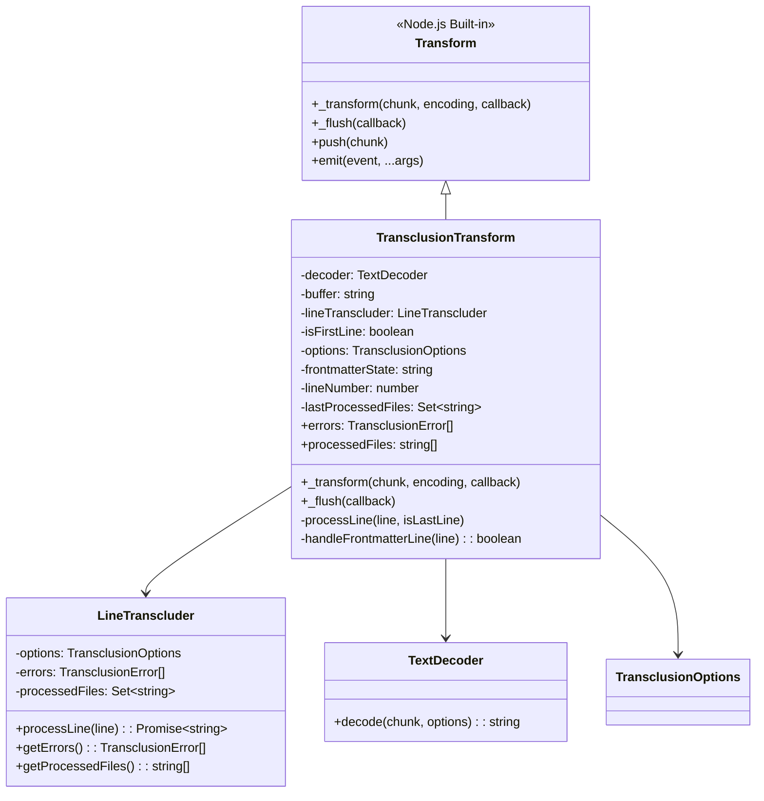

# stream.ts - Streaming Interface

## Overview

The `stream.ts` module provides a Node.js Transform stream implementation for processing Markdown content with transclusions. It enables efficient, memory-conscious processing of large files by processing content line-by-line as it flows through the stream.

## Rationale

This module exists to:
1. Enable streaming processing of large Markdown files
2. Integrate with Node.js stream pipelines
3. Provide real-time transclusion processing
4. Support frontmatter stripping in streams
5. Emit events for processed files
6. Maintain low memory footprint for large documents

## Architecture

The module implements a Transform stream that processes input chunks line-by-line:



## Dependencies

### Internal Dependencies
- `./utils/LineTranscluder` - Core line processing logic
- `./fileCache` - File caching implementations
- `./types` - TypeScript type definitions

### External Dependencies
- `stream` (Node.js built-in) - Transform stream base class
- `util` (Node.js built-in) - TextDecoder for UTF-8 handling

## API Reference

### Classes

#### TransclusionTransform
```typescript
export class TransclusionTransform extends Transform {
  readonly errors: TransclusionError[];
  readonly processedFiles: string[];
  
  constructor(options: TransclusionOptions);
}
```

Transform stream for processing transclusions.

**Properties:**
- `errors` - Accumulated errors during processing
- `processedFiles` - List of files that were processed

**Events:**
- `file` - Emitted when a new file is processed
  ```typescript
  stream.on('file', (filePath: string) => {
    console.log(`Processed: ${filePath}`);
  });
  ```

**Options:**
- All `TransclusionOptions` are supported
- Automatic `MemoryFileCache` when conditions are met

### Functions

#### createTransclusionStream
```typescript
export function createTransclusionStream(
  options: TransclusionOptions = {}
): TransclusionTransform
```

Factory function to create a new transclusion transform stream.

**Parameters:**
- `options` - Transclusion options

**Returns:** New `TransclusionTransform` instance

## Data Flow



### Frontmatter State Machine



## Class Diagrams



## Error Handling

The stream collects errors without interrupting the flow:

```mermaid
graph TB
    subgraph "Error Collection"
        Process[Process Line]
        LineTranscluder[LineTranscluder<br/>Collects Errors]
        ErrorArray[errors: TransclusionError[]]
        Consumer[Stream Consumer]
    end
    
    subgraph "Error Types"
        FileError[File Not Found]
        ParseError[Parse Error]
        SecurityError[Security Error]
        CircularError[Circular Reference]
    end
    
    Process --> LineTranscluder
    LineTranscluder --> ErrorArray
    
    FileError --> LineTranscluder
    ParseError --> LineTranscluder
    SecurityError --> LineTranscluder
    CircularError --> LineTranscluder
    
    Consumer -->|Check after stream ends| ErrorArray
```

### Error Handling Strategy
1. **Non-blocking** - Errors don't stop the stream
2. **Accumulation** - All errors collected in array
3. **Context Preserved** - File path and line info retained
4. **Post-processing** - Check errors after stream completes

## Performance Considerations

1. **Streaming Architecture**
   - Constant memory usage regardless of file size
   - No full file buffering
   - Processes data as it arrives

2. **Automatic Caching**
   - Enables `MemoryFileCache` when beneficial
   - Conditions: No explicit cache, not validate-only, maxDepth > 1
   - Significant speedup for recursive transclusions

3. **Line Buffering**
   - Minimal buffer for incomplete lines
   - Efficient string building with single join
   - No unnecessary string concatenation

4. **Event Batching**
   - File events emitted only for new files
   - Prevents duplicate events
   - Efficient set-based tracking

5. **UTF-8 Decoding**
   - Streaming decoder handles partial characters
   - No data loss at chunk boundaries
   - Supports all Unicode content

## Test Coverage

### Unit Test Scenarios

1. **Basic Streaming**
   ```typescript
   describe('TransclusionTransform', () => {
     it('should process simple content', async () => {
       const stream = createTransclusionStream({ basePath: '/docs' });
       const output: string[] = [];
       
       stream.on('data', chunk => output.push(chunk.toString()));
       
       stream.write('Line 1\n');
       stream.write('![[file.md]]\n');
       stream.write('Line 3');
       stream.end();
       
       await finished(stream);
       expect(output.join('')).toContain('Line 1');
       expect(output.join('')).toContain('transcluded content');
       expect(output.join('')).toContain('Line 3');
     });

     it('should handle chunk boundaries', async () => {
       const stream = createTransclusionStream({ basePath: '/docs' });
       
       // Split transclusion across chunks
       stream.write('![[fi');
       stream.write('le.md]]');
       stream.end();
       
       // Should still process correctly
     });
   });
   ```

2. **Error Collection**
   ```typescript
   describe('error handling', () => {
     it('should collect errors without stopping', async () => {
       const stream = createTransclusionStream({ basePath: '/docs' });
       
       stream.write('![[missing1.md]]\n');
       stream.write('Valid content\n');
       stream.write('![[missing2.md]]');
       stream.end();
       
       await finished(stream);
       expect(stream.errors).toHaveLength(2);
       expect(stream.errors[0].path).toBe('missing1.md');
       expect(stream.errors[1].path).toBe('missing2.md');
     });
   });
   ```

3. **Frontmatter Handling**
   ```typescript
   describe('frontmatter stripping', () => {
     it('should strip YAML frontmatter', async () => {
       const stream = createTransclusionStream({
         basePath: '/docs',
         stripFrontmatter: true
       });
       
       const output: string[] = [];
       stream.on('data', chunk => output.push(chunk.toString()));
       
       stream.write('---\n');
       stream.write('title: Test\n');
       stream.write('---\n');
       stream.write('Content');
       stream.end();
       
       await finished(stream);
       expect(output.join('')).toBe('Content');
     });

     it('should strip TOML frontmatter', async () => {
       const stream = createTransclusionStream({
         stripFrontmatter: true
       });
       
       stream.write('+++\n');
       stream.write('title = "Test"\n');
       stream.write('+++\n');
       stream.write('Content');
       stream.end();
       
       // Verify TOML frontmatter stripped
     });
   });
   ```

4. **File Events**
   ```typescript
   describe('file events', () => {
     it('should emit file events for processed files', async () => {
       const stream = createTransclusionStream({ basePath: '/docs' });
       const files: string[] = [];
       
       stream.on('file', file => files.push(file));
       
       stream.write('![[file1.md]]\n');
       stream.write('![[file2.md]]');
       stream.end();
       
       await finished(stream);
       expect(files).toContain('/docs/file1.md');
       expect(files).toContain('/docs/file2.md');
     });

     it('should not emit duplicate file events', async () => {
       const stream = createTransclusionStream({ basePath: '/docs' });
       const files: string[] = [];
       
       stream.on('file', file => files.push(file));
       
       stream.write('![[same.md]]\n');
       stream.write('![[same.md]]');
       stream.end();
       
       await finished(stream);
       expect(files.filter(f => f.includes('same.md'))).toHaveLength(1);
     });
   });
   ```

### Integration Tests

1. **Pipeline Integration**
   ```typescript
   it('should work in stream pipeline', async () => {
     await pipeline(
       fs.createReadStream('input.md'),
       createTransclusionStream({ basePath: '/docs' }),
       fs.createWriteStream('output.md')
     );
   });
   ```

2. **Large File Processing**
   - Test with multi-MB files
   - Verify memory usage stays constant
   - Check processing speed

3. **Unicode Handling**
   - Test with various Unicode content
   - Verify chunk boundary handling
   - Test different encodings

### Performance Tests

```typescript
describe('performance', () => {
  it('should maintain constant memory usage', async () => {
    const stream = createTransclusionStream({ basePath: '/docs' });
    const initialMemory = process.memoryUsage().heapUsed;
    
    // Process 100MB of data
    for (let i = 0; i < 1000; i++) {
      stream.write('x'.repeat(100 * 1024)); // 100KB chunks
    }
    stream.end();
    
    await finished(stream);
    const finalMemory = process.memoryUsage().heapUsed;
    
    // Memory increase should be minimal
    expect(finalMemory - initialMemory).toBeLessThan(10 * 1024 * 1024); // <10MB
  });
});
```

## Usage Examples

### Basic Stream Usage
```typescript
import { createTransclusionStream } from 'markdown-transclusion';
import { pipeline } from 'stream/promises';
import * as fs from 'fs';

// Simple file processing
await pipeline(
  fs.createReadStream('input.md'),
  createTransclusionStream({
    basePath: '/docs',
    stripFrontmatter: true
  }),
  fs.createWriteStream('output.md')
);
```

### With Error Handling
```typescript
const stream = createTransclusionStream({
  basePath: '/docs',
  cache: new MemoryFileCache()
});

stream.on('file', (file) => {
  console.log(`Processed: ${file}`);
});

stream.on('finish', () => {
  if (stream.errors.length > 0) {
    console.error('Errors encountered:');
    stream.errors.forEach(err => {
      console.error(`- ${err.path}: ${err.message}`);
    });
  }
  console.log(`Total files processed: ${stream.processedFiles.length}`);
});

// Use the stream
inputStream.pipe(stream).pipe(outputStream);
```

### Validate-Only Mode
```typescript
const validator = createTransclusionStream({
  basePath: '/docs',
  validateOnly: true
});

validator.on('finish', () => {
  if (validator.errors.length === 0) {
    console.log('All transclusions valid!');
  } else {
    console.error(`Found ${validator.errors.length} errors`);
    process.exit(1);
  }
});

fs.createReadStream('document.md').pipe(validator);
```

### Custom Transform Chain
```typescript
import { Transform } from 'stream';

const customTransform = new Transform({
  transform(chunk, encoding, callback) {
    // Add line numbers
    const lines = chunk.toString().split('\n');
    const numbered = lines.map((line, i) => `${i + 1}: ${line}`);
    callback(null, numbered.join('\n'));
  }
});

await pipeline(
  fs.createReadStream('input.md'),
  createTransclusionStream({ basePath: '/docs' }),
  customTransform,
  fs.createWriteStream('output.md')
);
```

### Programmatic Usage
```typescript
import { Readable } from 'stream';

const markdown = `
# Document

![[section1.md]]

## More Content

![[section2.md]]
`;

const stream = createTransclusionStream({
  basePath: '/docs',
  maxDepth: 3
});

let output = '';
stream.on('data', chunk => output += chunk);
stream.on('finish', () => {
  console.log('Processed:', output);
  console.log('Files:', stream.processedFiles);
});

Readable.from(markdown).pipe(stream);
```