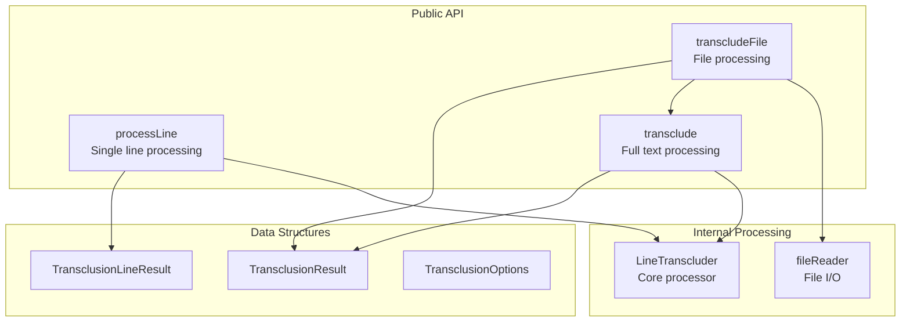
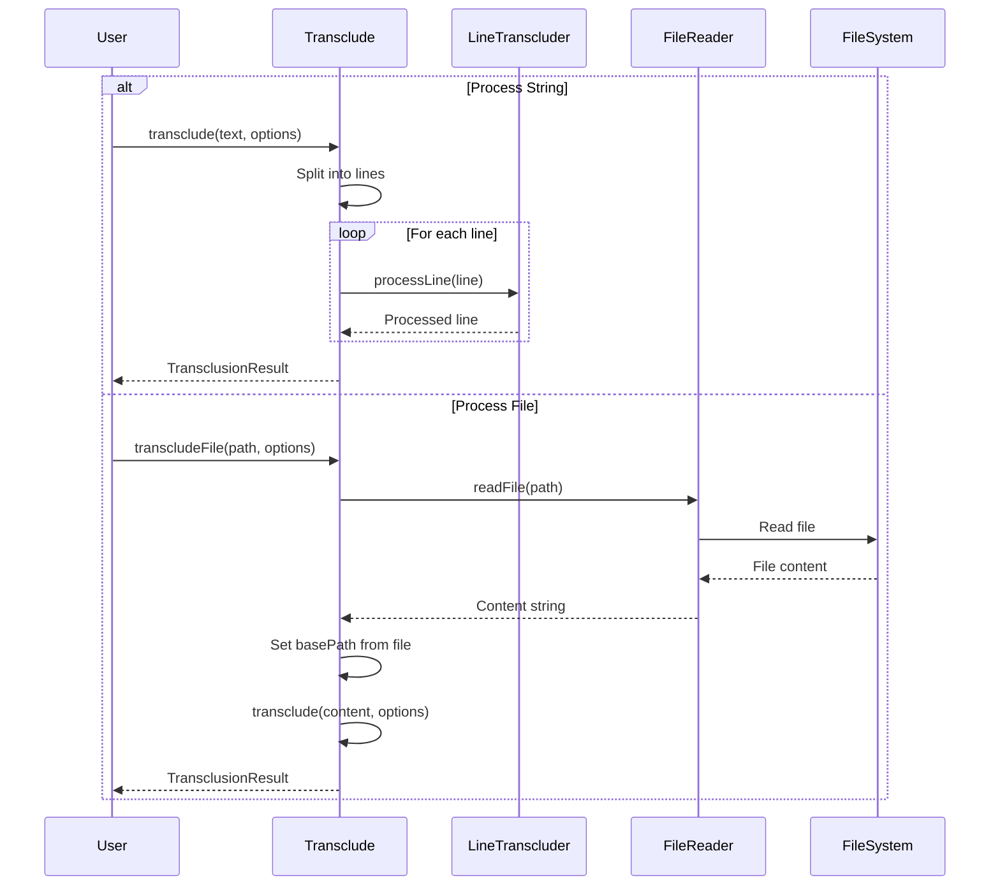
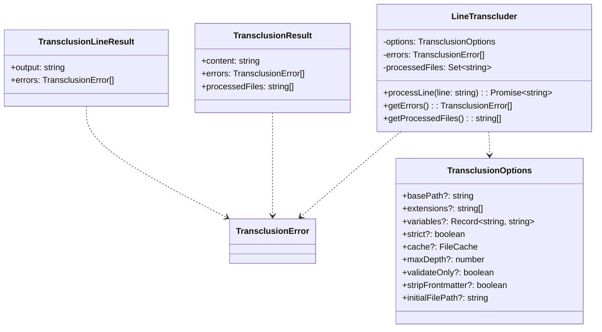

# transclude.ts - Core Transclusion Functionality

## Overview

The `transclude.ts` module provides the core transclusion functionality for processing Markdown content. It offers both line-by-line and full-text processing capabilities, handling recursive transclusions with circular reference detection.

## Rationale

This module exists to:
1. Provide high-level transclusion APIs for different use cases
2. Abstract the complexity of recursive transclusion processing
3. Handle both string-based and file-based workflows
4. Collect and report errors during processing
5. Track all files processed during transclusion

## Architecture

The module delegates the actual transclusion logic to the `LineTranscluder` utility class while providing a clean public API:



## Dependencies

### Internal Dependencies
- `./utils/LineTranscluder` - Core transclusion processing engine
- `./fileReader` - File reading operations
- `./types` - TypeScript type definitions

### External Dependencies
- `path` (Node.js built-in) - Path manipulation

## API Reference

### Interfaces

#### TransclusionLineResult
```typescript
export interface TransclusionLineResult {
  output: string;           // Processed line with transclusions resolved
  errors: TransclusionError[]; // Errors encountered during processing
}
```

### Functions

#### processLine
```typescript
export async function processLine(
  line: string,
  options: TransclusionOptions
): Promise<TransclusionLineResult>
```

Process a single line of Markdown, replacing transclusion references with file contents.

**Parameters:**
- `line` - The input line to process
- `options` - Transclusion options

**Returns:** Promise resolving to processed result and collected errors

**Features:**
- Handles recursive transclusions
- Detects circular references
- Collects all errors during processing

#### transclude
```typescript
export async function transclude(
  input: string,
  options: TransclusionOptions = {}
): Promise<TransclusionResult>
```

Process a complete Markdown string, replacing all transclusion references with file contents.

**Parameters:**
- `input` - The input Markdown string
- `options` - Transclusion options (optional)

**Returns:** Promise resolving to the processed content with all transclusions resolved

**Features:**
- Processes multi-line content
- Maintains line breaks
- Tracks all processed files
- Aggregates errors from all lines

#### transcludeFile
```typescript
export async function transcludeFile(
  filePath: string,
  options: TransclusionOptions = {}
): Promise<TransclusionResult>
```

Process a Markdown file, replacing all transclusion references with file contents.

**Parameters:**
- `filePath` - Path to the Markdown file to process
- `options` - Transclusion options (optional)

**Returns:** Promise resolving to the processed content with all transclusions resolved

**Features:**
- Reads file content automatically
- Uses file's directory as default base path
- Includes source file in processedFiles list
- Handles file reading errors

## Data Flow



## Class Diagrams



## Error Handling

The module collects and returns errors rather than throwing them, allowing partial processing to continue:

```mermaid
graph TB
    subgraph "Error Collection"
        Process[Process Line/File]
        LineTranscluder[LineTranscluder<br/>Collects Errors]
        ErrorArray[errors: TransclusionError[]]
    end
    
    subgraph "Error Types"
        FileNotFound[File Not Found]
        CircularRef[Circular Reference]
        ParseError[Parse Error]
        SecurityError[Security Violation]
    end
    
    Process --> LineTranscluder
    LineTranscluder --> ErrorArray
    
    FileNotFound --> ErrorArray
    CircularRef --> ErrorArray
    ParseError --> ErrorArray
    SecurityError --> ErrorArray
```

### Error Categories
1. **File Errors** - File not found, permission denied
2. **Security Errors** - Path traversal, outside base directory
3. **Parse Errors** - Invalid transclusion syntax
4. **Processing Errors** - Circular references, max depth exceeded

## Performance Considerations

1. **Line-by-Line Processing**
   - Minimizes memory usage for large files
   - Allows streaming processing
   - Each line processed independently

2. **File Caching**
   - Reuses cached content for repeated transclusions
   - Configurable cache implementation
   - Significant speedup for recursive transclusions

3. **Lazy Loading**
   - Files only read when transclusion is encountered
   - No pre-loading of potential transclusions

4. **String Building**
   - Uses array join for efficient string concatenation
   - Avoids repeated string concatenation in loops

## Test Coverage

### Unit Test Scenarios

1. **processLine Tests**
   ```typescript
   describe('processLine', () => {
     it('should process line without transclusions', async () => {
       const result = await processLine('Regular text', {});
       expect(result.output).toBe('Regular text');
       expect(result.errors).toHaveLength(0);
     });

     it('should process line with single transclusion', async () => {
       const result = await processLine('Before ![[file.md]] after', options);
       expect(result.output).toContain('transcluded content');
     });

     it('should collect errors for missing files', async () => {
       const result = await processLine('![[missing.md]]', options);
       expect(result.errors).toHaveLength(1);
       expect(result.errors[0].code).toBe('FILE_NOT_FOUND');
     });
   });
   ```

2. **transclude Tests**
   ```typescript
   describe('transclude', () => {
     it('should process multi-line content', async () => {
       const input = 'Line 1\n![[file.md]]\nLine 3';
       const result = await transclude(input, options);
       expect(result.content).toContain('Line 1');
       expect(result.content).toContain('transcluded content');
       expect(result.content).toContain('Line 3');
     });

     it('should track all processed files', async () => {
       const result = await transclude('![[a.md]]\n![[b.md]]', options);
       expect(result.processedFiles).toContain('/path/to/a.md');
       expect(result.processedFiles).toContain('/path/to/b.md');
     });

     it('should handle recursive transclusions', async () => {
       // a.md contains ![[b.md]], b.md contains content
       const result = await transclude('![[a.md]]', options);
       expect(result.processedFiles).toHaveLength(2);
     });
   });
   ```

3. **transcludeFile Tests**
   ```typescript
   describe('transcludeFile', () => {
     it('should read and process file', async () => {
       const result = await transcludeFile('/docs/main.md', options);
       expect(result.content).toBeDefined();
       expect(result.processedFiles[0]).toBe('/docs/main.md');
     });

     it('should use file directory as base path', async () => {
       const result = await transcludeFile('/docs/main.md', {});
       // Should resolve relative transclusions from /docs/
     });

     it('should handle file read errors', async () => {
       await expect(transcludeFile('/nonexistent.md', {}))
         .rejects.toThrow('FILE_NOT_FOUND');
     });
   });
   ```

### Integration Test Scenarios

1. **Complex Transclusion Chains**
   - Test deep recursive transclusions
   - Verify circular reference detection
   - Test max depth limits

2. **Error Propagation**
   - Verify errors from nested transclusions bubble up
   - Test partial success scenarios
   - Verify error context (file path, line number)

3. **Cache Integration**
   - Test with different cache implementations
   - Verify cache hits improve performance
   - Test cache invalidation scenarios

### Edge Cases

1. **Empty Input** - Empty strings, files
2. **Large Files** - Performance with large inputs
3. **Concurrent Processing** - Thread safety of shared state
4. **Special Characters** - Unicode, special markdown
5. **Platform Differences** - Path separators, line endings

## Usage Examples

### Basic Usage
```typescript
import { transclude, TransclusionOptions } from 'markdown-transclusion';

const markdown = `
# My Document

![[introduction.md]]

## Main Content

Here's some content with a transclusion: ![[details.md]]
`;

const options: TransclusionOptions = {
  basePath: '/docs',
  maxDepth: 3
};

const result = await transclude(markdown, options);
console.log(result.content);
console.log('Errors:', result.errors);
console.log('Processed files:', result.processedFiles);
```

### File Processing
```typescript
import { transcludeFile, MemoryFileCache } from 'markdown-transclusion';

const options = {
  cache: new MemoryFileCache(),
  stripFrontmatter: true,
  variables: {
    VERSION: '1.0.0'
  }
};

const result = await transcludeFile('/docs/manual.md', options);
```

### Line-by-Line Processing
```typescript
import { processLine } from 'markdown-transclusion';

const lines = markdown.split('\n');
for (const line of lines) {
  const result = await processLine(line, options);
  console.log(result.output);
  if (result.errors.length > 0) {
    console.error('Errors:', result.errors);
  }
}
```