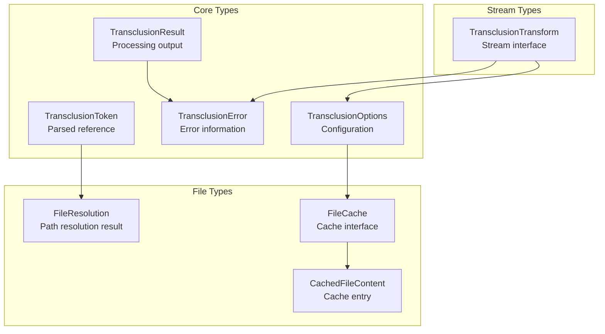
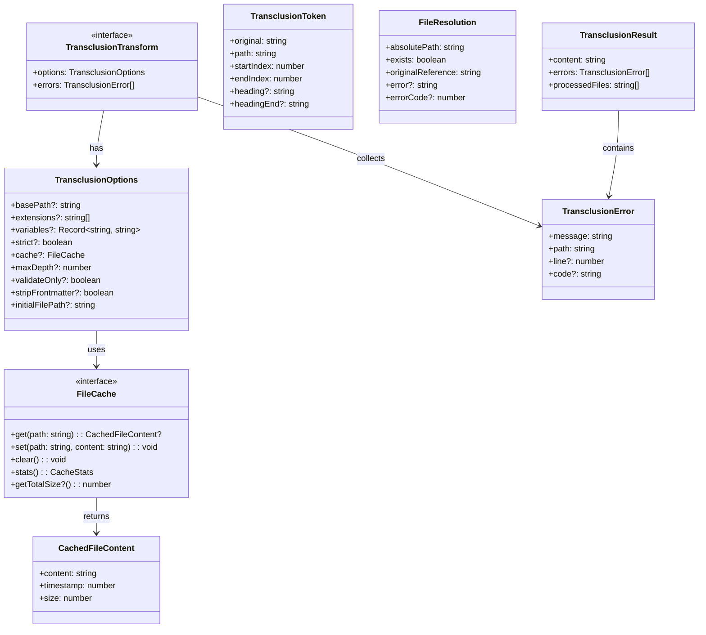

# types.ts - TypeScript Type Definitions

## Overview

The `types.ts` module contains all the TypeScript type definitions and interfaces used throughout the markdown-transclusion library. It serves as the central source of truth for data structures and contracts between modules.

## Rationale

This module exists to:
1. Provide a single source of truth for all type definitions
2. Enable type safety across the entire codebase
3. Document the shape of data structures
4. Facilitate API contracts between modules
5. Support TypeScript consumers with proper type exports

## Architecture

The module defines interfaces and types that represent the core concepts of the library:



## Dependencies

### External Dependencies
- `stream` (Node.js built-in) - For Transform type

### No Internal Dependencies
As the foundational type module, it has no dependencies on other project modules.

## API Reference

### Core Interfaces

#### TransclusionOptions
```typescript
export interface TransclusionOptions {
  basePath?: string;
  extensions?: string[];
  variables?: Record<string, string>;
  strict?: boolean;
  cache?: FileCache;
  maxDepth?: number;
  validateOnly?: boolean;
  stripFrontmatter?: boolean;
  initialFilePath?: string;
}
```

Configuration options for transclusion processing.

**Properties:**
- `basePath` - Base directory for resolving relative paths (default: `process.cwd()`)
- `extensions` - File extensions to try when none specified (default: `['.md', '.markdown']`)
- `variables` - Variables for path substitution (e.g., `{ VERSION: '1.0' }`)
- `strict` - Strict mode for variable substitution (throws on unknown variables)
- `cache` - File cache implementation to use
- `maxDepth` - Maximum transclusion depth to prevent infinite recursion
- `validateOnly` - Only validate references without processing
- `stripFrontmatter` - Remove YAML/TOML frontmatter from transcluded files
- `initialFilePath` - Initial file path for resolving relative paths in the first file

#### TransclusionError
```typescript
export interface TransclusionError {
  message: string;
  path: string;
  line?: number;
  code?: string;
}
```

Error information for transclusion failures.

**Properties:**
- `message` - Human-readable error message
- `path` - Path to the file that caused the error
- `line` - Line number where the error occurred (optional)
- `code` - Error code for programmatic handling (optional)

#### TransclusionResult
```typescript
export interface TransclusionResult {
  content: string;
  errors: TransclusionError[];
  processedFiles: string[];
}
```

Result of a transclusion operation.

**Properties:**
- `content` - The processed content with transclusions resolved
- `errors` - Any errors encountered during processing
- `processedFiles` - Paths of all files that were processed

#### TransclusionToken
```typescript
export interface TransclusionToken {
  original: string;
  path: string;
  startIndex: number;
  endIndex: number;
  heading?: string;
  headingEnd?: string;
}
```

Parsed transclusion token from markdown.

**Properties:**
- `original` - The complete original reference (e.g., `"![[file.md]]"`)
- `path` - The extracted path (e.g., `"file.md"`)
- `startIndex` - Start position in the line
- `endIndex` - End position in the line
- `heading` - Optional heading anchor (e.g., `"heading"` from `"![[file#heading]]"`)
- `headingEnd` - Optional end heading for range extraction (e.g., `"end"` from `"![[file#start:end]]"`)

### File-Related Interfaces

#### FileResolution
```typescript
export interface FileResolution {
  absolutePath: string;
  exists: boolean;
  originalReference: string;
  error?: string;
  errorCode?: number;
}
```

File resolution result with metadata.

**Properties:**
- `absolutePath` - Absolute path to the file
- `exists` - Whether the file exists on disk
- `originalReference` - Original reference that was resolved
- `error` - Any error encountered during resolution
- `errorCode` - Error code if error is a known type

#### CachedFileContent
```typescript
export interface CachedFileContent {
  content: string;
  timestamp: number;
  size: number;
}
```

Cached file content with metadata.

**Properties:**
- `content` - File content
- `timestamp` - Timestamp when cached (milliseconds since epoch)
- `size` - File size in bytes

#### FileCache
```typescript
export interface FileCache {
  get(path: string): CachedFileContent | undefined;
  set(path: string, content: string): void;
  clear(): void;
  stats(): {
    size: number;
    hits: number;
    misses: number;
  };
  getTotalSize?(): number;
}
```

File cache interface.

**Methods:**
- `get(path)` - Get cached content for a path
- `set(path, content)` - Store content in cache
- `clear()` - Clear all cached entries
- `stats()` - Get cache statistics
- `getTotalSize()` - Get total size of cached content in bytes (optional)

### Stream Interface

#### TransclusionTransform
```typescript
export interface TransclusionTransform extends Transform {
  readonly options: TransclusionOptions;
  readonly errors: TransclusionError[];
}
```

Transform stream for processing transclusions.

**Properties:**
- `options` - Options used by this transform
- `errors` - Errors encountered during processing

**Note:** Extends Node.js Transform stream.

## Type Relationships



## Usage Patterns

### Option Defaults
```typescript
// Common pattern for applying defaults
const defaultOptions: Required<TransclusionOptions> = {
  basePath: process.cwd(),
  extensions: ['.md', '.markdown'],
  variables: {},
  strict: false,
  cache: new NoopFileCache(),
  maxDepth: 10,
  validateOnly: false,
  stripFrontmatter: false,
  initialFilePath: ''
};

function processWithDefaults(options: TransclusionOptions = {}) {
  const opts = { ...defaultOptions, ...options };
  // Use opts...
}
```

### Type Guards
```typescript
// Type guard for TransclusionError
function isTransclusionError(error: unknown): error is TransclusionError {
  return (
    typeof error === 'object' &&
    error !== null &&
    'message' in error &&
    'path' in error
  );
}

// Type guard for successful FileResolution
function isResolvedFile(resolution: FileResolution): boolean {
  return resolution.exists && !resolution.error;
}
```

### Generic Cache Implementation
```typescript
// Example of implementing FileCache
class CustomCache implements FileCache {
  private storage = new Map<string, CachedFileContent>();
  private hits = 0;
  private misses = 0;
  
  get(path: string): CachedFileContent | undefined {
    const entry = this.storage.get(path);
    if (entry) {
      this.hits++;
      return entry;
    }
    this.misses++;
    return undefined;
  }
  
  set(path: string, content: string): void {
    this.storage.set(path, {
      content,
      timestamp: Date.now(),
      size: Buffer.byteLength(content, 'utf8')
    });
  }
  
  clear(): void {
    this.storage.clear();
    this.hits = 0;
    this.misses = 0;
  }
  
  stats() {
    return {
      size: this.storage.size,
      hits: this.hits,
      misses: this.misses
    };
  }
  
  getTotalSize(): number {
    let total = 0;
    for (const entry of this.storage.values()) {
      total += entry.size;
    }
    return total;
  }
}
```

## Test Coverage

### Type Testing

Since this is a pure type definition module, testing focuses on:

1. **Type Compatibility**
   ```typescript
   // Ensure types are properly exported
   import type {
     TransclusionOptions,
     TransclusionError,
     TransclusionResult,
     TransclusionToken,
     FileResolution,
     CachedFileContent,
     FileCache
   } from './types';
   
   // Type assertions compile-time checks
   const options: TransclusionOptions = {};
   const error: TransclusionError = {
     message: 'Error',
     path: '/file.md'
   };
   ```

2. **Interface Implementation**
   ```typescript
   // Verify interfaces can be implemented
   class TestCache implements FileCache {
     get(path: string) { return undefined; }
     set(path: string, content: string) { }
     clear() { }
     stats() { return { size: 0, hits: 0, misses: 0 }; }
   }
   ```

3. **Optional Property Handling**
   ```typescript
   // Test minimal valid objects
   const minimalOptions: TransclusionOptions = {};
   const minimalError: TransclusionError = {
     message: 'Error',
     path: '/path'
   };
   ```

## Design Decisions

### Why Interfaces vs Types
- **Interfaces** used for object shapes that can be implemented
- **Types** used for unions, intersections, and aliases
- Interfaces allow declaration merging if needed

### Optional vs Required Properties
- Most `TransclusionOptions` are optional for flexibility
- Core properties in results are required for consistency
- Error properties optional to allow gradual enhancement

### Naming Conventions
- `I` prefix avoided (not `IFileCache`)
- Descriptive names over abbreviations
- Consistent `Result`, `Error`, `Options` suffixes

### No Class Definitions
- Pure interfaces allow multiple implementations
- Reduces coupling between modules
- Enables easier testing with mocks

## Future Considerations

### Potential Additions
```typescript
// Possible future extensions

export interface TransclusionHook {
  beforeProcess?: (token: TransclusionToken) => void;
  afterProcess?: (token: TransclusionToken, content: string) => string;
}

export interface TransclusionMetrics {
  totalFiles: number;
  totalSize: number;
  processingTime: number;
  cacheHitRate: number;
}

export interface StreamOptions extends TransclusionOptions {
  highWaterMark?: number;
  encoding?: BufferEncoding;
}
```

### Version Compatibility
- Types are part of the public API
- Changes require major version bump
- Consider `@deprecated` for gradual migration
- Use union types for backward compatibility