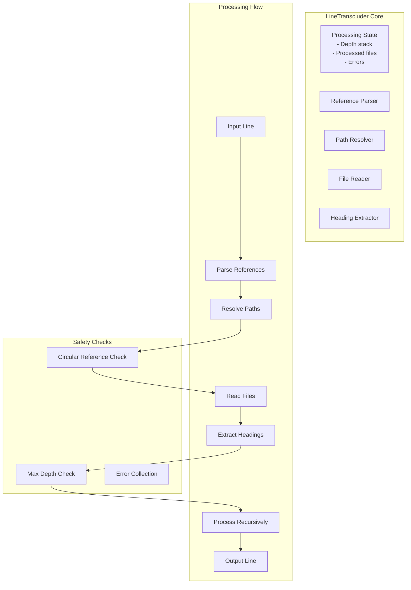
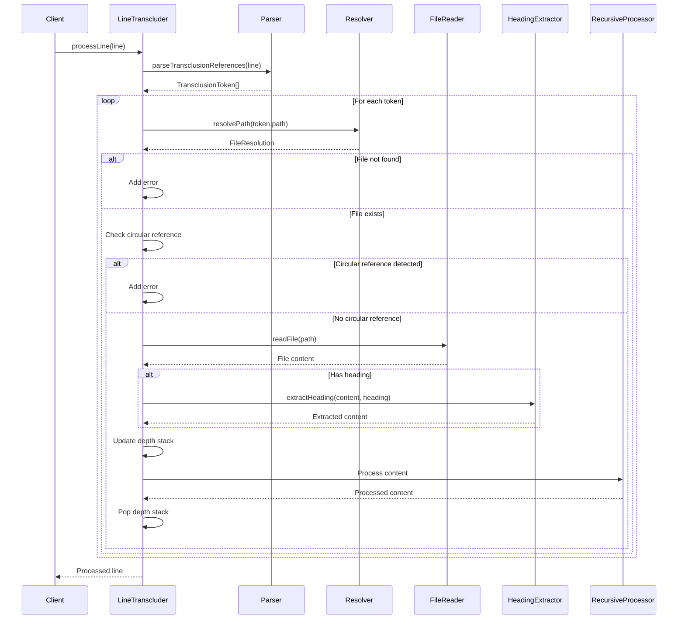
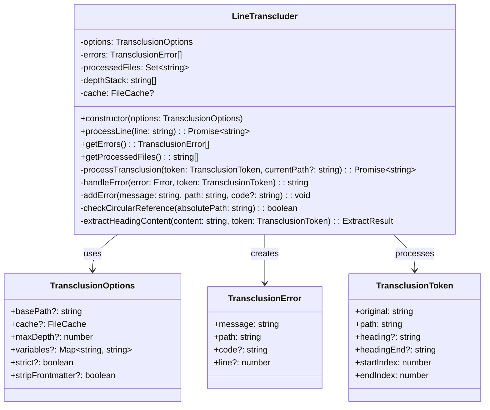
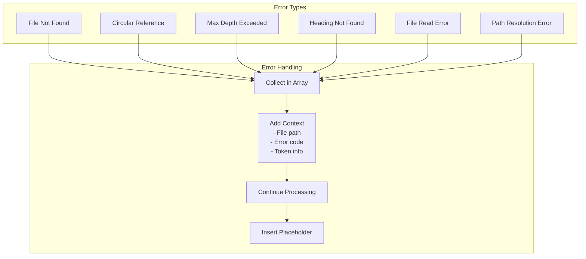

# LineTranscluder.ts - Line-Based Transclusion Processor

## Overview

The `LineTranscluder` class is the core engine for processing transclusions line by line. It handles recursive transclusion resolution, circular reference detection, heading extraction, and maintains processing state across multiple operations.

## Rationale

This module exists to:
1. Centralize transclusion processing logic
2. Handle recursive transclusions with depth limits
3. Detect and prevent circular references
4. Extract specific headings from transcluded files
5. Maintain error collection and file tracking
6. Support both streaming and batch processing

## Architecture

The class implements a stateful processor with recursive capabilities:



## Dependencies

### Internal Dependencies
- `../parser` - Parse transclusion references
- `../resolver` - Resolve file paths
- `../fileReader` - Read file contents
- `./headingExtractor` - Extract headings from content
- `./transclusionProcessor` - Process file transclusions
- `../types` - TypeScript type definitions

### External Dependencies
- `path` - Path manipulation

## API Reference

### Class: LineTranscluder

```typescript
export class LineTranscluder {
  constructor(options: TransclusionOptions);
  
  async processLine(line: string): Promise<string>;
  getErrors(): TransclusionError[];
  getProcessedFiles(): string[];
}
```

#### Constructor
```typescript
constructor(options: TransclusionOptions)
```

Creates a new LineTranscluder instance.

**Parameters:**
- `options` - Transclusion options including basePath, cache, maxDepth, etc.

#### Methods

##### processLine
```typescript
async processLine(line: string): Promise<string>
```

Process a single line, replacing transclusion references with file contents.

**Parameters:**
- `line` - The input line to process

**Returns:** Promise resolving to the processed line

**Features:**
- Handles multiple transclusions per line
- Maintains insertion order
- Tracks recursion depth
- Collects errors without throwing

##### getErrors
```typescript
getErrors(): TransclusionError[]
```

Get all errors collected during processing.

**Returns:** Array of transclusion errors

##### getProcessedFiles
```typescript
getProcessedFiles(): string[]
```

Get list of all files that were processed.

**Returns:** Array of absolute file paths

## Data Flow



## Class Diagram



## Error Handling

The LineTranscluder collects errors without interrupting processing:



### Error Collection Strategy

1. **Non-throwing** - Errors don't stop processing
2. **Contextual** - Each error includes file path and details
3. **Placeholder** - Failed transclusions show original reference
4. **Accumulation** - All errors available after processing

## Performance Considerations

1. **File Caching**
   - Uses provided cache to avoid repeated reads
   - Significant speedup for recursive transclusions
   - Cache-aware file reading

2. **Set-Based Tracking**
   - O(1) lookup for processed files
   - Efficient circular reference detection
   - Minimal memory overhead

3. **Depth Stack**
   - Array-based for fast push/pop
   - Enables accurate circular detection
   - Supports deep recursion

4. **Single Pass Processing**
   - Process each line once
   - No backtracking required
   - Efficient token replacement

## Test Coverage

### Unit Test Scenarios

1. **Basic Processing**
   ```typescript
   describe('LineTranscluder', () => {
     it('should process line without transclusions', async () => {
       const transcluder = new LineTranscluder({ basePath: '/docs' });
       const result = await transcluder.processLine('Regular text');
       expect(result).toBe('Regular text');
       expect(transcluder.getErrors()).toHaveLength(0);
     });

     it('should process single transclusion', async () => {
       const transcluder = new LineTranscluder({ basePath: '/docs' });
       const result = await transcluder.processLine('Before ![[file.md]] after');
       expect(result).toContain('transcluded content');
       expect(transcluder.getProcessedFiles()).toContain('/docs/file.md');
     });

     it('should handle multiple transclusions', async () => {
       const transcluder = new LineTranscluder({ basePath: '/docs' });
       const result = await transcluder.processLine('![[a.md]] and ![[b.md]]');
       expect(result).toContain('content A');
       expect(result).toContain('content B');
       expect(transcluder.getProcessedFiles()).toHaveLength(2);
     });
   });
   ```

2. **Recursive Processing**
   ```typescript
   describe('recursive transclusions', () => {
     it('should handle nested transclusions', async () => {
       // a.md contains ![[b.md]]
       // b.md contains "Hello"
       const transcluder = new LineTranscluder({ basePath: '/docs' });
       const result = await transcluder.processLine('![[a.md]]');
       expect(result).toContain('Hello');
       expect(transcluder.getProcessedFiles()).toContain('/docs/a.md');
       expect(transcluder.getProcessedFiles()).toContain('/docs/b.md');
     });

     it('should respect max depth', async () => {
       const transcluder = new LineTranscluder({ 
         basePath: '/docs',
         maxDepth: 2 
       });
       // Deep nesting beyond max depth
       const result = await transcluder.processLine('![[deep1.md]]');
       expect(transcluder.getErrors()).toContainEqual(
         expect.objectContaining({
           message: expect.stringContaining('Maximum transclusion depth')
         })
       );
     });
   });
   ```

3. **Circular Reference Detection**
   ```typescript
   describe('circular references', () => {
     it('should detect direct circular reference', async () => {
       // a.md contains ![[a.md]]
       const transcluder = new LineTranscluder({ basePath: '/docs' });
       const result = await transcluder.processLine('![[a.md]]');
       expect(transcluder.getErrors()).toContainEqual(
         expect.objectContaining({
           message: expect.stringContaining('Circular reference')
         })
       );
     });

     it('should detect indirect circular reference', async () => {
       // a.md contains ![[b.md]]
       // b.md contains ![[a.md]]
       const transcluder = new LineTranscluder({ basePath: '/docs' });
       const result = await transcluder.processLine('![[a.md]]');
       expect(transcluder.getErrors()).toContainEqual(
         expect.objectContaining({
           message: expect.stringContaining('Circular reference')
         })
       );
     });
   });
   ```

4. **Heading Extraction**
   ```typescript
   describe('heading extraction', () => {
     it('should extract specific heading', async () => {
       const transcluder = new LineTranscluder({ basePath: '/docs' });
       const result = await transcluder.processLine('![[file.md#section]]');
       expect(result).toContain('Section content');
       expect(result).not.toContain('Other section');
     });

     it('should extract heading range', async () => {
       const transcluder = new LineTranscluder({ basePath: '/docs' });
       const result = await transcluder.processLine('![[file.md#start:end]]');
       expect(result).toContain('Start content');
       expect(result).toContain('Middle content');
       expect(result).not.toContain('After end');
     });

     it('should handle missing heading', async () => {
       const transcluder = new LineTranscluder({ basePath: '/docs' });
       const result = await transcluder.processLine('![[file.md#nonexistent]]');
       expect(transcluder.getErrors()).toContainEqual(
         expect.objectContaining({
           message: expect.stringContaining('Heading not found')
         })
       );
     });
   });
   ```

5. **Error Collection**
   ```typescript
   describe('error handling', () => {
     it('should collect multiple errors', async () => {
       const transcluder = new LineTranscluder({ basePath: '/docs' });
       const result = await transcluder.processLine(
         '![[missing1.md]] and ![[missing2.md]]'
       );
       expect(transcluder.getErrors()).toHaveLength(2);
     });

     it('should continue processing after errors', async () => {
       const transcluder = new LineTranscluder({ basePath: '/docs' });
       const result = await transcluder.processLine(
         '![[missing.md]] but ![[exists.md]]'
       );
       expect(result).toContain('![[missing.md]]'); // Preserved
       expect(result).toContain('existing content'); // Processed
     });
   });
   ```

### Integration Tests

```typescript
describe('integration scenarios', () => {
  it('should handle complex document processing', async () => {
    const transcluder = new LineTranscluder({
      basePath: '/docs',
      cache: new MemoryFileCache(),
      variables: { VERSION: '1.0' },
      stripFrontmatter: true
    });
    
    // Process multiple lines with various scenarios
    const lines = [
      'Normal text',
      '![[simple.md]]',
      '![[nested/file.md#heading]]',
      '![[${VERSION}/api.md]]',
      '![[recursive.md]]'
    ];
    
    const results = [];
    for (const line of lines) {
      results.push(await transcluder.processLine(line));
    }
    
    // Verify results and error handling
  });
});
```

## Usage Examples

### Basic Usage
```typescript
import { LineTranscluder } from './utils/LineTranscluder';

const transcluder = new LineTranscluder({
  basePath: '/docs',
  maxDepth: 5
});

const processedLine = await transcluder.processLine(
  'Check out ![[guide.md]] for more info.'
);

console.log(processedLine);
console.log('Errors:', transcluder.getErrors());
console.log('Files:', transcluder.getProcessedFiles());
```

### With Caching
```typescript
const cache = new MemoryFileCache();
const transcluder = new LineTranscluder({
  basePath: '/docs',
  cache: cache
});

// Process multiple lines - files cached after first read
for (const line of lines) {
  await transcluder.processLine(line);
}

console.log('Cache stats:', cache.stats());
```

### Custom Error Handling
```typescript
const transcluder = new LineTranscluder({
  basePath: '/docs',
  strict: false // Continue on errors
});

const result = await transcluder.processLine(input);

// Check specific error types
for (const error of transcluder.getErrors()) {
  switch (error.code) {
    case 'FILE_NOT_FOUND':
      console.warn(`Missing file: ${error.path}`);
      break;
    case 'CIRCULAR_REFERENCE':
      console.error(`Circular reference: ${error.path}`);
      break;
    case 'HEADING_NOT_FOUND':
      console.warn(`Missing heading in ${error.path}`);
      break;
  }
}
```

### Streaming Integration
```typescript
// Used internally by TransclusionTransform
class MyTransform extends Transform {
  private transcluder = new LineTranscluder(options);
  
  async _transform(chunk, encoding, callback) {
    const lines = chunk.toString().split('\n');
    const processed = [];
    
    for (const line of lines) {
      processed.push(await this.transcluder.processLine(line));
    }
    
    callback(null, processed.join('\n'));
  }
}
```