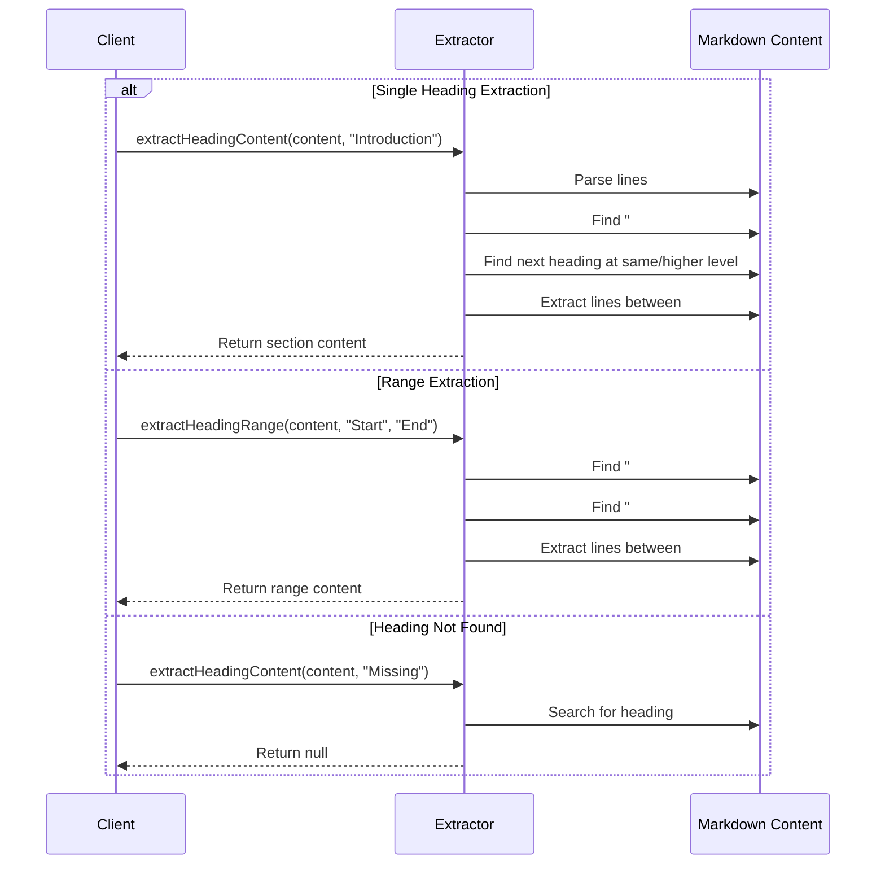
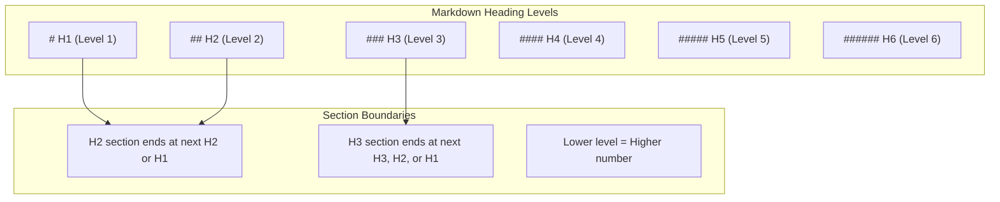
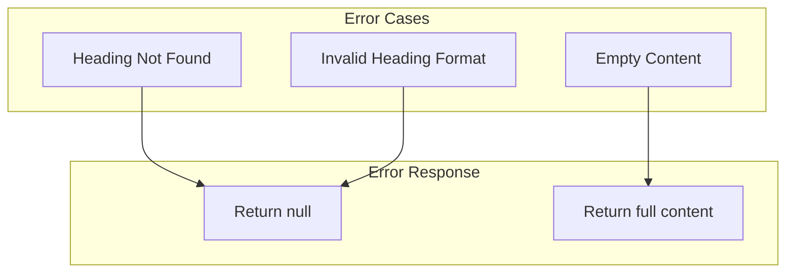

# headingExtractor.ts - Markdown Heading Extraction

## Overview

The `headingExtractor.ts` module provides functionality for extracting specific sections from Markdown content based on heading anchors. It supports both single heading extraction and range-based extraction, enabling precise content targeting in transclusions.

## Rationale

This module exists to:
1. Support Obsidian-style heading references (`![[file#heading]]`)
2. Extract specific sections from larger documents
3. Enable range-based content extraction (`![[file#start:end]]`)
4. Provide heading-aware content boundaries
5. Handle various heading levels and formats

## Architecture

The module implements heading detection and content extraction:

```mermaid
graph TB
    subgraph "Extraction Process"
        Input[Markdown Content]
        ParseHeadings[Parse Headings]
        FindTarget[Find Target Heading]
        DetermineEnd[Determine Section End]
        ExtractContent[Extract Content]
        Output[Section Content]
    end
    
    subgraph "Heading Detection"
        Regex[Heading Regex<br/>/^#{1,6}\s+/]
        Level[Heading Level]
        Text[Heading Text]
        Normalize[Case-insensitive<br/>Trimmed]
    end
    
    subgraph "Section Boundaries"
        StartHeading[Start at Target]
        EndAtSame[End at Same Level]
        EndAtHigher[End at Higher Level]
        EndAtDoc[End at Document End]
    end
    
    Input --> ParseHeadings
    ParseHeadings --> Regex
    Regex --> Level
    Regex --> Text
    Text --> Normalize
    ParseHeadings --> FindTarget
    FindTarget --> DetermineEnd
    DetermineEnd --> StartHeading
    StartHeading --> EndAtSame
    StartHeading --> EndAtHigher
    StartHeading --> EndAtDoc
    DetermineEnd --> ExtractContent
    ExtractContent --> Output
```

## Dependencies

### No Dependencies
This is a pure utility module with no external or internal dependencies.

## API Reference

### Functions

#### extractHeadingContent
```typescript
export function extractHeadingContent(
  content: string,
  headingText: string
): string | null
```

Extract content starting from a specific heading.

**Parameters:**
- `content` - The full markdown content
- `headingText` - The heading text to find (without # prefix)

**Returns:** 
- Content from the heading until the next same or higher level heading
- `null` if heading not found
- Full content if `headingText` is empty

**Algorithm:**
1. Split content into lines
2. Normalize heading text (lowercase, trimmed)
3. Find matching heading with regex
4. Determine heading level
5. Find next heading of same or higher level
6. Extract content between boundaries
7. Remove trailing empty lines

#### extractHeadingRange
```typescript
export function extractHeadingRange(
  content: string,
  startHeading: string,
  endHeading?: string
): string | null
```

Extract content for a heading range from markdown content.

**Parameters:**
- `content` - The full markdown content
- `startHeading` - The starting heading text (without # prefix)
- `endHeading` - The ending heading text (optional)

**Returns:**
- Content from start heading until (but not including) end heading
- `null` if start heading not found
- Content to document end if `endHeading` not specified

**Features:**
- Empty `startHeading` starts from document beginning
- Empty `endHeading` goes to document end
- End heading is excluded from result

#### hasHeadingAnchor
```typescript
export function hasHeadingAnchor(reference: string): boolean
```

Check if a reference includes a heading anchor.

**Parameters:**
- `reference` - The reference string to check

**Returns:** `true` if reference contains '#'

**Example:**
```typescript
hasHeadingAnchor('file.md#section') // true
hasHeadingAnchor('file.md') // false
```

#### splitReference
```typescript
export function splitReference(
  reference: string
): { path: string; heading?: string }
```

Split reference into path and heading parts.

**Parameters:**
- `reference` - The reference string to split

**Returns:** Object with:
- `path` - File path portion
- `heading` - Heading anchor (optional)

**Example:**
```typescript
splitReference('file.md#section') 
// { path: 'file.md', heading: 'section' }

splitReference('file.md') 
// { path: 'file.md', heading: undefined }
```

## Data Flow



## Heading Level Logic



## Error Handling

The module uses null returns for error cases:



## Performance Considerations

1. **Linear Search**
   - O(n) complexity for heading search
   - Single pass through content
   - Early termination when found

2. **Memory Efficiency**
   - Works with line arrays
   - No regex compilation overhead
   - Minimal string allocations

3. **Case-Insensitive Matching**
   - Normalized comparison
   - Single lowercase conversion
   - Cached normalized values

## Test Coverage

### Unit Test Scenarios

1. **Basic Heading Extraction**
   ```typescript
   describe('extractHeadingContent', () => {
     it('should extract single heading section', () => {
       const content = `
# Title

## Section 1
Content 1

## Section 2
Content 2
       `;
       
       const result = extractHeadingContent(content, 'Section 1');
       expect(result).toContain('## Section 1');
       expect(result).toContain('Content 1');
       expect(result).not.toContain('Section 2');
     });

     it('should handle nested headings', () => {
       const content = `
## Parent
### Child 1
Content
### Child 2
More content
## Next Parent
       `;
       
       const result = extractHeadingContent(content, 'Parent');
       expect(result).toContain('### Child 1');
       expect(result).toContain('### Child 2');
       expect(result).not.toContain('Next Parent');
     });

     it('should return null for missing heading', () => {
       const content = '# Title\nContent';
       const result = extractHeadingContent(content, 'Missing');
       expect(result).toBeNull();
     });
   });
   ```

2. **Range Extraction**
   ```typescript
   describe('extractHeadingRange', () => {
     it('should extract range between headings', () => {
       const content = `
# Start
Content A
# Middle
Content B
# End
Content C
       `;
       
       const result = extractHeadingRange(content, 'Start', 'End');
       expect(result).toContain('# Start');
       expect(result).toContain('# Middle');
       expect(result).not.toContain('# End');
     });

     it('should extract to end if no end heading', () => {
       const content = `
# Start
All content
To the end
       `;
       
       const result = extractHeadingRange(content, 'Start');
       expect(result).toContain('All content');
       expect(result).toContain('To the end');
     });

     it('should start from beginning with empty start', () => {
       const content = `
Beginning
# First
Content
       `;
       
       const result = extractHeadingRange(content, '', 'First');
       expect(result).toContain('Beginning');
       expect(result).not.toContain('# First');
     });
   });
   ```

3. **Edge Cases**
   ```typescript
   describe('edge cases', () => {
     it('should handle case-insensitive matching', () => {
       const content = '## My Heading\nContent';
       expect(extractHeadingContent(content, 'my heading')).toBeTruthy();
       expect(extractHeadingContent(content, 'MY HEADING')).toBeTruthy();
       expect(extractHeadingContent(content, 'My Heading')).toBeTruthy();
     });

     it('should handle headings with special characters', () => {
       const content = '## Feature: Test-Case (v1.0)\nContent';
       const result = extractHeadingContent(content, 'Feature: Test-Case (v1.0)');
       expect(result).toContain('Content');
     });

     it('should trim trailing empty lines', () => {
       const content = '## Section\nContent\n\n\n';
       const result = extractHeadingContent(content, 'Section');
       expect(result).not.toMatch(/\n\n$/);
     });

     it('should handle empty content', () => {
       const result = extractHeadingContent('', 'Heading');
       expect(result).toBeNull();
     });
   });
   ```

4. **Reference Utilities**
   ```typescript
   describe('reference utilities', () => {
     it('should detect heading anchors', () => {
       expect(hasHeadingAnchor('file.md#section')).toBe(true);
       expect(hasHeadingAnchor('file.md')).toBe(false);
       expect(hasHeadingAnchor('path/file.md#heading')).toBe(true);
     });

     it('should split references correctly', () => {
       expect(splitReference('file.md#section')).toEqual({
         path: 'file.md',
         heading: 'section'
       });
       
       expect(splitReference('file.md')).toEqual({
         path: 'file.md',
         heading: undefined
       });
       
       expect(splitReference('path/to/file.md#my-heading')).toEqual({
         path: 'path/to/file.md',
         heading: 'my-heading'
       });
     });
   });
   ```

## Usage Examples

### Basic Heading Extraction
```typescript
import { extractHeadingContent } from './utils/headingExtractor';

const markdown = `
# Document Title

## Introduction
This is the intro section.

### Background
Some background info.

## Main Content
The main content goes here.

## Conclusion
Final thoughts.
`;

// Extract the Introduction section
const intro = extractHeadingContent(markdown, 'Introduction');
console.log(intro);
// Output:
// ## Introduction
// This is the intro section.
// 
// ### Background
// Some background info.
```

### Range-Based Extraction
```typescript
import { extractHeadingRange } from './utils/headingExtractor';

// Extract everything between two headings
const mainSection = extractHeadingRange(
  markdown, 
  'Introduction', 
  'Conclusion'
);

// Extract from heading to end of document
const fromMain = extractHeadingRange(
  markdown,
  'Main Content'
);

// Extract from beginning to a heading
const upToMain = extractHeadingRange(
  markdown,
  '',
  'Main Content'
);
```

### Integration with Transclusion
```typescript
import { splitReference, extractHeadingContent } from './utils/headingExtractor';

async function processTransclusion(reference: string) {
  const { path, heading } = splitReference(reference);
  
  // Read the file
  const content = await readFile(path);
  
  // Extract heading if specified
  if (heading) {
    const section = extractHeadingContent(content, heading);
    if (section === null) {
      throw new Error(`Heading "${heading}" not found in ${path}`);
    }
    return section;
  }
  
  return content;
}

// Usage
const result = await processTransclusion('guide.md#installation');
```

### Heading Range Syntax
```typescript
// Parse range syntax like "start:end"
function parseHeadingRange(headingPart: string): {
  start: string;
  end?: string;
} {
  const parts = headingPart.split(':');
  return {
    start: parts[0],
    end: parts[1]
  };
}

// Use with transclusion
const { start, end } = parseHeadingRange('overview:details');
const content = extractHeadingRange(markdown, start, end);
```

## Best Practices

1. **Heading Normalization**
   - Always trim whitespace
   - Use case-insensitive matching
   - Handle special characters

2. **Error Handling**
   - Check for null returns
   - Provide helpful error messages
   - Validate heading existence

3. **Performance**
   - Cache extracted content when possible
   - Consider indexing for large documents
   - Avoid repeated extractions

4. **Content Integrity**
   - Preserve heading in output
   - Maintain formatting
   - Handle edge cases gracefully