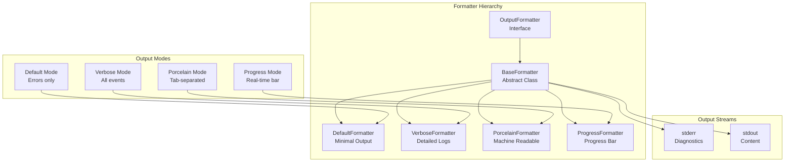
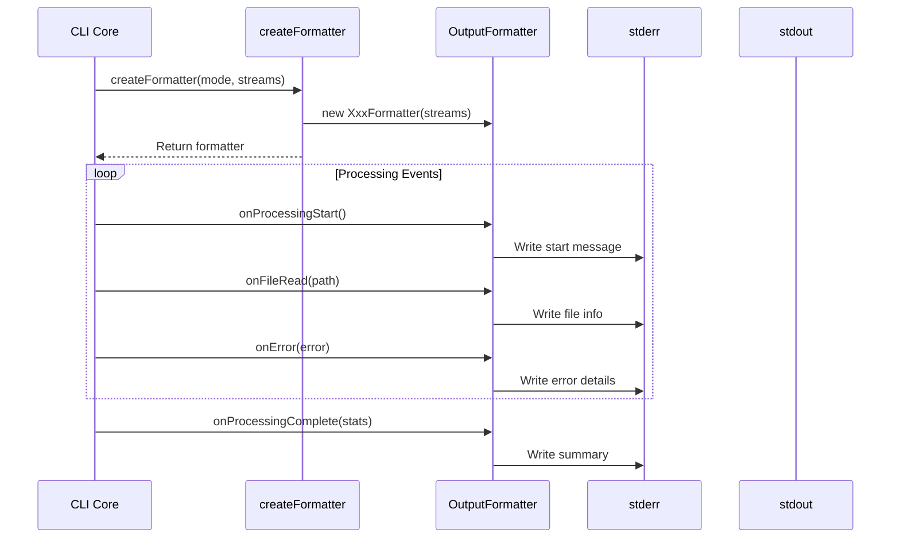
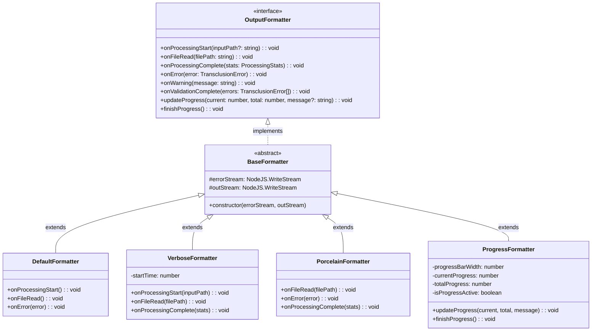
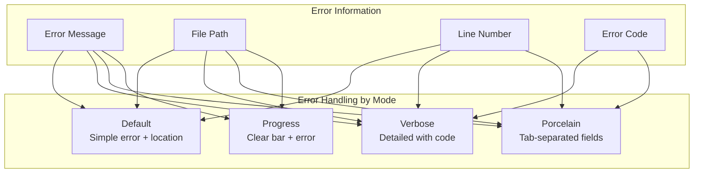

# outputFormatter.ts - CLI Output Formatting

## Overview

The `outputFormatter.ts` module provides different output formatting strategies for the CLI, supporting human-readable, machine-readable, and progress-based output modes. It implements the Strategy pattern to allow dynamic selection of output format based on user preferences.

## Rationale

This module exists to:
1. Separate output formatting from processing logic
2. Support multiple output modes (default, verbose, porcelain, progress)
3. Provide consistent formatting across the CLI
4. Enable machine-readable output for scripting
5. Show real-time progress for interactive use
6. Follow Unix philosophy of appropriate output streams

## Architecture

The module implements a formatter hierarchy with different strategies:



## Dependencies

### Internal Dependencies
- `../types` - TransclusionError type

### External Dependencies
- Node.js stream types

## API Reference

### Enums

#### OutputMode
```typescript
export enum OutputMode {
  DEFAULT = 'default',
  VERBOSE = 'verbose',
  PORCELAIN = 'porcelain',
  PROGRESS = 'progress'
}
```

Available output formatting modes.

### Interfaces

#### OutputFormatter
```typescript
export interface OutputFormatter {
  onProcessingStart(inputPath: string | undefined): void;
  onFileRead(filePath: string): void;
  onProcessingComplete(stats: ProcessingStats): void;
  onError(error: TransclusionError): void;
  onWarning(message: string): void;
  onValidationComplete(errors: TransclusionError[]): void;
  updateProgress(current: number, total: number, message?: string): void;
  finishProgress(): void;
}
```

Common interface for all output formatters.

#### ProcessingStats
```typescript
export interface ProcessingStats {
  filesProcessed: number;
  transclusionsResolved: number;
  warnings: number;
  errors: number;
  duration: number;
}
```

Statistics collected during processing.

### Classes

#### BaseFormatter (Abstract)
```typescript
abstract class BaseFormatter implements OutputFormatter
```

Base class with common functionality and stream management.

**Constructor:**
- `errorStream` - Stream for diagnostic output (typically stderr)
- `outStream` - Stream for content output (typically stdout)

#### DefaultFormatter
```typescript
export class DefaultFormatter extends BaseFormatter
```

Minimal output formatter following Unix philosophy.

**Characteristics:**
- Silent on success
- Only shows errors and warnings
- Writes to stderr only
- No progress information

#### VerboseFormatter
```typescript
export class VerboseFormatter extends BaseFormatter
```

Detailed human-readable output formatter.

**Characteristics:**
- Prefixed log levels ([INFO], [ERROR], etc.)
- Timestamps and duration
- File-by-file progress
- Complete statistics

#### PorcelainFormatter
```typescript
export class PorcelainFormatter extends BaseFormatter
```

Machine-readable output formatter for scripting.

**Format:**
- Tab-separated values
- Fixed field order
- No decorative elements
- Predictable parsing

**Output Format:**
```
READ<tab>filepath
ERROR<tab>code<tab>message<tab>path<tab>line
WARN<tab>message
COMPLETE<tab>files<tab>transclusions<tab>warnings<tab>errors<tab>duration
```

#### ProgressFormatter
```typescript
export class ProgressFormatter extends BaseFormatter
```

Real-time progress bar formatter.

**Features:**
- Unicode progress bar
- Percentage complete
- Current file display
- Clears on completion

### Functions

#### createFormatter
```typescript
export function createFormatter(
  mode: OutputMode,
  errorStream: NodeJS.WriteStream,
  outStream: NodeJS.WriteStream
): OutputFormatter
```

Factory function to create appropriate formatter.

## Data Flow



## Output Examples

### Default Mode
```bash
# Success - no output

# Error case
Error: File not found: missing.md
  in documents/main.md:15
```

### Verbose Mode
```bash
[INFO] Starting transclusion processing
[INFO] Input: documents/main.md
[INFO] Reading file: /path/to/included.md
[INFO] Reading file: /path/to/another.md
[WARN] Deprecated syntax used
[ERROR] File not found: missing.md
[ERROR] Location: documents/main.md:15
[ERROR] Code: FILE_NOT_FOUND

[INFO] Processing complete
[INFO] Files processed: 3
[INFO] Transclusions resolved: 2
[INFO] Warnings: 1
[INFO] Errors: 1
[INFO] Duration: 123ms
```

### Porcelain Mode
```bash
READ	/path/to/included.md
READ	/path/to/another.md
WARN	Deprecated syntax used
ERROR	FILE_NOT_FOUND	File not found: missing.md	documents/main.md	15
COMPLETE	3	2	1	1	123
```

### Progress Mode
```bash
Processing documents/main.md...
[████████████████████░░░░░░░░░░░░░░░░░░░] 50% Reading: /path/to/included.md

✓ Processing complete: 3 files, 2 transclusions (123ms)
⚠ 1 error(s) occurred
```

## Class Diagrams



## Error Handling

Each formatter handles errors differently:



## Performance Considerations

1. **Stream Efficiency**
   - Direct stream writes
   - No buffering in formatters
   - Minimal string concatenation

2. **Progress Updates**
   - Throttled updates
   - Efficient terminal control
   - Single line rewriting

3. **Memory Usage**
   - No state accumulation
   - Immediate output
   - Garbage collection friendly

## Test Coverage

### Unit Test Scenarios

1. **Formatter Creation**
   ```typescript
   describe('createFormatter', () => {
     it('should create correct formatter for each mode', () => {
       const stderr = new MockWriteStream();
       const stdout = new MockWriteStream();
       
       expect(createFormatter(OutputMode.DEFAULT, stderr, stdout))
         .toBeInstanceOf(DefaultFormatter);
       expect(createFormatter(OutputMode.VERBOSE, stderr, stdout))
         .toBeInstanceOf(VerboseFormatter);
       expect(createFormatter(OutputMode.PORCELAIN, stderr, stdout))
         .toBeInstanceOf(PorcelainFormatter);
       expect(createFormatter(OutputMode.PROGRESS, stderr, stdout))
         .toBeInstanceOf(ProgressFormatter);
     });
   });
   ```

2. **Default Formatter**
   ```typescript
   describe('DefaultFormatter', () => {
     it('should only output errors', () => {
       const stderr = new MockWriteStream();
       const formatter = new DefaultFormatter(stderr, stdout);
       
       formatter.onProcessingStart('/file.md');
       formatter.onFileRead('/included.md');
       expect(stderr.getOutput()).toBe('');
       
       formatter.onError({
         message: 'File not found',
         path: '/missing.md'
       });
       expect(stderr.getOutput()).toContain('Error: File not found');
     });
   });
   ```

3. **Porcelain Formatter**
   ```typescript
   describe('PorcelainFormatter', () => {
     it('should output tab-separated values', () => {
       const stderr = new MockWriteStream();
       const formatter = new PorcelainFormatter(stderr, stdout);
       
       formatter.onFileRead('/file.md');
       expect(stderr.getOutput()).toBe('READ\t/file.md\n');
       
       formatter.onError({
         code: 'E001',
         message: 'Test error',
         path: '/file.md',
         line: 10
       });
       expect(stderr.getOutput()).toContain('ERROR\tE001\tTest error\t/file.md\t10\n');
     });
   });
   ```

4. **Progress Formatter**
   ```typescript
   describe('ProgressFormatter', () => {
     it('should update progress bar', () => {
       const stderr = new MockWriteStream();
       const formatter = new ProgressFormatter(stderr, stdout);
       
       formatter.updateProgress(50, 100, 'Processing...');
       const output = stderr.getOutput();
       expect(output).toContain('[████████████████████');
       expect(output).toContain('50%');
       expect(output).toContain('Processing...');
     });

     it('should clear progress on completion', () => {
       const stderr = new MockWriteStream();
       const formatter = new ProgressFormatter(stderr, stdout);
       
       formatter.updateProgress(50, 100);
       formatter.finishProgress();
       
       const output = stderr.getOutput();
       expect(output).toContain('\r\x1b[K'); // Clear line escape
     });
   });
   ```

## Usage Examples

### Basic Usage
```typescript
import { createFormatter, OutputMode } from './utils/outputFormatter';

// Create formatter based on user preference
const formatter = createFormatter(
  userOptions.verbose ? OutputMode.VERBOSE : OutputMode.DEFAULT,
  process.stderr,
  process.stdout
);

// Use formatter during processing
formatter.onProcessingStart('input.md');

// During processing
formatter.onFileRead('/path/to/file.md');

// On error
formatter.onError({
  message: 'File not found',
  path: 'missing.md',
  code: 'FILE_NOT_FOUND'
});

// Complete
formatter.onProcessingComplete({
  filesProcessed: 5,
  transclusionsResolved: 3,
  warnings: 1,
  errors: 0,
  duration: 150
});
```

### Custom Formatter
```typescript
class JsonFormatter extends BaseFormatter {
  private events: any[] = [];
  
  onProcessingStart(inputPath?: string): void {
    this.events.push({
      type: 'start',
      input: inputPath || 'stdin',
      timestamp: new Date().toISOString()
    });
  }
  
  onProcessingComplete(stats: ProcessingStats): void {
    const output = {
      events: this.events,
      stats: stats,
      timestamp: new Date().toISOString()
    };
    this.outStream.write(JSON.stringify(output, null, 2) + '\n');
  }
  
  // ... other methods
}
```

### Testing with Mock Streams
```typescript
class MockWriteStream extends Writable {
  private chunks: string[] = [];
  
  _write(chunk: any, encoding: string, callback: Function): void {
    this.chunks.push(chunk.toString());
    callback();
  }
  
  getOutput(): string {
    return this.chunks.join('');
  }
}

// Test formatter output
const mockStderr = new MockWriteStream();
const formatter = new VerboseFormatter(mockStderr, process.stdout);

formatter.onError({ message: 'Test error', path: 'test.md' });
expect(mockStderr.getOutput()).toContain('[ERROR] Test error');
```

## Best Practices

1. **Stream Selection**
   - Diagnostics to stderr
   - Content to stdout
   - Respect Unix conventions

2. **Output Modes**
   - Default: Minimal, errors only
   - Verbose: Human-friendly details
   - Porcelain: Machine-parseable
   - Progress: Interactive only

3. **Error Formatting**
   - Include all context
   - Consistent format
   - Actionable messages

4. **Progress Updates**
   - Don't spam updates
   - Clear on completion
   - Handle terminal resize