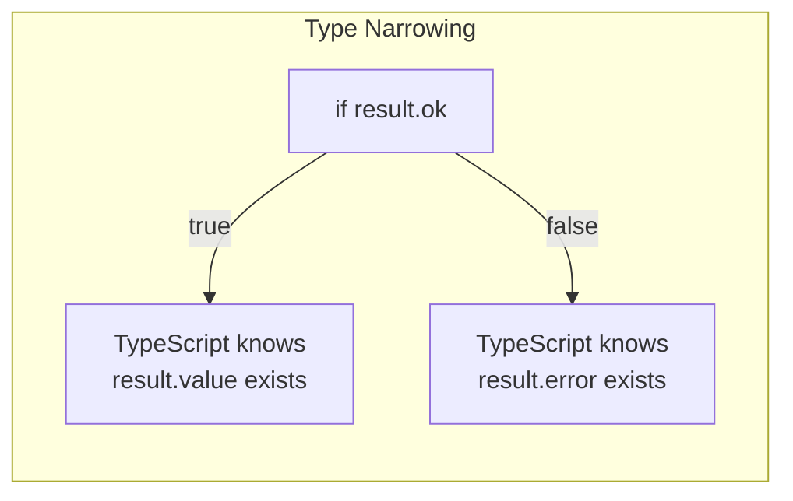
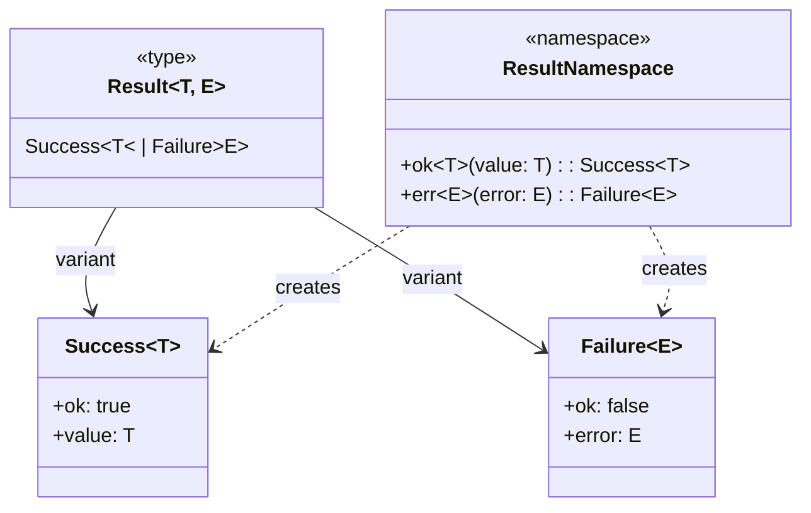

# result.ts - Result Type Utilities

## Overview

The `result.ts` module provides a Result type pattern implementation for explicit error handling without exceptions. It enables functional error handling with type safety, making error paths explicit and composable.

## Rationale

This module exists to:
1. Provide explicit error handling without exceptions
2. Make error paths type-safe and visible
3. Enable functional composition of operations
4. Avoid try-catch blocks in async code
5. Support Railway-Oriented Programming patterns

## Architecture

The module implements a discriminated union pattern for success and error cases:

```mermaid
graph TB
    subgraph "Result Type"
        Result[Result<T, E>]
        Success[Success<T><br/>ok: true<br/>value: T]
        Failure[Failure<E><br/>ok: false<br/>error: E]
    end
    
    subgraph "Constructor Functions"
        Ok[Result.ok(value)]
        Err[Result.err(error)]
    end
    
    subgraph "Usage Pattern"
        Operation[Operation]
        CheckResult[Check result.ok]
        UseValue[Use result.value]
        HandleError[Handle result.error]
    end
    
    Result --> Success
    Result --> Failure
    
    Ok --> Success
    Err --> Failure
    
    Operation --> CheckResult
    CheckResult -->|true| UseValue
    CheckResult -->|false| HandleError
```

## Dependencies

### No Dependencies
This is a pure TypeScript utility module with no external or internal dependencies.

## API Reference

### Types

#### Result<T, E>
```typescript
export type Result<T, E = Error> = Success<T> | Failure<E>;
```

A discriminated union representing either success with a value or failure with an error.

**Type Parameters:**
- `T` - The type of the success value
- `E` - The type of the error (defaults to Error)

#### Success<T>
```typescript
interface Success<T> {
  ok: true;
  value: T;
}
```

Represents a successful result.

**Properties:**
- `ok` - Always `true` for type discrimination
- `value` - The success value

#### Failure<E>
```typescript
interface Failure<E> {
  ok: false;
  error: E;
}
```

Represents a failed result.

**Properties:**
- `ok` - Always `false` for type discrimination
- `error` - The error information

### Functions

#### Result.ok
```typescript
export function ok<T>(value: T): Success<T>
```

Creates a successful result.

**Parameters:**
- `value` - The success value

**Returns:** A Success result

**Example:**
```typescript
const result = Result.ok({ data: 'success' });
```

#### Result.err
```typescript
export function err<E>(error: E): Failure<E>
```

Creates a failed result.

**Parameters:**
- `error` - The error value

**Returns:** A Failure result

**Example:**
```typescript
const result = Result.err(new Error('Something went wrong'));
```

### Namespace Export
```typescript
export const Result = { ok, err };
```

Namespace containing constructor functions.

## Usage Patterns

### Type Guards



TypeScript automatically narrows the type based on the `ok` property:

```typescript
function processResult<T, E>(result: Result<T, E>) {
  if (result.ok) {
    // TypeScript knows result.value exists
    console.log(result.value);
  } else {
    // TypeScript knows result.error exists
    console.error(result.error);
  }
}
```

### Functional Composition

```typescript
// Chain operations that return Results
function parseNumber(str: string): Result<number, string> {
  const num = Number(str);
  return isNaN(num) 
    ? Result.err('Invalid number')
    : Result.ok(num);
}

function divide(a: number, b: number): Result<number, string> {
  return b === 0
    ? Result.err('Division by zero')
    : Result.ok(a / b);
}

// Compose operations
function calculateResult(input: string, divisor: string): Result<number, string> {
  const numResult = parseNumber(input);
  if (!numResult.ok) return numResult;
  
  const divResult = parseNumber(divisor);
  if (!divResult.ok) return divResult;
  
  return divide(numResult.value, divResult.value);
}
```

## Class Diagrams



## Error Handling Patterns

### Traditional Try-Catch
```typescript
// Traditional approach
async function readFileTraditional(path: string): Promise<string> {
  try {
    const content = await fs.readFile(path, 'utf8');
    return content;
  } catch (error) {
    throw new Error(`Failed to read file: ${error.message}`);
  }
}

// Usage requires try-catch
try {
  const content = await readFileTraditional('file.txt');
  console.log(content);
} catch (error) {
  console.error(error);
}
```

### Result-Based Approach
```typescript
// Result-based approach
async function readFileResult(path: string): Promise<Result<string, Error>> {
  try {
    const content = await fs.readFile(path, 'utf8');
    return Result.ok(content);
  } catch (error) {
    return Result.err(error as Error);
  }
}

// Usage is explicit
const result = await readFileResult('file.txt');
if (result.ok) {
  console.log(result.value);
} else {
  console.error(result.error);
}
```

## Performance Considerations

1. **Zero Runtime Overhead**
   - Simple object creation
   - No classes or prototypes
   - Direct property access

2. **Type Safety at Compile Time**
   - TypeScript eliminates runtime checks
   - Discriminated union optimizations
   - No runtime type checking needed

3. **Memory Efficiency**
   - Minimal object allocation
   - No wrapper classes
   - Garbage collection friendly

## Test Coverage

### Unit Tests

```typescript
describe('Result type', () => {
  describe('Result.ok', () => {
    it('should create successful result', () => {
      const result = Result.ok(42);
      expect(result.ok).toBe(true);
      expect(result.value).toBe(42);
    });

    it('should work with complex types', () => {
      const result = Result.ok({ name: 'test', data: [1, 2, 3] });
      expect(result.value.name).toBe('test');
      expect(result.value.data).toHaveLength(3);
    });
  });

  describe('Result.err', () => {
    it('should create error result', () => {
      const result = Result.err(new Error('Test error'));
      expect(result.ok).toBe(false);
      expect(result.error.message).toBe('Test error');
    });

    it('should work with custom error types', () => {
      const result = Result.err({ code: 404, message: 'Not found' });
      expect(result.error.code).toBe(404);
    });
  });

  describe('Type narrowing', () => {
    it('should narrow types correctly', () => {
      function processResult(result: Result<number, string>) {
        if (result.ok) {
          // This should compile - value exists
          const doubled = result.value * 2;
          expect(typeof doubled).toBe('number');
        } else {
          // This should compile - error exists
          const upper = result.error.toUpperCase();
          expect(typeof upper).toBe('string');
        }
      }

      processResult(Result.ok(21));
      processResult(Result.err('error'));
    });
  });
});
```

### Type Safety Tests

```typescript
// These should produce TypeScript compile errors
describe('Type safety compile tests', () => {
  it('should not allow accessing value on error result', () => {
    const result = Result.err('error');
    if (!result.ok) {
      // @ts-expect-error - value doesn't exist on error
      console.log(result.value);
    }
  });

  it('should not allow accessing error on success result', () => {
    const result = Result.ok(42);
    if (result.ok) {
      // @ts-expect-error - error doesn't exist on success
      console.log(result.error);
    }
  });
});
```

## Usage Examples

### Basic Usage
```typescript
import { Result } from './utils/result';

function safeDivide(a: number, b: number): Result<number, string> {
  if (b === 0) {
    return Result.err('Division by zero');
  }
  return Result.ok(a / b);
}

const result = safeDivide(10, 2);
if (result.ok) {
  console.log(`Result: ${result.value}`); // Result: 5
} else {
  console.error(`Error: ${result.error}`);
}
```

### Async Operations
```typescript
async function fetchUserData(id: string): Promise<Result<User, Error>> {
  try {
    const response = await fetch(`/api/users/${id}`);
    if (!response.ok) {
      return Result.err(new Error(`HTTP ${response.status}`));
    }
    const user = await response.json();
    return Result.ok(user);
  } catch (error) {
    return Result.err(error as Error);
  }
}

// Usage
const userResult = await fetchUserData('123');
if (userResult.ok) {
  console.log(`Welcome, ${userResult.value.name}`);
} else {
  console.error(`Failed to fetch user: ${userResult.error.message}`);
}
```

### Chaining Operations
```typescript
function parseConfig(text: string): Result<Config, string> {
  try {
    const config = JSON.parse(text);
    return Result.ok(config);
  } catch {
    return Result.err('Invalid JSON');
  }
}

function validateConfig(config: any): Result<Config, string> {
  if (!config.version) {
    return Result.err('Missing version');
  }
  if (!config.name) {
    return Result.err('Missing name');
  }
  return Result.ok(config as Config);
}

function loadConfig(text: string): Result<Config, string> {
  const parseResult = parseConfig(text);
  if (!parseResult.ok) {
    return parseResult;
  }
  
  return validateConfig(parseResult.value);
}
```

### Result Mapping
```typescript
// Helper function for mapping results
function mapResult<T, U, E>(
  result: Result<T, E>,
  fn: (value: T) => U
): Result<U, E> {
  return result.ok 
    ? Result.ok(fn(result.value))
    : result;
}

// Usage
const numberResult = Result.ok(42);
const stringResult = mapResult(numberResult, n => n.toString());
// stringResult is Result<string, Error> with value "42"
```

### Collecting Results
```typescript
function collectResults<T, E>(results: Result<T, E>[]): Result<T[], E> {
  const values: T[] = [];
  
  for (const result of results) {
    if (!result.ok) {
      return result; // Return first error
    }
    values.push(result.value);
  }
  
  return Result.ok(values);
}

// Usage
const results = [
  Result.ok(1),
  Result.ok(2),
  Result.ok(3)
];

const collected = collectResults(results);
// collected.value = [1, 2, 3]
```

## Best Practices

1. **Use for Recoverable Errors** - Not for programming errors
2. **Be Explicit** - Make error handling visible
3. **Avoid Nested Results** - Flatten Result<Result<T, E>, E>
4. **Document Error Types** - Be clear about possible errors
5. **Consider Performance** - Results add slight overhead

## Comparison with Other Patterns

### Exceptions
- **Result**: Explicit, type-safe, no stack unwinding
- **Exceptions**: Implicit, runtime checks, stack unwinding

### Null/Undefined
- **Result**: Carries error information
- **Null**: No error context

### Promises
- **Result**: Synchronous, explicit error type
- **Promise**: Asynchronous, any error type

### Either Monad
- **Result**: Simplified, pragmatic approach
- **Either**: Full monadic interface