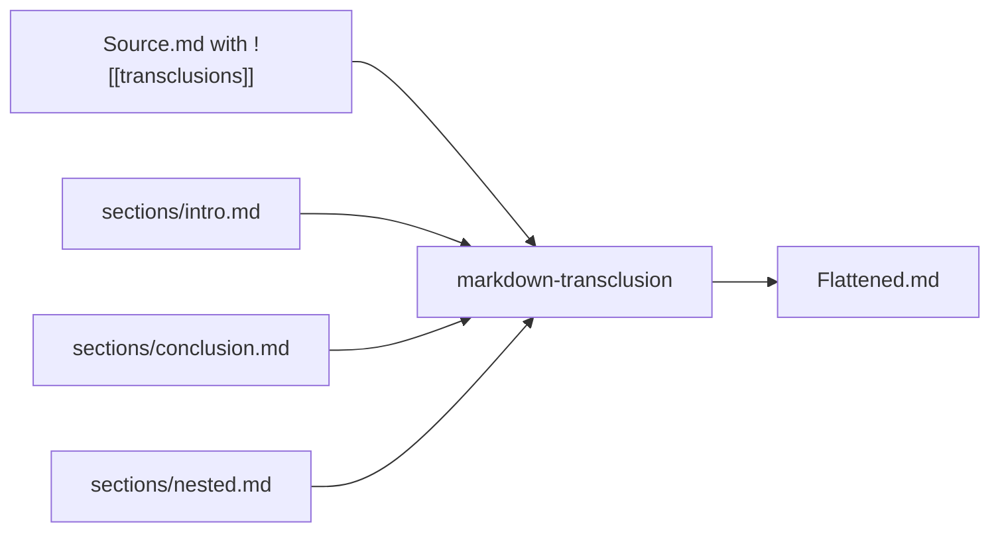
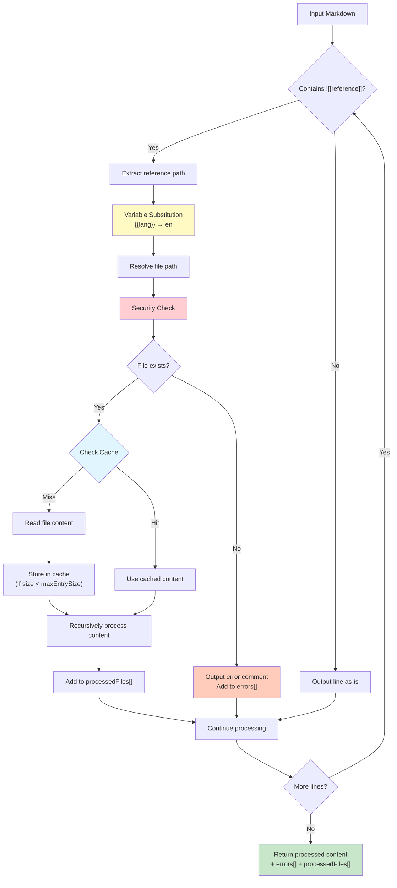
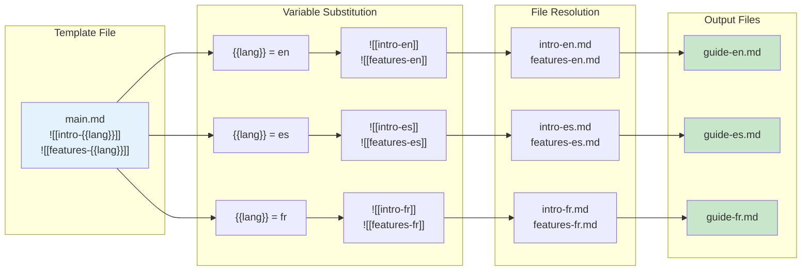
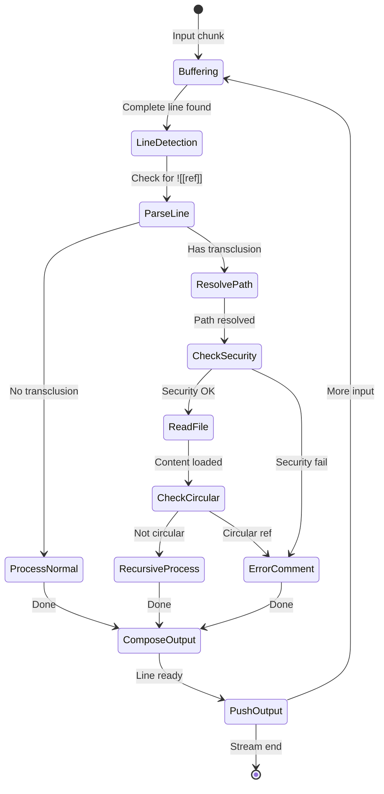
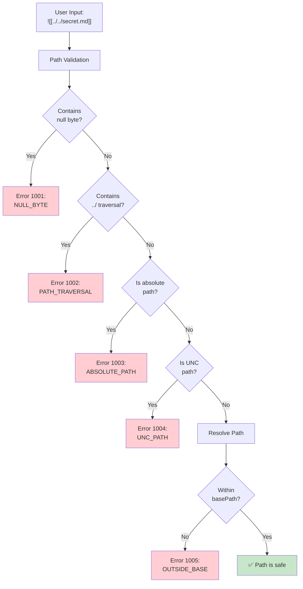

# Technical Design Document: `markdown-transclusion`

## Overview

**Package Name**: `markdown-transclusion`  
**Version**: 1.0.0  
**Purpose**: Core library for resolving transclusion references in Markdown documents  
**Target Users**: Technical writers, documentation teams, knowledge management systems

## Primary Use Case

Processes Obsidian-style Markdown transclusions for automated document generation workflows. Initially designed for the Universal Charter project's multilingual release pipeline, where it serves as a key component in the CI/CD-triggered document transformation process.

## Problem Statement

Modern documentation workflows increasingly rely on modular, composable content structures. However, existing Markdown parsers and processors do not natively support transclusion - the ability to embed one document's content within another through reference syntax.

**Current Pain Points:**
- Manual copy-paste leads to content duplication and sync issues
- No standardized way to compose documents from modular components  
- Translation workflows require maintaining separate copies of shared content
- Version control becomes complex with duplicated content across files
- Obsidian's `![[transclusion]]` syntax is proprietary and not portable

## Solution

A focused, single-purpose library that resolves transclusion references in Markdown documents, transforming modular source files into flattened output suitable for standard Markdown processors.



----

# Architecture & Design

## Core Algorithm



### Multilingual Workflow



## Transclusion Syntax Support

**Primary**: Obsidian-style transclusion
```markdown
![[filename]]
![[path/to/file]]
![[file#heading]]
```

**Future**: Wiki-style transclusion
```markdown
{{filename}}
{{:path/to/file}}
```

----

# Feature Specifications

The following table provides an overview of all features, their implementation status, and links to detailed specifications.

| ID | Feature Title | Status | Specification |
|----|--------------|--------|---------------|
| 001 | Basic Transclusion Resolution | implemented | [001-basic-transclusion.md](feature-specs/001-basic-transclusion.md) |
| 002 | Recursive Transclusion | implemented | [002-recursive-transclusion.md](feature-specs/002-recursive-transclusion.md) |
| 003 | Path Resolution | implemented | [003-path-resolution.md](feature-specs/003-path-resolution.md) |
| 004 | Error Handling & Debugging | implemented | [004-error-handling.md](feature-specs/004-error-handling.md) |
| 005 | Variable Substitution | implemented | [005-variable-substitution.md](feature-specs/005-variable-substitution.md) |
| 006 | Heading-Specific Transclusion | planned | [006-heading-extraction.md](feature-specs/006-heading-extraction.md) |
| 007 | Wiki-Style Transclusion Syntax | planned | [007-wiki-style-syntax.md](feature-specs/007-wiki-style-syntax.md) |
| 008 | Auto-Fix Suggestions | planned | [008-auto-fix-suggestions.md](feature-specs/008-auto-fix-suggestions.md) |
| 009 | Per-File Configuration | planned | [009-per-file-config.md](feature-specs/009-per-file-config.md) |
| 010 | Mermaid Diagram Validation | planned | [010-diagram-validation.md](feature-specs/010-diagram-validation.md) |
| 011 | Line Range Selection | planned | [011-line-range-selection.md](feature-specs/011-line-range-selection.md) |
| 012 | Transclusion Aliases | planned | [012-transclusion-aliases.md](feature-specs/012-transclusion-aliases.md) |
| 013 | Conditional Content Blocks | planned | [013-conditional-blocks.md](feature-specs/013-conditional-blocks.md) |

## Feature Categories

### Core Functionality (Implemented)
- **Transclusion Engine**: Basic resolution, recursive processing, path handling
- **Error Management**: Comprehensive error reporting and graceful degradation
- **Dynamic Content**: Variable substitution for conditional transclusions

### Enhanced Features (Planned)
- **Content Selection**: Extract specific sections via heading references
- **Syntax Compatibility**: Support alternative wiki-style syntax
- **Developer Experience**: Auto-fix suggestions and per-file configuration
- **Quality Assurance**: Validate embedded diagrams and code blocks

For detailed information about each feature, including user stories, acceptance criteria, and implementation notes, please refer to the individual specification files in the `feature-specs/` directory.

----

# API Design

Provides both a programmatic transform stream API and a command-line interface for integration into automated workflows.

## Stream-Based Core API

```typescript
interface TransclusionOptions {
  basePath?: string;
  extensions?: string[];
  maxDepth?: number;
  variables?: Record<string, string>;
  strict?: boolean;
  validateOnly?: boolean;
  cache?: FileCache;
}

interface TransclusionError {
  message: string;
  path: string;
  line?: number;
  code?: string;
}

interface TransclusionResult {
  content: string;
  errors: TransclusionError[];
  processedFiles: string[];
}

// Primary stream interface
function createTransclusionStream(
  options?: TransclusionOptions
): TransclusionTransform;

// The transform stream class with error tracking
class TransclusionTransform extends Transform {
  errors: TransclusionError[];  // Accumulated errors during processing
}

// Convenience function for simple use cases
function transclude(
  input: string, 
  options?: TransclusionOptions
): Promise<TransclusionResult>;

// File-based convenience function
function transcludeFile(
  filePath: string,
  options?: TransclusionOptions  
): Promise<TransclusionResult>;
```

## CLI Interface

Command-line interface follows Unix pipeline conventions for easy integration into CI/CD workflows and build scripts.

```bash
# Universal Charter workflow - stream processing
cat charter-template.md | npx markdown-transclusion \
  --variables "lang=es" > charter-es.md

# File input with stream output
npx markdown-transclusion charter-template.md \
  --variables "lang=es" > charter-es.md

# Validation mode (checks references without processing content)
npx markdown-transclusion charter-template.md \
  --validate \
  --variables "lang=en,es,fr,de,it"

# Strict mode with explicit output
npx markdown-transclusion charter-template.md \
  --variables "lang=es" \
  --strict \
  --output charter-es.md

# Pipeline with other tools
npx markdown-transclusion charter-template.md --variables "lang=es" | \
  pandoc --from markdown --to pdf > charter-es.pdf

# Control verbosity with log levels
npx markdown-transclusion input.md \
  --log-level ERROR  # Only show errors
  
npx markdown-transclusion input.md \
  --log-level DEBUG  # Show detailed processing information
```

### CLI Flags Reference

| Flag | Short | Description | Default |
|------|-------|-------------|---------|
| `--input` | `-i` | Input file path | stdin |
| `--output` | `-o` | Output file path | stdout |
| `--base-path` | `-b` | Base directory for resolving references | cwd |
| `--variables` | | Variable substitutions (key=value,key2=value2) | {} |
| `--extensions` | `-e` | File extensions to try (comma-separated) | md,markdown |
| `--max-depth` | `-d` | Maximum recursion depth | 10 |
| `--strict` | `-s` | Exit on any error | false |
| `--validate-only` | | Only validate references, don't output | false |
| `--log-level` | | Verbosity: ERROR, WARN, INFO, DEBUG | INFO |
| `--help` | `-h` | Show help message | |
| `--version` | `-v` | Show version number | |

## Usage Examples

Stream-based processing supports standard Unix pipeline patterns for flexible integration.

```typescript
import { createTransclusionStream, transclude } from 'markdown-transclusion';
import { createReadStream, createWriteStream } from 'fs';

// Stream-based processing (recommended for large files)
const transclusionStream = createTransclusionStream({
  basePath: './sections',
  variables: { lang: 'es' }
});

createReadStream('charter-template.md')
  .pipe(transclusionStream)
  .pipe(createWriteStream('charter-es.md'));

// Pipeline processing
process.stdin
  .pipe(createTransclusionStream({ variables: { lang: 'es' } }))
  .pipe(process.stdout);

// Convenience function for simple cases
const result = await transclude(markdownContent, {
  basePath: './sections',
  variables: { lang: 'es' }
});
console.log(result.content);       // Processed content
console.log(result.errors);        // Array of errors
console.log(result.processedFiles); // Files that were processed

// File-based convenience function
const fileResult = await transcludeFile('./docs/index.md', {
  variables: { version: '2.0' }
});
// Note: basePath defaults to the file's directory

// Error handling with streams
transclusionStream.on('error', (error) => {
  console.error(`Transclusion error: ${error.message}`);
  process.exit(1);
});

// Access accumulated errors after processing
transclusionStream.on('finish', () => {
  const errors = transclusionStream.errors;
  if (errors.length > 0) {
    console.error(`Found ${errors.length} errors during processing`);
    errors.forEach(err => {
      console.error(`[${err.path}] ${err.message}`);
    });
  }
});
```

----

# Implementation Details

## Design Goals

Built as part of a document transformation pipeline for generating multilingual versions of the Universal Charter project. The library emphasizes performance, reliability, and maintainability while keeping the API surface minimal and focused.

## Stream-Based Architecture

Implements Node.js Transform streams for memory-efficient processing of large documents without loading entire files into memory.



**Key Implementation Details:**
- **Transform Stream**: Primary interface using `stream.Transform`
- **Line Buffering**: Buffers input until complete lines or transclusion references are identified
- **Async File Resolution**: Non-blocking file reads when `![[reference]]` patterns are encountered
- **Backpressure Handling**: Proper stream backpressure management when reading transcluded files
- **Error Propagation**: Configurable error handling (strict mode throws, warn mode continues)

**Note**: When a transclusion is resolved, the stream buffers until the embedded document finishes recursive processing to correctly handle nested transclusions within embedded documents.

**Stream Processing Flow:**
```typescript
class TransclusionTransform extends Transform {
  _transform(chunk, encoding, callback) {
    // 1. Buffer incoming data until complete lines
    // 2. Process each line for transclusion patterns
    // 3. When ![[ref]] found: pause, read file, resume with content
    // 4. Handle recursive transclusions in loaded content
    // 5. Continue streaming processed output
  }
}
```

## Caching Strategy

The library implements a smart caching model that balances performance with predictability:

### Default Behavior
- **No cache by default**: Simple operations read directly from disk
- **Automatic caching for recursion**: When `maxDepth > 1` and no cache is provided, a `MemoryFileCache` is automatically enabled to optimize recursive transclusions
- **Respects user preferences**: Explicitly provided caches are never overridden

### Cache Implementations

#### NoopFileCache
Explicit null-object pattern for when caching must be disabled:
```typescript
const stream = createTransclusionStream({ 
  basePath: './docs',
  cache: new NoopFileCache()  // Explicitly disable caching
});
```

#### MemoryFileCache
In-memory cache with size limits to prevent memory issues:
```typescript
// Default: 1MB max per file
const cache = new MemoryFileCache();

// Custom size limit: 500KB per file
const cache = new MemoryFileCache(500 * 1024);

// Manual usage
const stream = createTransclusionStream({
  basePath: './docs', 
  cache: cache
});
```

**MemoryFileCache Features:**
- **Size-limited entries**: Files exceeding `maxEntrySize` (default 1MB) are not cached
- **UTF-8 aware**: Correctly calculates byte sizes for multi-byte characters
- **Statistics tracking**: Hit/miss rates and total cache size available

### Automatic Cache Enabling
The stream automatically creates a `MemoryFileCache` when:
1. No cache is explicitly provided
2. `validateOnly` is false
3. `maxDepth` is undefined (defaults to 10) or greater than 1

```typescript
// These will auto-enable caching:
createTransclusionStream({ maxDepth: 5 });     // Recursive processing
createTransclusionStream({});                   // Default maxDepth=10

// These will NOT auto-enable caching:
createTransclusionStream({ maxDepth: 1 });      // No recursion
createTransclusionStream({ validateOnly: true }); // Validation mode
createTransclusionStream({ cache: myCache });    // User-provided cache
```

### When Caching Makes Sense
- Processing files with deep transclusion hierarchies
- Multiple references to the same files
- Working with shared component libraries
- CI/CD environments with consistent file systems

## Dependencies

**Runtime**: Zero external dependencies, uses only Node.js built-in modules (`stream`, `fs`, `path`)  
**Development**: TypeScript, Jest, ESLint  
**Target**: Node.js 18.18.0+ (for modern stream APIs and async/await support)

## Security Model



## File Structure

```
markdown-transclusion/
├── src/
│   ├── index.ts              # Main exports
│   ├── stream.ts             # Transform stream implementation  
│   ├── transclude.ts         # Convenience functions
│   ├── resolver.ts           # Path resolution + variable substitution
│   ├── types.ts              # TypeScript definitions
│   └── cli.ts                # CLI interface
├── tests/
│   ├── fixtures/             # Test Markdown files
│   ├── stream.test.ts        # Stream-specific tests
│   ├── transclude.test.ts    # API functionality tests  
│   └── cli.test.ts           # CLI interface tests
├── docs/
│   └── api.md               # API documentation
└── package.json
```

## Performance Characteristics

- **Streaming Processing**: Constant memory usage regardless of input file size
- **No Default Caching**: Direct file reads for predictability and simplicity
- **Optional Memoization**: Opt-in file caching for scenarios with repeated reads
- **Lazy Loading**: Files are only read when their transclusion references are encountered
- **Async Operations**: Non-blocking file I/O prevents stream stalling

----

# Testing Strategy

Comprehensive testing approach covering unit, integration, and performance scenarios.

```mermaid
graph TB
    A["Unit Tests"] --> A1["Transform stream behavior"]
    A --> A2["Path resolution + variable substitution"]
    A --> A3["Error handling modes"]
    A --> A4["Circular reference detection"]
    A --> A5["Line buffering logic"]
    
    B["Integration Tests"] --> B1["CLI stream processing"]
    B --> B2["File system operations"]
    B --> B3["Pipeline composition"]
    B --> B4["Universal Charter scenarios"]
    
    C["Stream Tests"] --> C1["Backpressure handling"]
    C --> C2["Memory usage validation"]
    C --> C3["Large file processing"]
    C --> C4["Error propagation"]
    
    D["Performance Tests"] --> D1["Stream throughput benchmarks"]
    D --> D2["Deep recursion scenarios"]
    D --> D3["Concurrent file reads"]
```



**Stream-Specific Testing Focus:**
- **Transform Stream**: Verify proper chunk processing and buffering behavior
- **Pipeline Integration**: Test compatibility with various input/output streams  
- **Memory Bounds**: Ensure constant memory usage regardless of input size
- **Error Handling**: Validate stream error events vs callback error patterns
- **Backpressure**: Confirm proper handling when downstream processing is slow

----

*This technical design document represents the foundational specification for the markdown-transclusion library. Implementation follows standard Node.js best practices and modern TypeScript conventions.*