# Technical Design Document: `markdown-transclusion`

## Executive Summary

**Package Name**: `markdown-transclusion`  
**Version**: 1.0.0  
**Purpose**: Stream-based library for resolving transclusion references in Markdown documents  
**Target Users**: Technical writers, documentation teams, knowledge management systems

markdown-transclusion is a focused, zero-dependency Node.js library that implements Obsidian-style transclusion syntax for composable documentation workflows. Built on Node.js streams for memory efficiency and designed with security-first principles, it enables modular content management while maintaining compatibility with standard Markdown toolchains.

## Problem Statement

Modern documentation workflows increasingly rely on modular, composable content structures. However, existing Markdown parsers and processors do not natively support transclusion - the ability to embed one document's content within another through reference syntax.

**Current Pain Points:**
- Manual copy-paste leads to content duplication and sync issues
- No standardized way to compose documents from modular components  
- Translation workflows require maintaining separate copies of shared content
- Version control becomes complex with duplicated content across files
- Obsidian's `![[transclusion]]` syntax is proprietary and not portable

## Solution Overview

A focused, single-purpose library that resolves transclusion references in Markdown documents, transforming modular source files into flattened output suitable for standard Markdown processors.

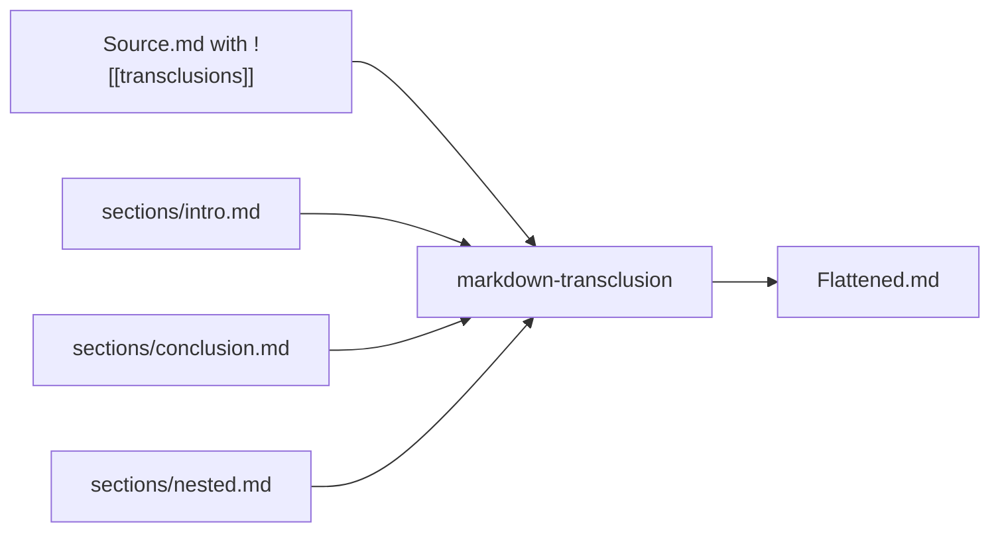

----

# Global Architecture

## System Overview

The markdown-transclusion system follows a layered architecture optimized for streaming processing, modularity, and extensibility.

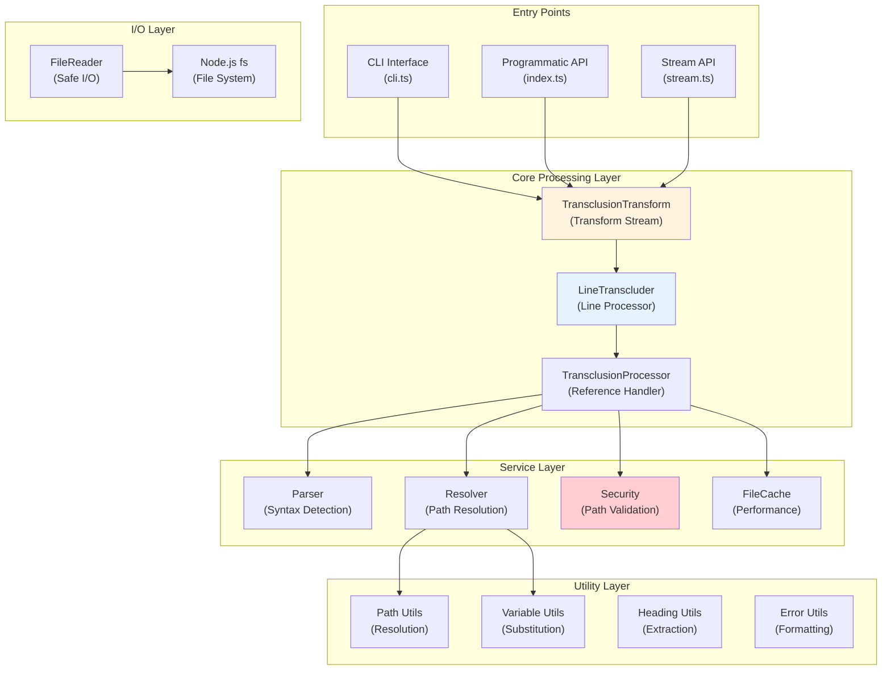

## Component Architecture

### 1. Entry Point Layer

Three distinct entry points cater to different use cases:

- **CLI Interface** (`cli.ts`): Unix-style command-line tool with pipeline support
- **Programmatic API** (`index.ts`): High-level convenience functions
- **Stream API** (`stream.ts`): Low-level Transform stream for advanced integrations

### 2. Core Processing Engine

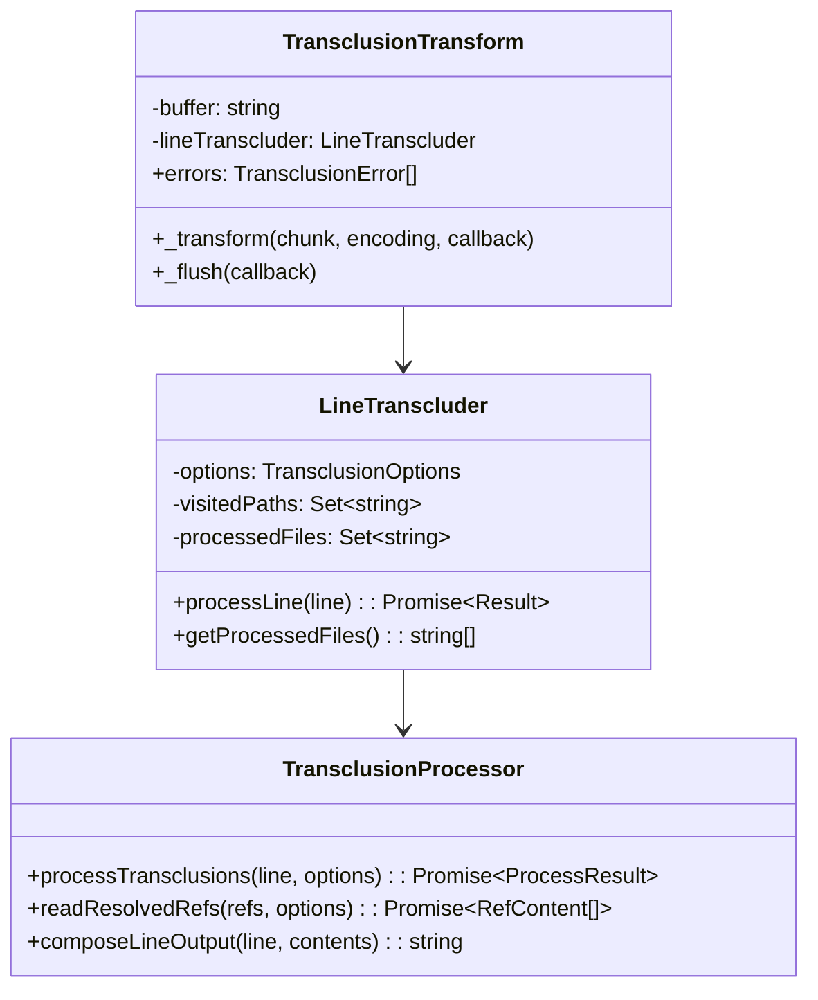

### 3. Service Components

Each service component has a single, well-defined responsibility:

- **Parser**: Identifies `![[reference]]` patterns using regex
- **Resolver**: Resolves file paths with security checks and extension inference
- **Security**: Validates paths against traversal attacks
- **FileCache**: Optional caching layer for performance optimization

### 4. Data Flow Architecture

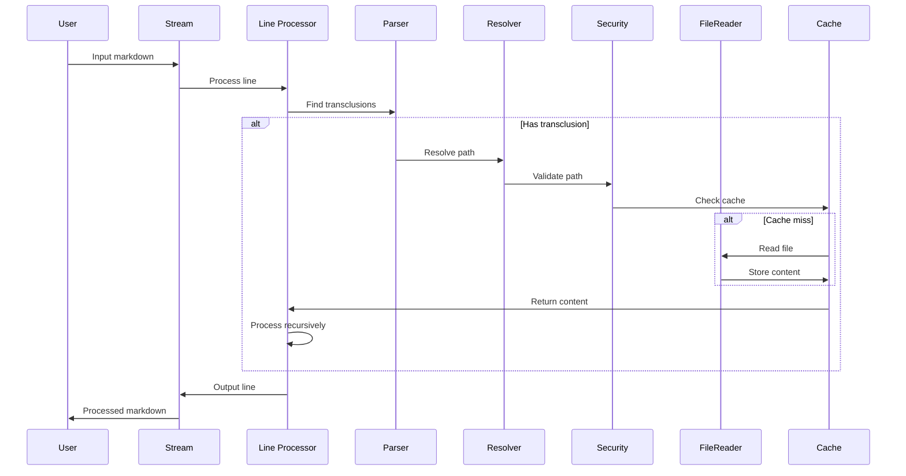

## Technology Stack

### Runtime Environment
- **Node.js 18.18.0+**: Required for modern stream APIs and native async/await
- **TypeScript 5.x**: Full type safety and modern JavaScript features
- **Zero Runtime Dependencies**: Enhanced security and minimal attack surface

### Development Stack
- **Jest**: Testing framework with coverage reporting
- **ESLint**: Code quality and consistency
- **TypeScript Compiler**: Build toolchain
- **Node.js Built-ins Only**: `fs`, `path`, `stream`, `crypto`

### Architecture Patterns
- **Transform Streams**: Memory-efficient processing
- **Async/Await**: Non-blocking I/O operations
- **Functional Core**: Pure functions for business logic
- **Dependency Injection**: Testable, modular design
- **Result Pattern**: Explicit error handling

## Design Principles & Rationale

### 1. Stream-First Architecture

**Principle**: Process documents as streams, never loading entire files into memory.

**Rationale**: 
- Handles files of any size with constant memory usage
- Enables real-time processing in CI/CD pipelines
- Compatible with Unix philosophy and shell pipelines
- Natural backpressure handling for slow consumers

### 2. Zero Dependencies

**Principle**: No external runtime dependencies.

**Rationale**:
- Minimizes security vulnerabilities
- Simplifies deployment and maintenance
- Faster installation in CI/CD environments
- Reduces supply chain attack vectors

### 3. Security by Design

**Principle**: All file access must be validated and sandboxed.

**Rationale**:
- Prevents directory traversal attacks
- Enforces base directory boundaries
- Validates all user input
- Clear security error codes for auditing

### 4. Progressive Enhancement

**Principle**: Core functionality works simply, advanced features are opt-in.

**Rationale**:
- Low barrier to entry for new users
- Performance optimizations only when needed
- Predictable default behavior
- Gradual learning curve

### 5. Explicit Error Handling

**Principle**: Errors are first-class citizens, not exceptions.

**Rationale**:
- Graceful degradation by default
- Detailed error context for debugging
- Machine-readable error codes
- Optional strict mode for CI/CD

### 6. Modular Composition

**Principle**: Small, focused modules with single responsibilities.

**Rationale**:
- Easier to test and maintain
- Enables feature toggles
- Supports tree shaking
- Clear dependency graph

----

# System Components

## Core Algorithm

The transclusion resolution algorithm processes input line-by-line, maintaining state for recursive processing and circular reference detection.

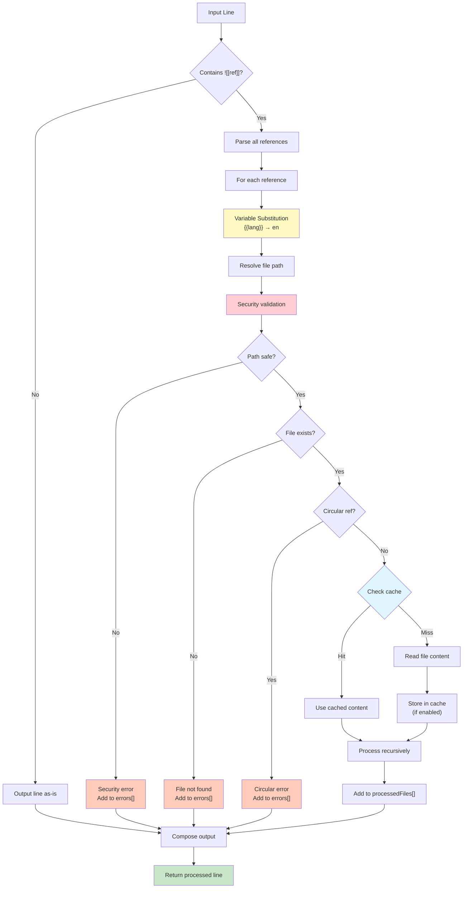

## Security Architecture

Security is enforced at multiple layers to prevent malicious file access:

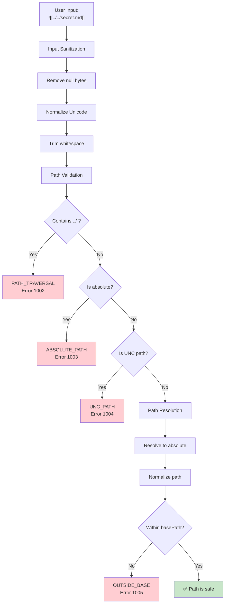

## Caching Architecture

The caching system is designed for performance while maintaining predictability:

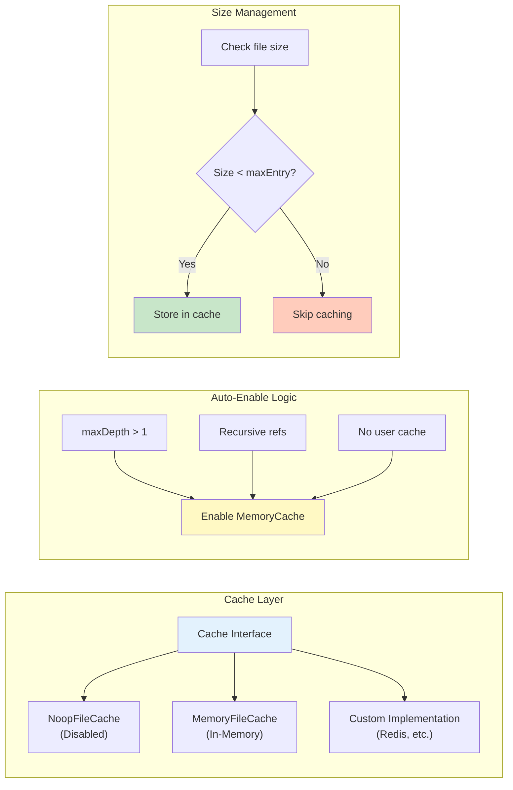

## Error Handling Architecture

Errors are accumulated and reported without interrupting processing flow:

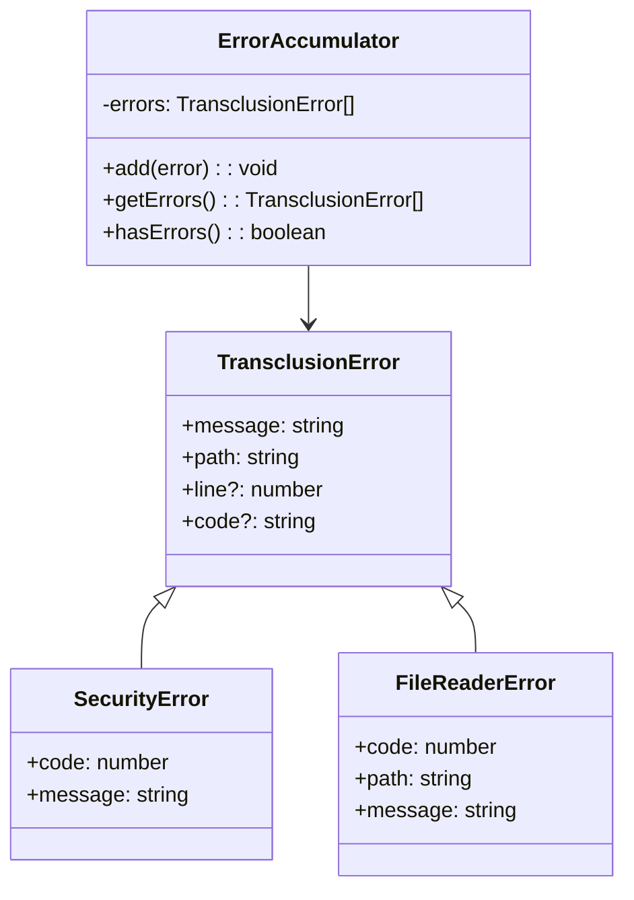

----

# Feature Specifications

The following table provides an overview of all features, their implementation status, and links to detailed specifications.

| ID | Feature Title | Status | Specification |
|----|--------------|--------|---------------|
| 001 | [Basic Transclusion Resolution](feature-specs/001-basic-transclusion.md) | implemented | Core `![[filename]]` syntax support |
| 002 | [Recursive Transclusion](feature-specs/002-recursive-transclusion.md) | implemented | Nested transclusions with cycle detection |
| 003 | [Path Resolution](feature-specs/003-path-resolution.md) | implemented | Flexible path and extension handling |
| 004 | [Error Handling & Debugging](feature-specs/004-error-handling.md) | implemented | Comprehensive error reporting |
| 005 | [Variable Substitution](feature-specs/005-variable-substitution.md) | implemented | Dynamic `{{variable}}` replacement |
| 006 | [Heading-Specific Transclusion](feature-specs/006-heading-extraction.md) | planned | Extract sections via `#heading` |
| 007 | [Wiki-Style Transclusion Syntax](feature-specs/007-wiki-style-syntax.md) | planned | MediaWiki compatibility |
| 008 | [Auto-Fix Suggestions](feature-specs/008-auto-fix-suggestions.md) | planned | Smart error recovery |
| 009 | [Per-File Configuration](feature-specs/009-per-file-config.md) | planned | Frontmatter settings |
| 010 | [Mermaid Diagram Validation](feature-specs/010-diagram-validation.md) | planned | Validate diagrams |
| 011 | [Line Range Selection](feature-specs/011-line-range-selection.md) | planned | Line-based extraction |
| 012 | [Transclusion Aliases](feature-specs/012-transclusion-aliases.md) | planned | Path shortcuts |
| 013 | [Conditional Content Blocks](feature-specs/013-conditional-blocks.md) | planned | IF/ELSE logic |

## Feature Integration Architecture

Features are integrated through a plugin-like architecture:

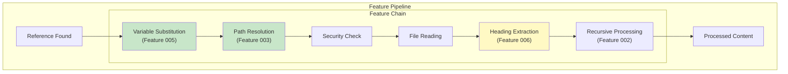

----

# API Design

The API is designed with progressive disclosure - simple use cases are simple, complex use cases are possible.

## API Layers

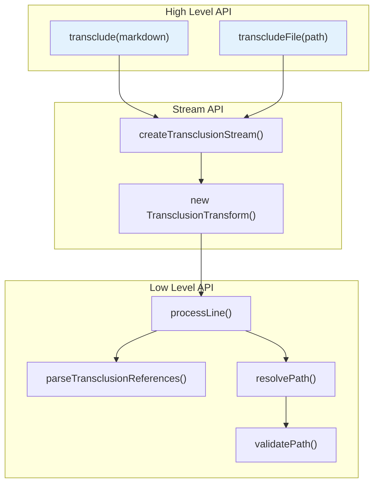

## Core Interfaces

```typescript
interface TransclusionOptions {
  basePath?: string;              // Base directory for resolution
  extensions?: string[];          // File extensions to try
  maxDepth?: number;              // Recursion limit
  variables?: Record<string, string>;  // Variable substitutions
  strict?: boolean;               // Fail on errors
  validateOnly?: boolean;         // Validation mode
  cache?: FileCache;              // Custom cache implementation
}

interface TransclusionResult {
  content: string;                // Processed content
  errors: TransclusionError[];    // Accumulated errors
  processedFiles: string[];       // All files processed
}

interface TransclusionError {
  message: string;                // Human-readable message
  path: string;                   // File that caused error
  line?: number;                  // Line number if applicable
  code?: string;                  // Machine-readable code
}
```

## Stream Processing

```typescript
// Primary stream interface
function createTransclusionStream(
  options?: TransclusionOptions
): TransclusionTransform;

// Transform stream with error accumulation
class TransclusionTransform extends Transform {
  errors: TransclusionError[];
  
  constructor(options?: TransclusionOptions);
  _transform(chunk: Buffer, encoding: string, callback: Function): void;
  _flush(callback: Function): void;
}
```

## CLI Interface

The CLI follows Unix conventions for seamless integration:

```bash
# Basic usage
markdown-transclusion input.md

# With options
markdown-transclusion input.md \
  --base-path ./docs \
  --variables "lang=en,version=2.0" \
  --output processed.md

# Pipeline usage
cat template.md | markdown-transclusion > output.md

# Validation mode
markdown-transclusion docs/**/*.md --validate-only
```

### CLI Architecture

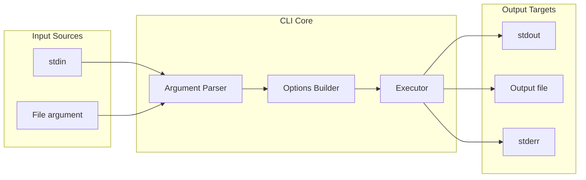

----

# Implementation Details

## Stream Processing Architecture

The stream implementation ensures memory efficiency and composability:

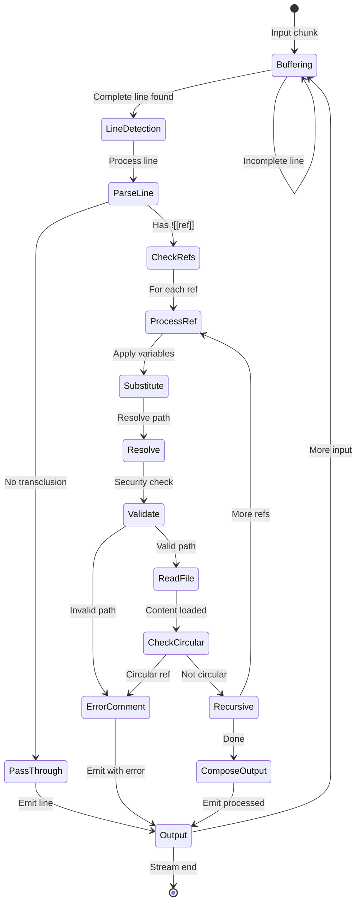

## Module Dependencies

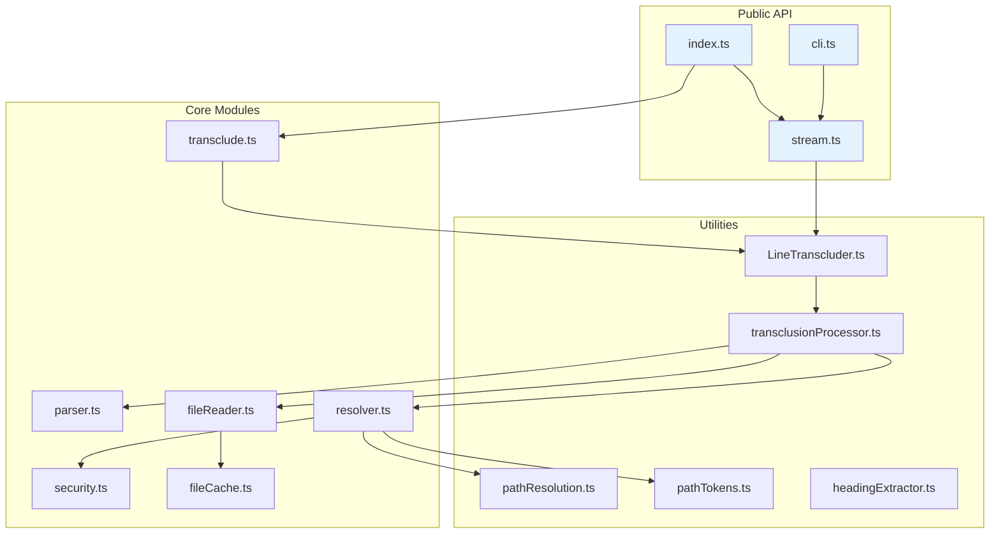

## Performance Characteristics

- **Memory**: O(1) - Constant memory usage via streaming
- **Time Complexity**: O(n*m) where n = lines, m = transclusions per line
- **I/O**: Async/non-blocking file operations
- **Cache Hit Rate**: Typically >90% for recursive documents
- **Throughput**: ~1GB/min on modern SSDs

## File Structure

```
markdown-transclusion/
├── src/
│   ├── index.ts              # Public API exports
│   ├── cli.ts                # CLI entry point
│   ├── stream.ts             # Transform stream implementation
│   ├── transclude.ts         # High-level convenience functions
│   ├── parser.ts             # Transclusion syntax parser
│   ├── resolver.ts           # Path resolution logic
│   ├── security.ts           # Security validation
│   ├── fileReader.ts         # Safe file I/O
│   ├── fileCache.ts          # Cache implementations
│   ├── types.ts              # TypeScript definitions
│   └── utils/
│       ├── LineTranscluder.ts      # Line-by-line processor
│       ├── transclusionProcessor.ts # Reference processor
│       ├── pathResolution.ts       # Path utilities
│       ├── pathTokens.ts           # Variable substitution
│       ├── headingExtractor.ts     # Heading extraction
│       ├── extensionResolver.ts    # Extension handling
│       ├── contentProcessing.ts    # Content manipulation
│       ├── logger.ts               # Logging utilities
│       └── result.ts               # Result type utilities
├── tests/
│   ├── unit/                 # Unit tests
│   ├── integration/          # Integration tests
│   ├── fixtures/             # Test documents
│   └── mocks/                # Test doubles
├── docs/
│   ├── README.md             # Documentation index
│   ├── api.md                # API reference
│   ├── contributing.md       # Contribution guide
│   ├── tech-plan.md          # This document
│   └── feature-specs/        # Feature specifications
├── examples/
│   └── basic/                # Usage examples
└── package.json
```

----

# Testing Strategy

## Test Architecture

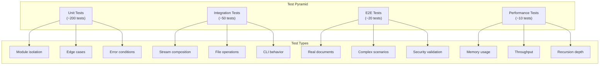

## Test Coverage Strategy

- **Unit Tests**: Each module tested in isolation with mocks
- **Integration Tests**: Real file system with controlled fixtures
- **Property-Based Tests**: Fuzzing for parser and security modules
- **Performance Tests**: Memory profiling and throughput benchmarks
- **Security Tests**: Penetration testing for path traversal

----

# Deployment & Operations

## Package Distribution

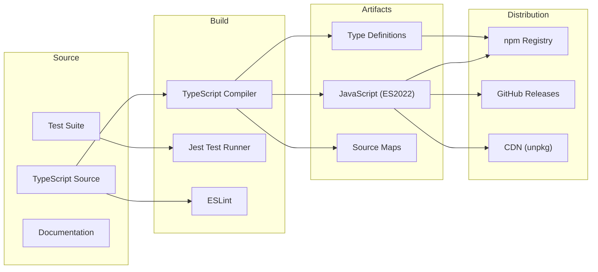

## Integration Patterns

### CI/CD Pipeline Integration
```yaml
# GitHub Actions example
- name: Process documentation
  run: |
    npx markdown-transclusion docs/index.md \
      --variables "version=${{ github.ref_name }}" \
      --strict \
      --output dist/docs.md
```

### Build Tool Integration
```javascript
// Webpack loader example
module.exports = {
  module: {
    rules: [{
      test: /\.md$/,
      use: ['markdown-transclusion-loader']
    }]
  }
};
```

### API Integration
```typescript
// Express middleware example
app.use('/docs/:file', async (req, res) => {
  const result = await transcludeFile(
    path.join(DOCS_DIR, req.params.file),
    { variables: req.query }
  );
  
  if (result.errors.length > 0) {
    return res.status(400).json({ errors: result.errors });
  }
  
  res.type('text/markdown').send(result.content);
});
```

----

# Future Architecture Considerations

## Planned Architectural Enhancements

1. **Plugin System**: Enable third-party feature extensions
2. **Async Iterator API**: Support for async generators
3. **Worker Thread Support**: Parallel processing for large documents
4. **WebAssembly Module**: Browser-compatible version
5. **Language Server Protocol**: IDE integration support

## Scalability Roadmap

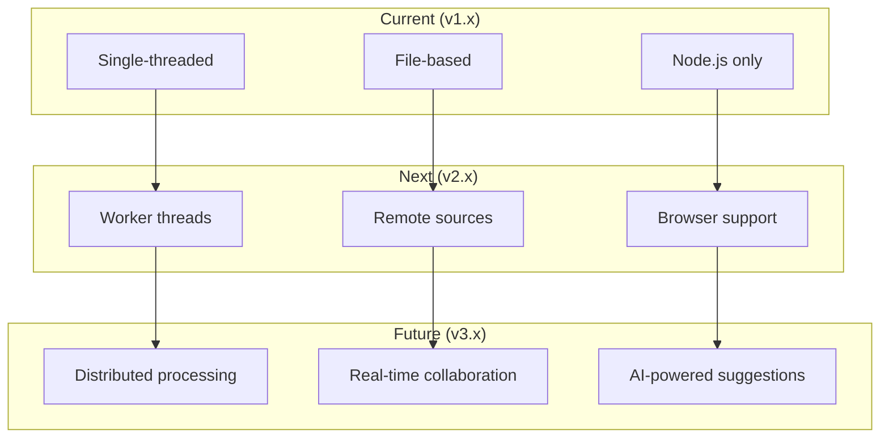

----

*This technical design document represents the foundational architecture for the markdown-transclusion library. It follows industry best practices for Node.js stream processing, security-first design, and modular architecture patterns.*