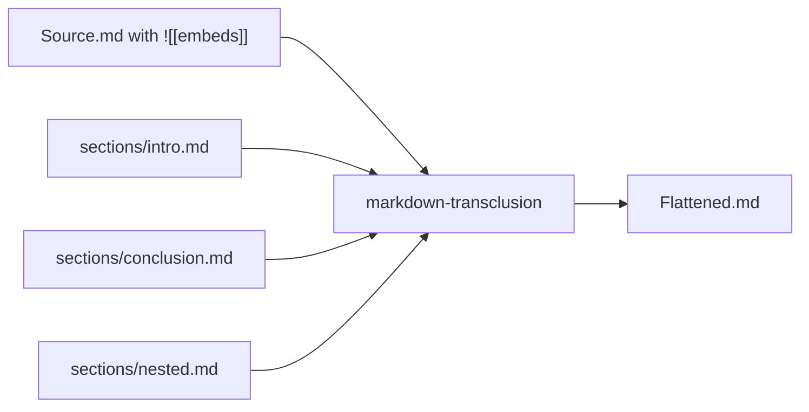
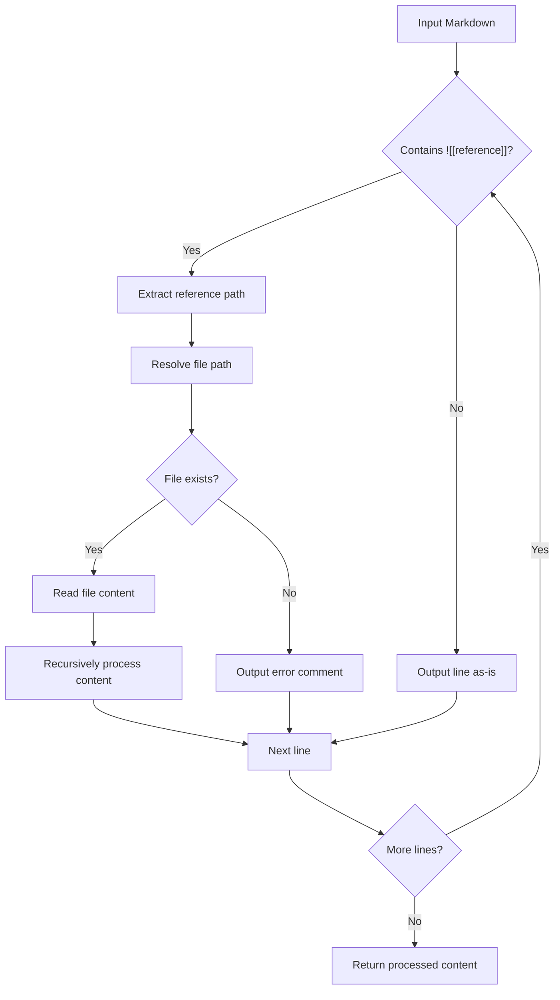

# Technical Design Document: `markdown-transclusion`

## Overview

**Package Name**: `markdown-transclusion`  
**Version**: 1.0.0  
**Purpose**: Core library for resolving transclusion references in Markdown documents  
**Target Users**: Technical writers, documentation teams, knowledge management systems

## Primary Use Case

Processes Obsidian-style Markdown transclusions for automated document generation workflows. Initially designed for the Universal Charter project's multilingual release pipeline, where it serves as a key component in the CI/CD-triggered document transformation process.

## Problem Statement

Modern documentation workflows increasingly rely on modular, composable content structures. However, existing Markdown parsers and processors do not natively support transclusion - the ability to embed one document's content within another through reference syntax.

**Current Pain Points:**
- Manual copy-paste leads to content duplication and sync issues
- No standardized way to compose documents from modular components  
- Translation workflows require maintaining separate copies of shared content
- Version control becomes complex with duplicated content across files
- Obsidian's `![[embed]]` syntax is proprietary and not portable

## Solution

A focused, single-purpose library that resolves transclusion references in Markdown documents, transforming modular source files into flattened output suitable for standard Markdown processors.



----

# Architecture & Design

## Core Algorithm



## Transclusion Syntax Support

**Primary**: Obsidian-style transclusion
```markdown
![[filename]]
![[path/to/file]]
![[file#heading]]
```

**Future**: Wiki-style transclusion
```markdown
{{filename}}
{{:path/to/file}}
```

----

# Features & User Stories

## Core Features

### F1: Basic Transclusion Resolution
**As a** technical writer  
**I want to** embed content from other files using `![[filename]]` syntax  
**So that** I can compose documents from reusable components

**Acceptance Criteria:**
- ✅ Resolves `![[filename]]` to file contents
- ✅ Supports relative paths from base directory
- ✅ Handles missing files gracefully with error comments
- ✅ Preserves original line structure for non-transclusion content

### F2: Recursive Transclusion
**As a** documentation maintainer  
**I want** embedded files to support their own transclusions  
**So that** I can create deeply modular content hierarchies

**Acceptance Criteria:**
- ✅ Recursively processes transclusions in embedded content
- ✅ Detects and prevents circular references
- ✅ Maintains proper error reporting through recursion chain

### F3: Path Resolution
**As a** content author  
**I want** flexible path resolution for embedded files  
**So that** I can organize content in logical directory structures

**Acceptance Criteria:**
- ✅ Supports relative paths: `![[../shared/header]]`
- ✅ Supports nested paths: `![[sections/intro/overview]]`  
- ✅ Configurable base path for resolution
- ✅ File extension inference (.md assumed if not specified)

### F4: Error Handling & Debugging
**As a** developer integrating the library  
**I want** comprehensive error reporting  
**So that** I can debug transclusion issues efficiently

**Acceptance Criteria:**
- ✅ Clear error messages for missing files
- ✅ Circular reference detection with path trace
- ✅ Optional verbose logging for debugging
- ✅ Graceful degradation (continues processing on errors)

## Advanced Features

### F5: Conditional Transclusion
**As a** multilingual content creator  
**I want** language-aware transclusion  
**So that** I can maintain translations efficiently

```markdown
![[intro-{{lang}}]]  <!-- Resolves to intro-en.md, intro-es.md, etc -->
```

### F6: Heading-Specific Transclusion
**As a** documentation author  
**I want** to embed specific sections of files  
**So that** I can reuse parts of documents without duplication

```markdown
![[api-reference#authentication]]  <!-- Only the Authentication section -->
```

----

# API Design

Provides both a programmatic transform stream API and a command-line interface for integration into automated workflows.

## Stream-Based Core API

```typescript
interface TransclusionOptions {
  basePath?: string;
  extensions?: string[];
  maxDepth?: number;
  variables?: Record<string, string>;
  strict?: boolean;
  validateOnly?: boolean;
  cache?: FileCache;
}

interface TransclusionError {
  message: string;
  path: string;
  line?: number;
}

// Primary stream interface
function createTransclusionStream(
  options?: TransclusionOptions
): Transform;

// Convenience function for simple use cases
function transclude(
  input: string, 
  options?: TransclusionOptions
): Promise<string>;

// File-based convenience function
function transcludeFile(
  filePath: string,
  options?: TransclusionOptions  
): Promise<string>;
```

## CLI Interface

Command-line interface follows Unix pipeline conventions for easy integration into CI/CD workflows and build scripts.

```bash
# Universal Charter workflow - stream processing
cat charter-template.md | npx markdown-transclusion \
  --variables lang=es > charter-es.md

# File input with stream output
npx markdown-transclusion charter-template.md \
  --variables lang=es > charter-es.md

# Validation mode (checks references without processing content)
npx markdown-transclusion charter-template.md \
  --validate \
  --variables lang=en,es,fr,de,it

# Strict mode with explicit output
npx markdown-transclusion charter-template.md \
  --variables lang=es \
  --strict \
  --output charter-es.md

# Pipeline with other tools
npx markdown-transclusion charter-template.md --variables lang=es | \
  pandoc --from markdown --to pdf > charter-es.pdf
```

## Usage Examples

Stream-based processing supports standard Unix pipeline patterns for flexible integration.

```typescript
import { createTransclusionStream, transclude } from 'markdown-transclusion';
import { createReadStream, createWriteStream } from 'fs';

// Stream-based processing (recommended for large files)
const transclusionStream = createTransclusionStream({
  basePath: './sections',
  variables: { lang: 'es' }
});

createReadStream('charter-template.md')
  .pipe(transclusionStream)
  .pipe(createWriteStream('charter-es.md'));

// Pipeline processing
process.stdin
  .pipe(createTransclusionStream({ variables: { lang: 'es' } }))
  .pipe(process.stdout);

// Convenience function for simple cases
const result = await transclude(markdownContent, {
  basePath: './sections',
  variables: { lang: 'es' }
});

// Error handling with streams
transclusionStream.on('error', (error) => {
  console.error(`Transclusion error: ${error.message}`);
  process.exit(1);
});
```

----

# Implementation Details

## Design Goals

Built as part of a document transformation pipeline for generating multilingual versions of the Universal Charter project. The library emphasizes performance, reliability, and maintainability while keeping the API surface minimal and focused.

## Stream-Based Architecture

Implements Node.js Transform streams for memory-efficient processing of large documents without loading entire files into memory.

**Key Implementation Details:**
- **Transform Stream**: Primary interface using `stream.Transform`
- **Line Buffering**: Buffers input until complete lines or transclusion references are identified
- **Async File Resolution**: Non-blocking file reads when `![[reference]]` patterns are encountered
- **Backpressure Handling**: Proper stream backpressure management when reading transcluded files
- **Error Propagation**: Configurable error handling (strict mode throws, warn mode continues)

**Note**: When a transclusion is resolved, the stream buffers until the embedded document finishes recursive processing to correctly handle nested transclusions within embedded documents.

**Stream Processing Flow:**
```typescript
class TransclusionTransform extends Transform {
  _transform(chunk, encoding, callback) {
    // 1. Buffer incoming data until complete lines
    // 2. Process each line for transclusion patterns
    // 3. When ![[ref]] found: pause, read file, resume with content
    // 4. Handle recursive transclusions in loaded content
    // 5. Continue streaming processed output
  }
}
```

## Caching Strategy

The library implements an optional caching layer with no caching by default:

- **No cache by default**: File reads go directly to disk for simplicity and predictability
- **NoopFileCache**: Explicit null-object pattern for when a do-nothing cache is needed
- **MemoryFileCache**: Opt-in performance optimization for scenarios with repeated file reads

```typescript
// No cache (default)
const stream = createTransclusionStream({ basePath: './docs' });

// Explicit no-op cache
const stream = createTransclusionStream({ 
  basePath: './docs',
  cache: new NoopFileCache()
});

// Memory cache for performance-critical scenarios
const stream = createTransclusionStream({
  basePath: './docs', 
  cache: new MemoryFileCache()
});
```

Caching only makes sense when:
- Processing the same files multiple times in a single run
- Working with deeply nested transclusions with shared components
- Operating in environments with slow disk I/O

## Dependencies

**Runtime**: Zero external dependencies, uses only Node.js built-in modules (`stream`, `fs`, `path`)  
**Development**: TypeScript, Jest, ESLint  
**Target**: Node.js 16+ (for modern stream APIs and async/await support)

## File Structure

```
markdown-transclusion/
├── src/
│   ├── index.ts              # Main exports
│   ├── stream.ts             # Transform stream implementation  
│   ├── transclude.ts         # Convenience functions
│   ├── resolver.ts           # Path resolution + variable substitution
│   ├── types.ts              # TypeScript definitions
│   └── cli.ts                # CLI interface
├── tests/
│   ├── fixtures/             # Test Markdown files
│   ├── stream.test.ts        # Stream-specific tests
│   ├── transclude.test.ts    # API functionality tests  
│   └── cli.test.ts           # CLI interface tests
├── docs/
│   └── api.md               # API documentation
└── package.json
```

## Performance Characteristics

- **Streaming Processing**: Constant memory usage regardless of input file size
- **No Default Caching**: Direct file reads for predictability and simplicity
- **Optional Memoization**: Opt-in file caching for scenarios with repeated reads
- **Lazy Loading**: Files are only read when their transclusion references are encountered
- **Async Operations**: Non-blocking file I/O prevents stream stalling

----

# Testing Strategy

Comprehensive testing approach covering unit, integration, and performance scenarios.

```mermaid
graph TB
    A["Unit Tests"] --> A1["Transform stream behavior"]
    A --> A2["Path resolution + variable substitution"]
    A --> A3["Error handling modes"]
    A --> A4["Circular reference detection"]
    A --> A5["Line buffering logic"]
    
    B["Integration Tests"] --> B1["CLI stream processing"]
    B --> B2["File system operations"]
    B --> B3["Pipeline composition"]
    B --> B4["Universal Charter scenarios"]
    
    C["Stream Tests"] --> C1["Backpressure handling"]
    C --> C2["Memory usage validation"]
    C --> C3["Large file processing"]
    C --> C4["Error propagation"]
    
    D["Performance Tests"] --> D1["Stream throughput benchmarks"]
    D --> D2["Deep recursion scenarios"]
    D --> D3["Concurrent file reads"]
```



**Stream-Specific Testing Focus:**
- **Transform Stream**: Verify proper chunk processing and buffering behavior
- **Pipeline Integration**: Test compatibility with various input/output streams  
- **Memory Bounds**: Ensure constant memory usage regardless of input size
- **Error Handling**: Validate stream error events vs callback error patterns
- **Backpressure**: Confirm proper handling when downstream processing is slow

----

*This technical design document represents the foundational specification for the markdown-transclusion library. Implementation follows standard Node.js best practices and modern TypeScript conventions.*