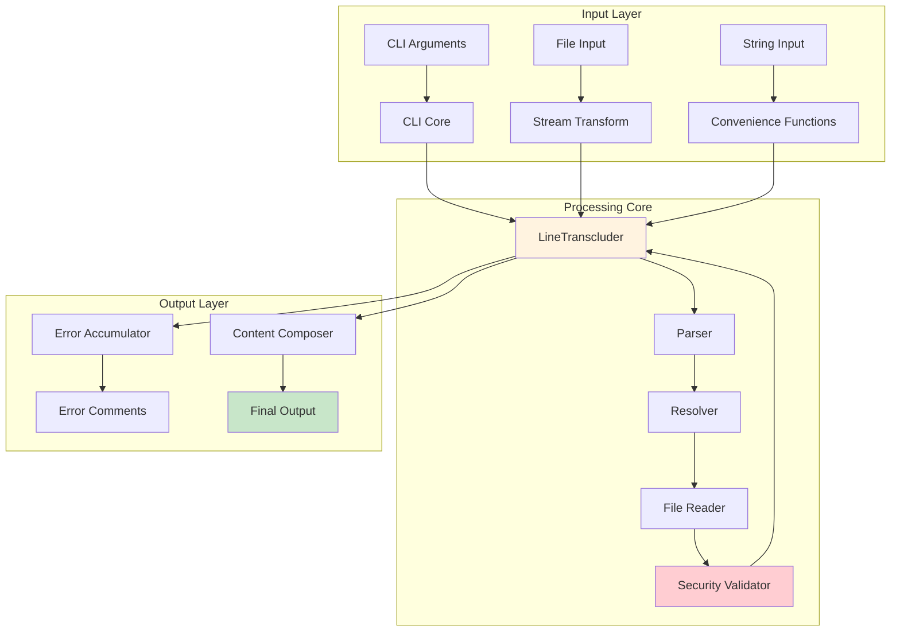

# System Architecture

## Overview

The markdown-transclusion system is built on a modular architecture with clear separation of concerns:

## Components

### Parser
Identifies transclusion syntax patterns in the markdown text.

### Resolver
Resolves file paths and handles path security validation.

### File Reader
Reads file contents with support for caching and error handling.

### Transcluder
Orchestrates the transclusion process with recursive processing.

### Stream
Provides efficient line-by-line processing for large files.

## Data Flow

1. Input markdown is processed line by line
2. Each line is parsed for transclusion references
3. References are resolved to file paths
4. Files are read and processed recursively
5. Content is composed and output

## Security Model

All file access is restricted to the configured base path to prevent unauthorized file access.